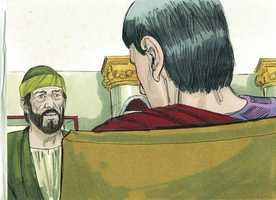
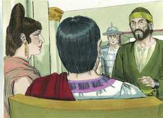
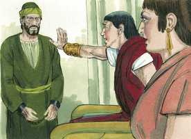

# Atos dos Apóstolos Cap 24

**1** 	E, CINCO dias depois, o sumo sacerdote Ananias desceu com os anciãos, e um certo Tértulo, orador, os quais compareceram perante o presidente contra Paulo.

**2** 	E, sendo chamado, Tértulo começou a acusá-lo, dizendo: Visto como por ti temos tanta paz e por tua prudência se fazem a este povo muitos e louváveis serviços,

 

**3** 	Sempre e em todo o lugar, ó potentíssimo Félix, com todo o agradecimento o queremos reconhecer.

**4** 	Mas, para que não te detenha muito, rogo-te que, conforme a tua eqüidade, nos ouças por pouco tempo.

**5** 	Temos achado que este homem é uma peste, e promotor de sedições entre todos os judeus, por todo o mundo; e o principal defensor da seita dos nazarenos;

**6** 	O qual intentou também profanar o templo; e nós o prendemos, e conforme a nossa lei o quisemos julgar.

**7** 	Mas, sobrevindo o tribuno Lísias, no-lo tirou de entre as mãos com grande violência,

**8** 	Mandando aos seus acusadores que viessem a ti; e dele tu mesmo, examinando-o, poderás entender tudo o de que o acusamos.

**9** 	E também os judeus consentiam, dizendo serem estas coisas assim.

 

**10** 	Paulo, porém, fazendo-lhe o presidente sinal que falasse, respondeu: Porque sei que já vai para muitos anos que desta nação és juiz, com tanto melhor ânimo respondo por mim.

 

**11** 	Pois bem podes saber que não há mais de doze dias que subi a Jerusalém a adorar;

**12** 	E não me acharam no templo falando com alguém, nem amotinando o povo nas sinagogas, nem na cidade.

**13** 	Nem tampouco podem provar as coisas de que agora me acusam.

**14** 	Mas confesso-te isto que, conforme aquele Caminho que chamam seita, assim sirvo ao Deus de nossos pais, crendo tudo quanto está escrito na lei e nos profetas.

 

**15** 	Tendo esperança em Deus, como estes mesmos também esperam, de que há de haver ressurreição de mortos, assim dos justos como dos injustos.

**16** 	E por isso procuro sempre ter uma consciência sem ofensa, tanto para com Deus como para com os homens.

**17** 	Ora, muitos anos depois, vim trazer à minha nação esmolas e ofertas.

 

**18** 	Nisto me acharam já santificado no templo, não em ajuntamentos, nem com alvoroços, uns certos judeus da Ásia,

**19** 	Os quais convinha que estivessem presentes perante ti, e me acusassem, se alguma coisa contra mim tivessem.

**20** 	Ou digam estes mesmos, se acharam em mim alguma iniqüidade, quando compareci perante o conselho,

 

**21** 	A não ser estas palavras que, estando entre eles, clamei: Hoje sou julgado por vós acerca da ressurreição dos mortos.

 

**22** 	Então Félix, havendo ouvido estas coisas, lhes pôs dilação, dizendo: Havendo-me informado melhor deste Caminho, quando o tribuno Lísias tiver descido, então tomarei inteiro conhecimento dos vossos negócios.

 

**23** 	E mandou ao centurião que o guardasse em prisão, tratando-o com brandura, e que a ninguém dos seus proibisse servi-lo ou vir ter com ele.

**24** 	E alguns dias depois, vindo Félix com sua mulher Drusila, que era judia, mandou chamar a Paulo, e ouviu-o acerca da fé em Cristo.

 

**25** 	E, tratando ele da justiça, e da temperança, e do juízo vindouro, Félix, espavorido, respondeu: Por agora vai-te, e em tendo oportunidade te chamarei.

 

**26** 	Esperando ao mesmo tempo que Paulo lhe desse dinheiro, para que o soltasse; pelo que também muitas vezes o mandava chamar, e falava com ele.

**27** 	Mas, passados dois anos, Félix teve por sucessor a Pórcio Festo; e, querendo Félix comprazer aos judeus, deixou a Paulo preso.

 

> **Cmt MHenry** Intro: O apóstolo arrazoa acerca da natureza e das obrigações da justiça, a temperança e o juízo vindouro, demonstrando assim ao juiz opressor e a sua amante dissoluta a necessidade que eles tinham de arrependimento, do perdão e da graça do Evangelho. A justiça em relação a nossa conduta na vida, particularmente com referência ao próximo; a temperança, ao estado e governo de nossas almas com relação a Deus. quem não se exercita nestas, não tem nem a forma, Ne o poder da piedade, e deve ser abrumado pela ira divina no dia da manifestação de Deus.\ A perspectiva do juízo vindouro é suficiente para fazer que trema o coração mais forte. Feliz estremeceu, mas isso foi tudo. Muitos dos que se surpreendem com a Palavra de Deus não são mudados por ela. Muitos temem as conseqüências do pecado, mas continuam amando-o e praticando-o. As demoras são perigosas nos assuntos de nossas almas. Felix postergou este assunto para um momento mais propício, mas não vemos que tenha chegado nunca o momento mais conveniente. Considere-se que agora é o tempo aceitável: escuta hoje a voz do Senhor. Ele teve pressa para deixar ouvir a verdade. Havia um assunto mais urgente para ele que reformar sua conduta ou mais importante que a salvação de sua alma! Os pecadores começam, comumente, como um homem que acorda de seu sono por um barulho forte, mas logo voltam a afundar em seu habitual torpor. Não se deixem enganar pelas aparências *ocasionais* em nós mesmos ou no próximo. Por sobre todas as coisas, não julguemos com a palavra de Deus. Esperamos acaso que nossos corações sejam amolecidos ao irmos avançando na vida, ou que diminua a influência do pecado? Não corremos neste momento o perigo de perder-nos para sempre? agora é o dia da salvação; amanhã pode ser demasiado tarde.> Paulo dá um justo relato de si mesmo que o exonera do delito e igualmente mostra a verdadeira razão da violência contra ele. não sejamos tirados de um bom caminho porque tenha má fama. Ao adorar a Deus é muito consolador considerá-lo como o Deus de nossos pais, sem estabelecer nenhuma outra regra de fé ou conduta que não sejam as Escrituras. isto mostra aqui que haverá uma ressurreição para o juízo final. Os profetas e duas doutrinas deviam provar-se por seus frutos.\ O alvo de Paulo era ter uma consciência desprovida de ofensa. Seus interesse e finalidade eram abster-se de muitas coisas e abundar em todos os momentos nos exercícios da religião com Deus e com o homem. Se formos culpados de sermos mais zelosos nas coisas de Deus que nosso próximo, que contestaremos? Nos encolheremos diante da acusação? Quantos há no mundo que preferem serem acusados de qualquer fraqueza, sim, até de maldade, e não de um sentimento de amor, fervoroso e anelante pelo Senhor Jesus Cristo, e de consagração a seu serviço! Podem os tais pensar que os confessará quando voltar em sua glória e diante dos anjos de Deus? se há uma visão prazerosa para o Deus de nossa salvação, e uma visão ante a qual se regozijam os anjos, é contemplar a um seguidor devoto do Senhor, aqui na terra, que reconhece ser culpável, se for crime, de amar com todo seu coração, alma, mente e força o Senhor que morreu por ele. não pode permanecer calado ao ver que se despreza a Palavra de Deus ou escuta que se profana Seu nome. Este se arriscará, melhor, ao ridículo e ao ódio do mundo, antes que causar ira a esse ser bondoso cujo amor é melhor que a vida.> Aqui vemos a infelicidade dos grandes homens, e é uma grande desgraça que os louvem por seus serviços além de toda medida, sem que nunca se fale fielmente de suas faltas; por isso, se endurecem e atrevem no mal, como Felix. Os profetas de Deus foram acusados de ser os perturbadores da terra, e nosso Senhor Jesus Cristo, de perverter a nação; as mesmas acusações foram formuladas contra Paulo. As perversas paixões egoístas dos homens os impelem para frente e as graças e o poder da fala têm sido utilizados freqüentemente para dirigir mal e prejudicar os homens contra a verdade. Quão diferentes serão os caracteres de Felix e Paulo no dia do juízo, segundo são representados no discurso de Tértulo! Que os cristãos não valorizem o aplauso e não se turvem pelas repreensões dos homens ímpios, que apresentam quase como deuses os mais vis da raça humana, e como pestes e promotores de sedição aos excelentes da terra.