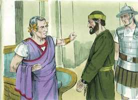
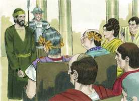

# Atos dos Apóstolos Cap 25

**1** 	ENTRANDO, pois, Festo na província, subiu dali a três dias de Cesaréia a Jerusalém.

**2** 	E o sumo sacerdote e os principais dos judeus compareceram perante ele contra Paulo, e lhe rogaram,

**3** 	Pedindo como favor contra ele que o fizesse vir a Jerusalém, armando ciladas para o matarem no caminho.

**4** 	Mas Festo respondeu que Paulo estava guardado em Cesaréia, e que ele brevemente partiria para lá.

**5** 	Os que, pois, disse, dentre vós, têm poder, desçam comigo e, se neste homem houver algum crime, acusem-no.

**6** 	E, havendo-se demorado entre eles mais de dez dias, desceu a Cesaréia; e no dia seguinte, assentando-se no tribunal, mandou que trouxessem Paulo.

**7** 	E, chegando ele, rodearam-no os judeus que haviam descido de Jerusalém, trazendo contra Paulo muitas e graves acusações, que não podiam provar.

**8** 	Mas ele, em sua defesa, disse: Eu não pequei em coisa alguma contra a lei dos judeus, nem contra o templo, nem contra César.

 

**9** 	Todavia Festo, querendo comprazer aos judeus, respondendo a Paulo, disse: Queres tu subir a Jerusalém, e ser lá perante mim julgado acerca destas coisas?

 

**10** 	Mas Paulo disse: Estou perante o tribunal de César, onde convém que seja julgado; não fiz agravo algum aos judeus, como tu muito bem sabes.

 

**11** 	Se fiz algum agravo, ou cometi alguma coisa digna de morte, não recuso morrer; mas, se nada há das coisas de que estes me acusam, ninguém me pode entregar a eles; apelo para César.

**12** 	Então Festo, tendo falado com o conselho, respondeu: Apelaste para César? para César irás.

 

**13** 	E, passados alguns dias, o rei Agripa e Berenice vieram a Cesaréia, a saudar Festo.

**14** 	E, como ali ficassem muitos dias, Festo contou ao rei os negócios de Paulo, dizendo: Um certo homem foi deixado por Félix aqui preso,

 

**15** 	Por cujo respeito os principais dos sacerdotes e os anciãos dos judeus, estando eu em Jerusalém, compareceram perante mim, pedindo sentença contra ele.

**16** 	Aos quais respondi não ser costume dos romanos entregar algum homem à morte, sem que o acusado tenha presentes os seus acusadores, e possa defender-se da acusação.

**17** 	De sorte que, chegando eles aqui juntos, no dia seguinte, sem fazer dilação alguma, assentado no tribunal, mandei que trouxessem o homem.

**18** 	Acerca do qual, estando presentes os acusadores, nenhuma coisa apontaram daquelas que eu suspeitava.

**19** 	Tinham, porém, contra ele algumas questões acerca da sua superstição, e de um tal Jesus, morto, que Paulo afirmava viver.

**20** 	E, estando eu perplexo acerca da inquirição desta causa, disse se queria ir a Jerusalém, e lá ser julgado acerca destas coisas.

**21** 	E, apelando Paulo para que fosse reservado ao conhecimento de Augusto, mandei que o guardassem até que o envie a César.

**22** 	Então Agripa disse a Festo: Bem quisera eu também ouvir esse homem. E ele disse: Amanhã o ouvirás.

**23** 	E, no dia seguinte, vindo Agripa e Berenice, com muito aparato, entraram no auditório com os tribunos e homens principais da cidade, sendo trazido Paulo por mandado de Festo.

 

**24** 	E Festo disse: Rei Agripa, e todos os senhores que estais presentes conosco; aqui vedes um homem de quem toda a multidão dos judeus me tem falado, tanto em Jerusalém como aqui, clamando que não convém que viva mais.

**25** 	Mas, achando eu que nenhuma coisa digna de morte fizera, e apelando ele mesmo também para Augusto, tenho determinado enviar-lho.

**26** 	Do qual não tenho coisa alguma certa que escreva ao meu senhor, e por isso perante vós o trouxe, principalmente perante ti, ó rei Agripa, para que, depois de interrogado, tenha alguma coisa que escrever.

**27** 	Porque me parece contra a razão enviar um preso, e não notificar contra ele as acusações.

> **Cmt MHenry** Intro: " Agripa tinha o governo da Galiléia. Quantos juízos injustos e apressados são condenados pela máxima romana! (versículo 16). Este pagão guiado somente pela luz da natureza, seguiu exatamente a lei e os costumes, porém quantos são os cristãos que não seguem as regras da verdade, da justiça e da caridade ao julgar seus irmãos! As questões sobre a adoração de Deus, o caminho da salvação e as verdades do Evangelho podem parecer duvidosas e sem interesse aos homens mundanos e aos políticos. Veja-se com quanta leviandade este romano fala de Cristo, e da grande polêmica entre judeus e cristãos. Todavia, aproxima-se o dia em que Festo e todo o mundo verão que todos os interesses do império romano eram somente besteiras sem conseqüência, comparadas com esta questão da ressurreição de Cristo. os que tiveram meios de instrução e os desprezaram, serão horrorosamente convencidos de seu pecado e tolice.\ Eis aqui uma notável assembléia reunida para ouvir as verdades do Evangelho, embora eles somente queriam satisfazer sua curiosidade assistindo a defesa de um prisioneiro. Ainda hoje há muitos que vãos aos lugares onde se escuta a Palavra de Deus com "grande pompa", e demasiado amiúde sem melhor motivo que a curiosidade. Mesmo que agora os ministros não são prisioneiros que devam defender suas vidas, ainda assim há muitos que pretendem julgá-los, desejosos de fazê-los ofensores por uma palavra, antes que aprender deles a verdade e a vontade de Deus para a salvação de suas almas. A pompa desta apresentação foi apagada pela glória real do pobre prisioneiro no estrado. O que era a honra do fino aspecto deles comparada com o aspecto de sabedoria, e com a graça e a santidade de Paulo, seu valor e sua constância para sofrer por Cristo! Não é pouca misericórdia que Deus aclare como a luz nossa justiça, e como o meio-dia nosso trato justo; sem que haja nada certo carregado em nossa contra. Deus faz que até os inimigos de seu povo lhes façam bem. "> Veja-se quão incansável é a maldade. Os perseguidores consideram que é um favor especial que sua maldade seja satisfeita. Pregar a Cristo, o fim da lei, não era ofensa contra a lei. Nos tempos de sofrimento é provada a prudência e a paciência do povo do Senhor; eles necessitam sabedoria. Corresponde aos que são inocentes insistirem na sua inocência. Paulo estava disposto a obedecer aos regulamentos da lei e deixar que continuassem seu curso. Se merecer a morte, aceitaria o castigo, mas se nenhuma das coisas das quais era acusado resultava verdadeira, ninguém poderia entregá-lo a eles, com justiça. Paulo não é liberado nem condenado. Este é um caso dos passos lentos que dá a providência, pelos quais costumamos ser envergonhados de nossas esperanças e de nossos temores, e somos mantidos esperando em Deus.