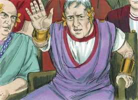
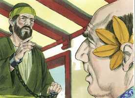
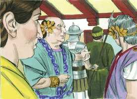

# Atos dos Apóstolos Cap 26

**1** 	DEPOIS Agripa disse a Paulo: É permitido que te defendas. Então Paulo, estendendo a mão em sua defesa, respondeu:

**2** 	Tenho-me por feliz, ó rei Agripa, de que perante ti me haja hoje de defender de todas as coisas de que sou acusado pelos judeus;

 

**3** 	Mormente sabendo eu que tens conhecimento de todos os costumes e questões que há entre os judeus; por isso te rogo que me ouças com paciência.

**4** 	Quanto à minha vida, desde a mocidade, como decorreu desde o princípio entre os da minha nação, em Jerusalém, todos os judeus a conhecem,

**5** 	Sabendo de mim desde o princípio (se o quiserem testificar), que, conforme a mais severa seita da nossa religião, vivi fariseu.

**6** 	E agora pela esperança da promessa que por Deus foi feita a nossos pais estou aqui e sou julgado.

**7** 	À qual as nossas doze tribos esperam chegar, servindo a Deus continuamente, noite e dia. Por esta esperança, ó rei Agripa, eu sou acusado pelos judeus.

**8** 	Pois quê? julga-se coisa incrível entre vós que Deus ressuscite os mortos?

**9** 	Bem tinha eu imaginado que contra o nome de Jesus Nazareno devia eu praticar muitos atos;

**10** 	O que também fiz em Jerusalém. E, havendo recebido autorização dos principais dos sacerdotes, encerrei muitos dos santos nas prisões; e quando os matavam eu dava o meu voto contra eles.

**11** 	E, castigando-os muitas vezes por todas as sinagogas, os obriguei a blasfemar. E, enfurecido demasiadamente contra eles, até nas cidades estranhas os persegui.

**12** 	Sobre o que, indo então a Damasco, com poder e comissão dos principais dos sacerdotes,

**13** 	Ao meio-dia, ó rei, vi no caminho uma luz do céu, que excedia o esplendor do sol, cuja claridade me envolveu a mim e aos que iam comigo.

**14** 	E, caindo nós todos por terra, ouvi uma voz que me falava, e em língua hebraica dizia: Saulo, Saulo, por que me persegues? Dura coisa te é recalcitrar contra os aguilhões.

**15** 	E disse eu: Quem és, Senhor? E ele respondeu: Eu sou Jesus, a quem tu persegues;

**16** 	Mas levanta-te e põe-te sobre teus pés, porque te apareci por isto, para te pôr por ministro e testemunha tanto das coisas que tens visto como daquelas pelas quais te aparecerei ainda;

**17** 	Livrando-te deste povo, e dos gentios, a quem agora te envio,

**18** 	Para lhes abrires os olhos, e das trevas os converteres à luz, e do poder de Satanás a Deus; a fim de que recebam a remissão de pecados, e herança entre os que são santificados pela fé em mim.

**19** 	Por isso, ó rei Agripa, não fui desobediente à visão celestial.

**20** 	Antes anunciei primeiramente aos que estão em Damasco e em Jerusalém, e por toda a terra da Judéia, e aos gentios, que se emendassem e se convertessem a Deus, fazendo obras dignas de arrependimento.

**21** 	Por causa disto os judeus lançaram mão de mim no templo, e procuraram matar-me.

**22** 	Mas, alcançando socorro de Deus, ainda até ao dia de hoje permaneço dando testemunho tanto a pequenos como a grandes, não dizendo nada mais do que o que os profetas e Moisés disseram que devia acontecer,

**23** 	Isto é, que o Cristo devia padecer, e sendo o primeiro da ressurreição dentre os mortos, devia anunciar a luz a este povo e aos gentios.

**24** 	E, dizendo ele isto em sua defesa, disse Festo em alta voz: Estás louco, Paulo; as muitas letras te fazem delirar.

 

**25** 	Mas ele disse: Não deliro, ó potentíssimo Festo; antes digo palavras de verdade e de um são juízo.

**26** 	Porque o rei, diante de quem também falo com ousadia, sabe estas coisas, pois não creio que nada disto lhe é oculto; porque isto não se fez em qualquer canto.

**27** 	Crês tu nos profetas, ó rei Agripa? Bem sei que crês.

 

**28** 	E disse Agripa a Paulo: Por pouco me queres persuadir a que me faça cristão!

 

**29** 	E disse Paulo: Prouvera a Deus que, ou por pouco ou por muito, não somente tu, mas também todos quantos hoje me estão ouvindo, se tornassem tais qual eu sou, exceto estas cadeias.

**30** 	E, dizendo ele isto, levantou-se o rei, o presidente, e Berenice, e os que com eles estavam assentados.

**31** 	E, apartando-se dali falavam uns com os outros, dizendo: Este homem nada fez digno de morte ou de prisões.

 

**32** 	E Agripa disse a Festo: Bem podia soltar-se este homem, se não houvera apelado para César.

> **Cmt MHenry** Intro: Corresponde a nós, em todas as ocasiões, dizer palavras de verdade e sobriedade e, então, não teremos que turbar-nos pelas censuras injustas dos homens. Os seguidores ativos e esforçados do Evangelho têm sido freqüentemente desprezados pelos sonhadores ou loucos, por crer tais doutrinas e tais feitos maravilhosos; e por testificar que a mesma fé e diligência, e uma experiência como a deles, é necessária para todos os homens, qualquer seja sua categoria, para sua salvação. Porém os apóstolos e os profetas, e o próprio Filho de Deus, foram expostos a esta acusação; ninguém deve comover-se por isso quando a graça divina os fez sábios para salvação. Agripa viu que havia muita razão para o cristianismo. Seu entendimento e seu juízo foram convencidos momentaneamente, mas seu coração não foi mudado. Sua conduta e temperamento eram muito diferentes da humildade e espiritualidade do Evangelho. Muitos dos que estão *quase* persuadidos de serem religiosos, não estão *completamente* persuadidos; estão submetidos a fortes convicções de seu dever e da excelência dos caminhos de Deus, embora não procurem suas convicções. Paulo instava que era interesse de cada um chegar a ser um cristão verdadeiro: que há graça suficiente em Cristo para todos. expressa seu pleno convencimento da verdade do Evangelho, da necessidade absurda de fé em Cristo para salvação. A salvação da escravidão é o que o evangelho de Cristo oferece aos gentios; a um mundo perdido. Não obstante, é com muita dificuldade que se pode convencer a qualquer pessoa de que necessita a obra de graça em seu coração, como é necessária para a conversão dos gentios. Cuidemo-nos da vacilação fatal de nossa própria conduta; e lembremo-nos de quanto dista o estar *quase* persuadido de ser cristão, de sê-lo *por completo*, como é todo crente verdadeiro.> Paulo foi feito cristão pelo poder divino; por uma revelação de Cristo a ele e nele, quando estava no apogeu de sua carreira de pecado. foi feito ministro por autoridade divina: o próprio Jesus que lhe aparecera nessa luz gloriosa, o enviou a pregar o Evangelho aos gentios. O mundo que está em trevas deve ser iluminado; devem ser levados a conhecer as coisas que correspondem a sua paz eterna os que ainda as ignoram. O mundo que jaz na iniqüidade deve ser santificado e reformado; não basta com que os olhos deles tenham sido abertos, eles mesmos devem ser renovados em seus corações; não basta com ter-se voltado da escuridão à luz ; devem voltar-se do poder de atn a Deus. todos os que são convertidos do pecado a Deus, não somente são perdoados: têm a concessão de uma rica herança. O perdão dos pecados dá lugar a isso. Ninguém que não seja santo pode ser feliz; e para ser santos no céu primeiro devemos ser santos na terra. Somos feitos santos e salvos pela fé em Cristo; pela qual confiamos em Cristo como Jeová Justiça nossa, e nos entregamos a Ele como Jeová nosso Rei; por isso recebemos a remissão dos pecados, o dom do Espírito Santo e a vida eterna.\ A cruz de Cristo era uma pedra de tropeço para os judeus, e eles estavam furiosos porque Paulo pregava o cumprimento das predições do Antigo Testamento. Cristo devia ser o primeiro a ressuscitar dentre os mortos: o Cabeça ou o Principal. Além disso, os profetas anunciaram que os gentios seriam conduzidos a conhecer a Deus por meio do Messias; e por que deviam desagradar-se os judeus disso, com justiça? Assim, pois, o convertido verdadeiro pode dar razão de sua esperança e uma boa conta da mudança manifestada nele. No entanto, por andar por ali e chamar os homens a se arrependerem e serem convertidos deste modo, muitíssimas pessoas têm sido culpadas e perseguidas.> O cristianismo nos ensina a dar razão da espírito que há em nós, e também a honrar a quem se deve render honras, sem adulações nem temor ao homem. Agripa era bem versado nas Escrituras do Antigo Testamento, portanto, poderia julgar melhor na polêmica de que Jesus era o Messias. Certamente os ministros podem esperar, quando pregam a fé de Cristo, serem ouvidos com paciência. Paulo confessa que ele ainda aderia a todo o que de bom havia no que primeiramente tinha sido educado e preparado. Veja-se aqui qual *era* sua religião. Era um moralista, um homem virtuoso, e não tinha aprendido as artes dos astutos fariseus cobiçosos; ele não podia ser acusado de nenhum vício franco, nem de profano. Era firme na fé. Sempre tivera santa consideração pela antiga promessa feita por Deus aos pais, e edificado sua esperança sobre ela. O apóstolo sabia muito bem que tudo isso não o justificava perante Deus, porém sabia que era para sua reputação entre os judeus, e um argumento de que não era a classe de homem que eles diziam que era. Embora contava isso como perda para ganhar a Cristo, ainda assim, o menciona quando serve para honrar a Cristo. Veja-se aqui qual *é* a religião de Paulo; ele não tem o zelo pela lei cerimonial que teve em sua juventude; os sacrifícios e as ofertas designadas por ela estão terminados pelo grande Sacrifício que elas tipificavam. Não faz menção das lavagens cerimoniais e acha que o sacerdócio levítico terminou pelo sacerdócio de Cristo, mas Enquanto aos principais fundamentos de sua religião, continua tão zeloso como sempre. Cristo e o céu são as duas grandes doutrinas do Evangelho; que Deus nos tem dado vida eterna, e esta vida está em seu Filho. Estes são os temas da promessa feita aos antepassados. O serviço do templo ou o curso contínuo dos deveres religiosos, dia e noite, era mantido como profissão de fé na promessa da vida eterna, e como expectativa dela. A perspectiva da vida eterna deve comprometer-nos a sermos diligentes e constantes em todos os exercícios religiosos. Não obstante, os saduceus odiavam a Paulo por pregar a ressurreição; e os outros judeus se uniram a eles porque ele testificava que Jesus tinha ressuscitado e que era o prometido Redentor de Israel. Muitas coisas se pensam que estão além da crença, somente porque passam por alto a natureza e as perfeições infinitas de quem as revelou, cumpriu ou prometeu. Paulo reconhece que enquanto foi fariseu, era um inimigo acérrimo do cristianismo. Este era seu caráter e estilo de vida no começo de seu tempo; e havia toda classe de coisas que obstaculizavam que ele fosse cristão. Os que têm sido mais estritos em sua conduta antes da conversão, depois verão que há muitos motivos para humilhar-se ainda por coisas que então pensavam que deviam ser feitas.