# Atos dos Apóstolos Cap 27

**1** 	E, COMO se determinou que havíamos de navegar para a Itália, entregaram Paulo, e alguns outros presos, a um centurião por nome Júlio, da coorte augusta.

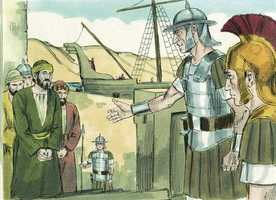 

**2** 	E, embarcando nós em um navio adramitino, partimos navegando pelos lugares da costa da Ásia, estando conosco Aristarco, macedônio, de Tessalônica.

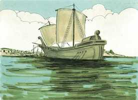 

**3** 	E chegamos no dia seguinte a Sidom, e Júlio, tratando Paulo humanamente, lhe permitiu ir ver os amigos, para que cuidassem dele.

**4** 	E, partindo dali, fomos navegando abaixo de Chipre, porque os ventos eram contrários.

**5** 	E, tendo atravessado o mar, ao longo da Cilícia e Panfília, chegamos a Mirra, na Lícia.

**6** 	E, achando ali o centurião um navio de Alexandria, que navegava para a Itália, nos fez embarcar nele.

**7** 	E, como por muitos dias navegássemos vagarosamente, havendo chegado apenas defronte de Cnido, não nos permitindo o vento ir mais adiante, navegamos abaixo de Creta, junto de Salmone.

**8** 	E, costeando-a dificilmente, chegamos a um lugar chamado Bons Portos, perto do qual estava a cidade de Laséia.

**9** 	E, passado muito tempo, e sendo já perigosa a navegação, pois, também o jejum já tinha passado, Paulo os admoestava,

**10** 	Dizendo-lhes: Senhores, vejo que a navegação há de ser incômoda, e com muito dano, não só para o navio e carga, mas também para as nossas vidas.

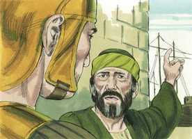 

**11** 	Mas o centurião cria mais no piloto e no mestre, do que no que dizia Paulo.

**12** 	E, como aquele porto não era cômodo para invernar, os mais deles foram de parecer que se partisse dali para ver se podiam chegar a Fenice, que é um porto de Creta que olha para o lado do vento da África e do Coro, e invernar ali.

**13** 	E, soprando o sul brandamente, lhes pareceu terem já o que desejavam e, fazendo-se de vela, foram de muito perto costeando Creta.

**14** 	Mas não muito depois deu nela um pé de vento, chamado Euro-aquilão.

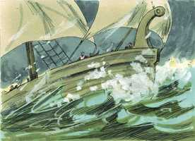 

**15** 	E, sendo o navio arrebatado, e não podendo navegar contra o vento, dando de mão a tudo, nos deixamos ir à toa.

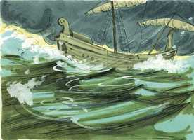 

**16** 	E, correndo abaixo de uma pequena ilha chamada Clauda, apenas pudemos ganhar o batel.

**17** 	E, levado este para cima, usaram de todos os meios, cingindo o navio; e, temendo darem à costa na Sirte, amainadas as velas, assim foram à toa.

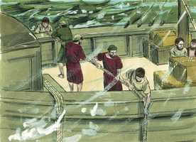 

**18** 	E, andando nós agitados por uma veemente tempestade, no dia seguinte aliviaram o navio.

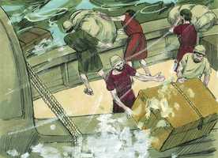 

**19** 	E ao terceiro dia nós mesmos, com as nossas próprias mãos, lançamos ao mar a armação do navio.

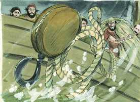 

**20** 	E, não aparecendo, havia já muitos dias, nem sol nem estrelas, e caindo sobre nós uma não pequena tempestade, fugiu-nos toda a esperança de nos salvarmos.

**21** 	E, havendo já muito que não se comia, então Paulo, pondo-se em pé no meio deles, disse: Fora, na verdade, razoável, ó senhores, ter-me ouvido a mim e não partir de Creta, e assim evitariam este incômodo e esta perda.

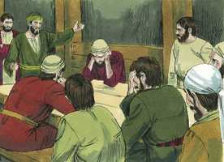 

**22** 	Mas agora vos admoesto a que tenhais bom ânimo, porque não se perderá a vida de nenhum de vós, mas somente o navio.

 

**23** 	Porque esta mesma noite o anjo de Deus, de quem eu sou, e a quem sirvo, esteve comigo,

**24** 	Dizendo: Paulo, não temas; importa que sejas apresentado a César, e eis que Deus te deu todos quantos navegam contigo.

**25** 	Portanto, ó senhores, tende bom ânimo; porque creio em Deus, que há de acontecer assim como a mim me foi dito.

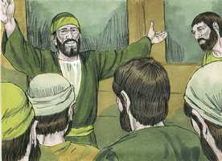 

**26** 	É, contudo, necessário irmos dar numa ilha.

**27** 	E, quando chegou a décima quarta noite, sendo impelidos de um e outro lado no mar Adriático, lá pela meia-noite suspeitaram os marinheiros que estavam próximos de alguma terra.

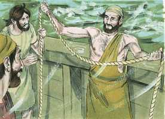 

**28** 	E, lançando o prumo, acharam vinte braças; e, passando um pouco mais adiante, tornando a lançar o prumo, acharam quinze braças.

**29** 	E, temendo ir dar em alguns rochedos, lançaram da popa quatro âncoras, desejando que viesse o dia.

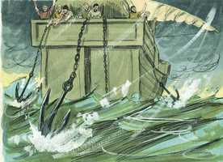 

**30** 	Procurando, porém, os marinheiros fugir do navio, e tendo já deitado o batel ao mar, como que querendo lançar as âncoras pela proa,

 

**31** 	Disse Paulo ao centurião e aos soldados: Se estes não ficarem no navio, não podereis salvar-vos.

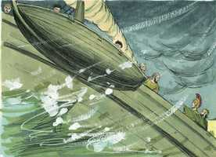 

**32** 	Então os soldados cortaram os cabos do batel, e o deixaram cair.

**33** 	E, entretanto que o dia vinha, Paulo exortava a todos a que comessem alguma coisa, dizendo: É já hoje o décimo quarto dia que esperais, e permaneceis sem comer, não havendo provado nada.

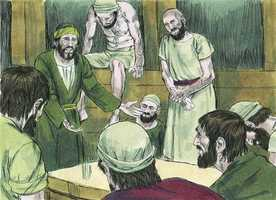 

**34** 	Portanto, exorto-vos a que comais alguma coisa, pois é para a vossa saúde; porque nem um cabelo cairá da cabeça de qualquer de vós.

**35** 	E, havendo dito isto, tomando o pão, deu graças a Deus na presença de todos; e, partindo-o, começou a comer.

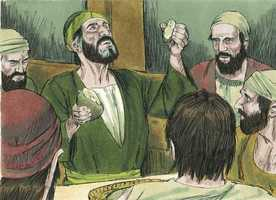 

**36** 	E, tendo já todos bom ânimo, puseram-se também a comer.

**37** 	E éramos ao todo, no navio, duzentas e setenta e seis almas.

**38** 	E, refeitos com a comida, aliviaram o navio, lançando o trigo ao mar.

**39** 	E, sendo já dia, não conheceram a terra; enxergaram, porém, uma enseada que tinha praia, e consultaram-se sobre se deveriam encalhar nela o navio.

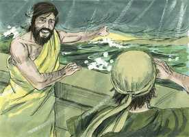 

**40** 	E, levantando as âncoras, deixaram-no ir ao mar, largando também as amarras do leme; e, alçando a vela maior ao vento, dirigiram-se para a praia.

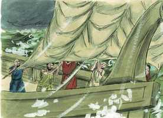 

**41** 	Dando, porém, num lugar de dois mares, encalharam ali o navio; e, fixa a proa, ficou imóvel, mas a popa abria-se com a força das ondas.

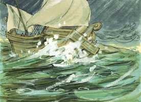 

**42** 	Então a idéia dos soldados foi que matassem os presos para que nenhum fugisse, escapando a nado.

**43** 	Mas o centurião, querendo salvar a Paulo, lhes estorvou este intento; e mandou que os que pudessem nadar se lançassem primeiro ao mar, e se salvassem em terra;

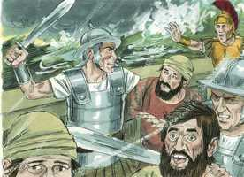 

**44** 	E os demais, uns em tábuas e outros em coisas do navio. E assim aconteceu que todos chegaram à terra a salvo.

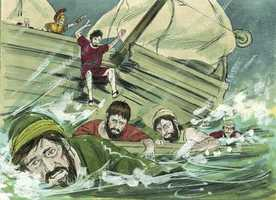 

> **Cmt MHenry** Intro: O barco que tinha evadido a tormenta em mar aberto, onde havia espaço, se rompe em pedaços quando está amarrado. Assim, está perdido o coração que afixa no mundo seus afetos, e se aferra a este. As tentações de Satanás o golpeiam e se acaba, mas há esperança em tanto se mantiver por acima do mundo, embora chacoalhado com afãs e tumultos. Eles tinham a costa à vista, mas soçobraram no porto; assim somos ensinados que nunca devemos sentir-nos seguros.\ Apesar de que existam grandes dificuldades no conhecimento da salvação prometida, se produzirá sem falta. Acontecerá não importar quantas sejas as provas e perigos, porque no devido momento todos os crentes chegarão a salvo ao céu. Senhor Jesus, Tu nos asseguras-te que nenhum dos teus perecerá. Tu os levarás a todos a salvo à praia celestial. E quão prazeroso será esse desembarco! Tu os apresentaras a teu Pai, e darás a teu Espírito Santo a plena possessão deles para sempre.> Deus, que determinou o fim -que eles sejam salvados-, determinou o meio -que fossem salvados pela ajuda destes marinheiros. O dever é nosso, os acontecimentos são de Deus; não confiamos em Deus, senão que o tentamos quando dizemos que nos colocamos debaixo de sua proteção, se não usamos os meios apropriados para nossa seguridade, os meios que estão a nosso alcance.\ Mas quão egoístas são em geral os homens que volta e meia estão prontos a procurar sua própria seguridade pela destruição do próximo! Ditosos os que têm em sua companhia a um como Paulo, que não só tem relação com o Céu, senão que era espírito vivificante para os que o rodeavam. A tristeza segundo o mundo produz morte, enquanto que o gozo em Deus é vida e paz, nas angústias e perigos maiores.\ O consolo das promessas de Deus pode ser nosso somente se dependermos com filho dEle para que cumpra sua Palavra em nós; a salvação que Ele revela devemos esperá-la no uso dos médios que Ele determina. Se Deus nos escolheu para salvação, também determinou que a obtenhamos pelo arrependimento, a fé, a oração e a obediência perseverante; presunção fatal é esperá-la de alguma outra maneira. Estímulo para a gente é encomendar-se a Cristo como seu Salvador quando os que convidam mostram claramente que assim fazem eles próprios.> Eles não escutaram ao apóstolo quando os advertiu do perigo; contudo, se reconhecer sua atitude néscia e se arrepender dela, ele lhes fala consolo e alívio em meio do perigo. A maioria da gente se mete em encrencas porque não sabem quando estão bem; se prejudicam e se perdem por apontar à emenda de sua condição, amiúde em contra do conselho.\ Observe-se a solene confissão que fez Paulo de sua relação com Deus. Nenhuma tormenta ou tempestade pode obstaculizar o favor de Deus para com seu povo, dado que é ajuda sempre próxima. É consolo para os servos fiéis de Deus em dificuldades que suas vidas serão prolongadas na medida em que o Senhor tenha uma obra para que eles realizem. Se Paulo se tiver comprometido desnecessariamente em má companhia, teria sido justamente lançado com eles, mas ao chamá-lo Deus, os outros foram preservados com ele. eles te são dados; não há maior satisfação para um homem bom que saber que é uma bênção pública. Ele os consola com os consolos com que ele mesmo foi consolado. Deus sempre e fiel, portanto, estejam sempre felizes todos os que dependem de suas promessas. Como dizer e fazer não são duas coisas para Deus, também não crer e desfrutar devem sê-lo para nós. A esperança é a âncora da alma, segura e firme, que entra até dentro do véu. Que os que estão nas trevas espirituais se sustentem firme nisso e não pensem em zarpar de novo, senão em permanecer em Cristo e esperar que clareie o dia e as sombras fujam.> Os que se lançam ao oceano deste mundo com um bom vento, não sabem com que tormentas podem encontrar-se e, portanto, não devem sar por sentado que tenham logrado seu propósito. Não nos façamos a expectativa de estar completamente a salvo, senão até que entremos noção eu. Eles não viram sol nem estrelas por muitos dias. Assim, às vezes, a tristeza é o estado do Povo de Deus Enquanto a seus assuntos espirituais: andam nas trevas e não têm luz.\ Veja-se aqui que é a riqueza do mundo: embora cobiçada como bênção, pode ser que chegue o momento em que seja uma carga; não só demasiado pesada para executá-la, senão suficientemente pesada para afundar o que a leve. Os filhos deste mundo podem ser dispendiosos com os bens para salvar sua vida, mas são tacanhos com seus bens para as obras de piedade e caridade, e para sofrer por Cristo. todo homem preferiria fazer que soçobrem seus bens antes que sua vida, porém muitos preferem que soçobrem a fé e a boa consciência antes que seus bens. O meio que usaram os marinheiros não resultou, mas quando os pecadores renunciam a toda esperança de salvar a si mesmos, estão preparados para entender a Palavra de Deus e para confiar em sua misericórdia por meio de Jesus Cristo.> O conselho de Deus determinou, antes que o determinasse o conselho de Festo, que Paulo devia ir a Roma, porque Deus tinha lá obra para que ele fizesse. Aqui se estipula o rumo que seguiram e os lugares que tocaram. Com isso Deus estimula os que sofrem por Ele a que confiem nEle; porque Ele pode pôr nos corações dos que menos se espera que se convertam em amigos.\ Os marinheiros devem aproveitar ao máximo o vento e, de igual modo, todos nós, em nossa passagem pelo oceano deste mundo. Quando os ventos são contrários devemos seguir adiante tão bem como pudermos.\ Muitos dos que não retrocedem pelas providências negativas, não avançam pelas providências favoráveis. Muitos são os cristãos verdadeiros que se lamentam das preocupações de suas almas, que têm muito que fazer para manter-se em sua posição.\ Todo porto bom não é porto seguro. Muitos dos que mostram respeito aos bons ministros, não seguem seus conselhos. Contudo, o acontecimento convencerá os pecadores da vaidade de suas esperanças e da tolice de sua conduta.