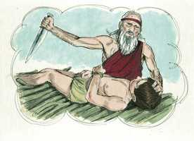

# Tiago Cap 02

**1** 	MEUS irmãos, não tenhais a fé de nosso Senhor Jesus Cristo, Senhor da glória, em acepção de pessoas.

**2** 	Porque, se no vosso ajuntamento entrar algum homem com anel de ouro no dedo, com trajes preciosos, e entrar também algum pobre com sórdido traje,

**3** 	E atentardes para o que traz o traje precioso, e lhe disserdes: Assenta-te tu aqui num lugar de honra, e disserdes ao pobre: Tu, fica aí em pé, ou assenta-te abaixo do meu estrado,

**4** 	Porventura não fizestes distinção entre vós mesmos, e não vos fizestes juízes de maus pensamentos?

**5** 	Ouvi, meus amados irmãos: Porventura não escolheu Deus aos pobres deste mundo para serem ricos na fé, e herdeiros do reino que prometeu aos que o amam?

 

**6** 	Mas vós desonrastes o pobre. Porventura não vos oprimem os ricos, e não vos arrastam aos tribunais?

**7** 	Porventura não blasfemam eles o bom nome que sobre vós foi invocado?

**8** 	Todavia, se cumprirdes, conforme a Escritura, a lei real: Amarás a teu próximo como a ti mesmo, bem fazeis.

**9** 	Mas, se fazeis acepção de pessoas, cometeis pecado, e sois redargüidos pela lei como transgressores.

 

**10** 	Porque qualquer que guardar toda a lei, e tropeçar em um só ponto, tornou-se culpado de todos.

**11** 	Porque aquele que disse: Não cometerás adultério, também disse: Não matarás. Se tu pois não cometeres adultério, mas matares, estás feito transgressor da lei.

**12** 	Assim falai, e assim procedei, como devendo ser julgados pela lei da liberdade.

**13** 	Porque o juízo será sem misericórdia sobre aquele que não fez misericórdia; e a misericórdia triunfa do juízo.

**14** 	Meus irmãos, que aproveita se alguém disser que tem fé, e não tiver as obras? Porventura a fé pode salvá-lo?

**15** 	E, se o irmão ou a irmã estiverem nus, e tiverem falta de mantimento quotidiano,

 

**16** 	E algum de vós lhes disser: Ide em paz, aquentai-vos, e fartai-vos; e não lhes derdes as coisas necessárias para o corpo, que proveito virá daí?

 

**17** 	Assim também a fé, se não tiver as obras, é morta em si mesma.

**18** 	Mas dirá alguém: Tu tens a fé, e eu tenho as obras; mostra-me a tua fé sem as tuas obras, e eu te mostrarei a minha fé pelas minhas obras.

**19** 	Tu crês que há um só Deus; fazes bem. Também os demônios o crêem, e estremecem.

**20** 	Mas, ó homem vão, queres tu saber que a fé sem as obras é morta?

**21** 	Porventura o nosso pai Abraão não foi justificado pelas obras, quando ofereceu sobre o altar o seu filho Isaque?

 

**22** 	Bem vês que a fé cooperou com as suas obras, e que pelas obras a fé foi aperfeiçoada.

**23** 	E cumpriu-se a Escritura, que diz: E creu Abraão em Deus, e foi-lhe isso imputado como justiça, e foi chamado o amigo de Deus.

**24** 	Vedes então que o homem é justificado pelas obras, e não somente pela fé.

**25** 	E de igual modo Raabe, a meretriz, não foi também justificada pelas obras, quando recolheu os emissários, e os despediu por outro caminho?

**26** 	Porque, assim como o corpo sem o espírito está morto, assim também a fé sem obras é morta.

> **Cmt MHenry** Intro: Erram os que tomam a só crença de noções do evangelho pelo todo da religião evangélica, como fazem muitos agora. Sem dúvida que a só fé verdadeira, pela qual os homens participam na justiça, expiação e graça de Cristo, salva suas almas; porém produz frutos santos e se demonstra verdadeira por seus efeitos nas obras deles, enquanto o só assentimento a qualquer forma de doutrina ou crença histórica de fatos difere totalmente da fé salvadora. A só profissão de fé pode obter a boa opinião da gente piedosa, e em alguns casos pode obter coisas mundanas boas, mas, de que aproveita a alguém se ganhar o mundo e perder a sua alma? Pode essa fé salvá-lo? todas as coisas devem ser contadas como proveitosas ou prejudiciais para nós, segundo tendam a promover ou a estorvar a salvação de nossas almas. Este lugar da Escritura mostra evidentemente que uma opinião ou assentimento ao evangelho, sem obras, não é fé. não há forma de mostrar que cremos realmente em Cristo, senão sendo diligentes em boas por motivo do evangelho e para propósitos do evangelho. Os homens podem vangloriar-se uns a outros e orgulhar-se falsamente do que não têm em realidade.\ Não se trata somente de *conformar-se* à fé, senão de *aceder* a ela; não se de consentir à verdade da palavra, senão do aceder a receber a Cristo, crer verdadeiramente não é somente um ato do entendimento, senão uma obra de todo o coração. Por dois exemplos demonstra-se que a fé que justifica não pode ser sem obras: Abraão e Raabe. Abraão creu em Deus e lhe foi imputado por justiça. A fé que produz tais obras o levou a favores peculiares. Então vemos (versículo 24), como é justificado o homem pelas obras, não pela só opinião ou declaração, ou por crer sem obedecer, senão tendo a fé que produz boas obras. Ter de negar sua própria razão, afetos e interesses é uma ação apta para provar a um crente.\ Note-se aqui o maravilhoso poder da fé para mudar os pecadores. A conduta de Raabe provou que a fé dela era viva e tinha poder; demonstrou que ela cria com seu coração e não somente por consentimento intelectual.\ Então, prestemos atenção ao fato de que as boas obras, sem fé, são obras mortas, carentes de raiz e princípio. Todo o que fazemos por fé é realmente bom, porque se faz em obediência a Deus e para sua aceitação: quando não há fruto é como se a raiz estiver morta. A fé é a raiz, as boas obras são os frutos e devemos ocupar-nos de ter ambas. Esta é a graça de Deus pela qual resistimos e à qual devemos defender. Não há estado intermédio. Cada um deve viver como amigo de Deus ou como inimigo dEle. Viver para Deus, que é conseqüência da fé, que justifica e salvará, nos obriga a não fazer nada em Sua contra, mas a fazer todo por Ele e para Ele.> Os que professam fé em Cristo como o Senhor da glória não devem fazer acepção de pessoas simplesmente pelas circunstâncias é aparências externas, de uma maneira que não concordam com sua profissão de ser discípulos do humilde Jesus. aqui Tiago não anima à rudeza nem à desordem; deve dar-se o respeito civil, mas nunca de tal modo que influencie nos procedimentos dos cristãos para dispor dos ofícios da Igreja de Cristo ou para passar as censuras da igreja, ou em alguma questão da religião. O questionar-nos é algo que serve de muito em cada parte da vida santa. Façamo-lo com maior freqüência e aproveitemos toda ocasião para discorrer com as nossas almas.\ Como os lugares de adoração não podem ser edificados nem mantidos sem custos, pode resultar apropriado que os que contribuem sejam acomodados de forma concordante, no entanto, se todos fossem pessoas de maior orientação espiritual, os pobres seriam tratados com mais atenção do que costuma acontecer nas congregações.\ O estado humilde é mais favorável para a paz interior e o crescimento na santidade. Deus daria riquezas e honra deste mundo a todos os crentes se fossem para seu bem, considerando que Ele os têm escolhido para que sejam ricos na fé e os tem feito herdeiros de seu reino, que prometeu conceder a todos os que o amam. Considere-se com quanta freqüência as riquezas conduzem ao vício e à maldade, e quão grandes recriminações se faze, a Deus e à religião por parte de homens ricos, poderosos e grandes no mundo; isso fará que este pecado pareça muito grave e néscio.\ A Escritura dá como lei amar ao próximo como a um mesmo. esta lei é uma lei real que vem do Rei de reis; e se os cristãos agem injustamente tornam-se convictos de transgressão pela lei.\ Pensar que as nossas boas obras expiarão nossas más obras é algo que claramente nos conduz que buscar outra expiação. Conforme com a aliança de obras, transgredir qualquer mandamento coloca ao homem sob condenação, da qual nenhuma obediência pode livrá-lo, seja passada, presente ou futura.\ Isto nos mostra a alegria dos que estão em Cristo. podemos servi-o sem medo escravizador. Contudo, Deus considera que é sua glória e felicidade perdoar e abençoar os que poderiam ser condenados com justiça em seu tribunal; e sua graça ensina que os que participam de sua misericórdia devem imitá-la em sua conduta.