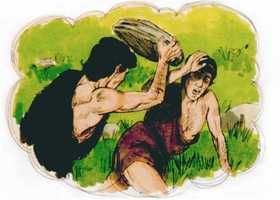

# 1 João Cap 03

**1** 	VEDE quão grande amor nos tem concedido o Pai, que fôssemos chamados filhos de Deus. Por isso o mundo não nos conhece; porque não o conhece a ele.

**2** 	Amados, agora somos filhos de Deus, e ainda não é manifestado o que havemos de ser. Mas sabemos que, quando ele se manifestar, seremos semelhantes a ele; porque assim como é o veremos.

**3** 	E qualquer que nele tem esta esperança purifica-se a si mesmo, como também ele é puro.

**4** 	Qualquer que comete pecado, também comete iniqüidade; porque o pecado é iniqüidade.

**5** 	E bem sabeis que ele se manifestou para tirar os nossos pecados; e nele não há pecado.

**6** 	Qualquer que permanece nele não peca; qualquer que peca não o viu nem o conheceu.

**7** 	Filhinhos, ninguém vos engane. Quem pratica justiça é justo, assim como ele é justo.

**8** 	Quem comete o pecado é do diabo; porque o diabo peca desde o princípio. Para isto o Filho de Deus se manifestou: para desfazer as obras do diabo.

**9** 	Qualquer que é nascido de Deus não comete pecado; porque a sua semente permanece nele; e não pode pecar, porque é nascido de Deus.

**10** 	Nisto são manifestos os filhos de Deus, e os filhos do diabo. Qualquer que não pratica a justiça, e não ama a seu irmão, não é de Deus.

**11** 	Porque esta é a mensagem que ouvistes desde o princípio: que nos amemos uns aos outros.

**12** 	Não como Caim, que era do maligno, e matou a seu irmão. E por que causa o matou? Porque as suas obras eram más e as de seu irmão justas.

 

**13** 	Meus irmãos, não vos maravilheis, se o mundo vos odeia.

**14** 	Nós sabemos que passamos da morte para a vida, porque amamos os irmãos. Quem não ama a seu irmão permanece na morte.

**15** 	Qualquer que odeia a seu irmão é homicida. E vós sabeis que nenhum homicida tem a vida eterna permanecendo nele.

**16** 	Conhecemos o amor nisto: que ele deu a sua vida por nós, e nós devemos dar a vida pelos irmãos.

**17** 	Quem, pois, tiver bens do mundo, e, vendo o seu irmão necessitado, lhe cerrar as suas entranhas, como estará nele o amor de Deus?

**18** 	Meus filhinhos, não amemos de palavra, nem de língua, mas por obra e em verdade.

 

**19** 	E nisto conhecemos que somos da verdade, e diante dele asseguraremos nossos corações;

**20** 	Sabendo que, se o nosso coração nos condena, maior é Deus do que o nosso coração, e conhece todas as coisas.

**21** 	Amados, se o nosso coração não nos condena, temos confiança para com Deus;

 

**22** 	E qualquer coisa que lhe pedirmos, dele a receberemos, porque guardamos os seus mandamentos, e fazemos o que é agradável à sua vista.

**23** 	E o seu mandamento é este: que creiamos no nome de seu Filho Jesus Cristo, e nos amemos uns aos outros, segundo o seu mandamento.

**24** 	E aquele que guarda os seus mandamentos nele está, e ele nele. E nisto conhecemos que ele está em nós, pelo Espírito que nos tem dado.

> **Cmt MHenry** Intro: Quando os crentes têm confiança em Deus, por meio do Espírito de adoção, e por fé no grande Sumo Sacerdote, podem pedir o que queiram de seu Pai reconciliado. O receberão se for bom para eles. Como desde o céu se proclamou boa vontade para com os homens, assim deve haver boa vontade entre os homens, em particular entre os irmãos, nos corações dos que vão a Deus e ao céu.\ Quem assim segue a Cristo, habita nEle como sua arca, refúgio e repouso, e em seu Pai por meio dEle. Esta união entre Cristo e as almas dos crentes, e pelo Espírito que Ele lhes deu.\ O homem pode crer que Deus é bondoso antes de conhecê-lo; porém, quando a fé se empossa das promessas, coloca a trabalhar a razão. o Espírito de Deus opera uma mudança; em todos os cristãos verdadeiros, muda o poder de Satanás para o poder de Deus. considera, crente, como muda teu coração. Não anelas a paz com Deus? Não renunciarias a todo o do mundo por ela? Nenhum proveito, prazer ou preferência te impedirá seguir a Cristo. esta salvação está edificada sobre o testemunho divino, o Espírito de Deus.> Eis aqui a condescendência, o milagre, o mistério do amor divino: que Deus redima a Igreja com seu próprio sangue. Seguramente amamos aos que Deus tem amado e amado a *ponto tal*. O Espírito Santo, pesaroso pelo egoísmo, abandona o coração egoísta sem consolo, deixando-o cheio de trevas e terror. Como se pode saber se um homem tem o sentido verdadeiro do amor de Cristo pelos pecadores que perecem, ou se o amor de Deus foi plantado em seu coração pelo Espírito Santo? Se o amor pelo mundo e por seu bem supera os sentimentos de compaixão pelo irmão que perece. Cada exemplo deste egoísmo deve debilitar as provas da conversão do h.; quando é algo habitual e permitido, decide em sua contra. Se a consciência nos condena por pecado conhecido, ou por descuidar um dever conhecido, Deus também. Portanto, deixemos que a consciência esteja bem informada, seja ouvida e atendida com diligência.> Devemos amar ao Senhor Jesus, valorizar seu amor e, portanto, amar a todos nossos irmãos em Cristo. Este amor é o fruto de nossa fé, e sinal seguro de que somos nascidos de novo. porém, ninguém que conheça retamente o coração do homem pode assombrar-se ante o desprezo e a inimizade da gente ímpia contra os filhos de Deus.\ Sabemos que passamos de morte para vida: podemos sabê-lo pelas provas de nossa fé em Cristo, das quais uma é o amor pelos irmãos. Não é o zelo por um partido da religião comum, nem afeto pelos que são da mesma denominação e sentimentos que nós. A vida da graça no coração a pessoa regenerada é o começo e o primeiro princípio da vida de glória da qual estão destituídos os que odeiam a seus irmãos em seus corações.> Os filhos de Deus sabem que seu Senhor é de olhos muito puros, que não permitem que nada ímpio ou impuro habite nEle. A esperança dos hipócritas, não a dos filhos de Deus, é a que permite a satisfação de desejos e concupiscências impuras. Sejamos seus seguidores como filhos amados, mostrando assim nosso sentido de sua indizível misericórdia e expressemos essa mentalidade humilde, agradecida e obediente que nos corresponde.\ O pecado é rejeitar a lei divina. NEle, isto é, em Cristo, não houve pecado. Ele assumiu todas as fraquezas, mas sem pecado, que foram conseqüências da queda, isto é, todas essas debilidades da mente ou corpo que submetem o homem aos sofrimentos e os expõem à tentação. Todavia, Ele não teve a nossa debilidade moral, nossa tendência ao pecado.\ Quem permanece em Cristo não pratica habitualmente o pecado. renunciar ao pecado é a grande prova da união espiritual com o Senhor Cristo, e da permanência nEle e em seu conhecimento salvador. Cuidado com enganar a um mesmo. quem faz justiça é justo e é seguidor de Cristo, demonstra interesse por fé em sua obediência e sofrimentos. Porém o homem não pode agir como o diabo e ser, ao mesmo tempo, um discípulo de Cristo Jesus. não sirvamos nem consintamos naquilo que o Filho de Deus veio destruir. Ser nascido de Deus é ser internamente renovado pelo poder do Espírito de Deus. a graça renovadora é um princípio permanente. A religião não é uma arte, nem assunto de destreza ou perícia, senão uma nova natureza. A pessoa regenerada não pode pecar como pecava antes de nascer de Deus, nem como pecam outros que não são nascidos de novo. Existe essa luz em sua mente que lhe mostra o mal e a malignidade do pecado. Existe essa inclinação em seu coração que o dispõe a aborrecer e odiar o pecado. Existe o princípio espiritual que se opõe aos atos pecaminosos. E existe o arrependimento quando se comete o pecado. Pecar intencionalmente é algo contrário a ele.\ Os filhos de Deus e os filhos do diabo têm seus caracteres diferentes. A semente da serpente é conhecida por seu descuido da religião e por seu ódio aos cristãos verdadeiros. Somente é justo ante Deus, como crente justificado, quem tem sido ensinado e disposto à justiça pelo Espírito Santo. Nisto se manifestam os filhos de Deus e os filhos do diabo. Os professantes do evangelho devem assumir com muita responsabilidade estas verdades e provar a si mesmos por elas.> Pouco conhece o mundo a alegria dos verdadeiros seguidores de Cristo. pouco pensa o mundo que estes pobres, humildes e desprezados são os favoritos de Deus e que habitarão no céu. Os seguidores de Cristo devem contentar-se com as dificuldades daqui, pois que estão em terra de estrangeiros, onde seu Senhor foi tão maltratado antes deles.\ Os filhos de Deus devem andar pela fé e viver pela esperança. Bem podem esperar com fé, esperança e fervoroso desejo a revelação do Senhor Jesus. os filhos de Deus serão conhecidos, e manifestados por sua semelhança com sua Cabeça. Serão transformados à mesma imagem, por vê-lo a Ele.