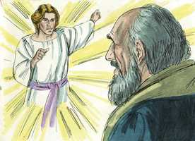
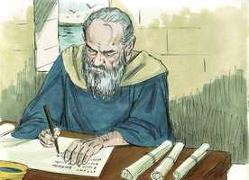

# Apocalipse Cap 01

**1** 	REVELAÇÃO de Jesus Cristo, a qual Deus lhe deu, para mostrar aos seus servos as coisas que brevemente devem acontecer; e pelo seu anjo as enviou, e as notificou a João seu servo;

 

**2** 	O qual testificou da palavra de Deus, e do testemunho de Jesus Cristo, e de tudo o que tem visto.

**3** 	Bem-aventurado aquele que lê, e os que ouvem as palavras desta profecia, e guardam as coisas que nela estão escritas; porque o tempo está próximo.

**4** 	João, às sete igrejas que estão na Ásia: Graça e paz seja convosco da parte daquele que é, e que era, e que há de vir, e da dos sete espíritos que estão diante do seu trono;

**5** 	E da parte de Jesus Cristo, que é a fiel testemunha, o primogênito dentre os mortos e o príncipe dos reis da terra. Àquele que nos amou, e em seu sangue nos lavou dos nossos pecados,

**6** 	E nos fez reis e sacerdotes para Deus e seu Pai; a ele glória e poder para todo o sempre. Amém.

**7** 	Eis que vem com as nuvens, e todo o olho o verá, até os mesmos que o traspassaram; e todas as tribos da terra se lamentarão sobre ele. Sim. Amém.

**8** 	Eu sou o Alfa e o Ômega, o princípio e o fim, diz o Senhor, que é, e que era, e que há de vir, o Todo-Poderoso.

**9** 	Eu, João, que também sou vosso irmão, e companheiro na aflição, e no reino, e paciência de Jesus Cristo, estava na ilha chamada Patmos, por causa da palavra de Deus, e pelo testemunho de Jesus Cristo.

**10** 	Eu fui arrebatado no Espírito no dia do Senhor, e ouvi detrás de mim uma grande voz, como de trombeta,

 

**11** 	Que dizia: Eu sou o Alfa e o Ômega, o primeiro e o derradeiro; e o que vês, escreve-o num livro, e envia-o às sete igrejas que estão na Ásia: a Éfeso, e a Esmirna, e a Pérgamo, e a Tiatira, e a Sardes, e a Filadélfia, e a Laodicéia.

**12** 	E virei-me para ver quem falava comigo. E, virando-me, vi sete castiçais de ouro;

**13** 	E no meio dos sete castiçais um semelhante ao Filho do homem, vestido até aos pés de uma roupa comprida, e cingido pelos peitos com um cinto de ouro.

**14** 	E a sua cabeça e cabelos eram brancos como lã branca, como a neve, e os seus olhos como chama de fogo;

**15** 	E os seus pés, semelhantes a latão reluzente, como se tivessem sido refinados numa fornalha, e a sua voz como a voz de muitas águas.

**16** 	E ele tinha na sua destra sete estrelas; e da sua boca saía uma aguda espada de dois fios; e o seu rosto era como o sol, quando na sua força resplandece.

**17** 	E eu, quando o vi, caí a seus pés como morto; e ele pôs sobre mim a sua destra, dizendo-me: Não temas; Eu sou o primeiro e o último;

**18** 	E o que vivo e fui morto, mas eis aqui estou vivo para todo o sempre. Amém. E tenho as chaves da morte e do inferno.

**19** 	Escreve as coisas que tens visto, e as que são, e as que depois destas hão de acontecer;

**20** 	O mistério das sete estrelas, que viste na minha destra, e dos sete castiçais de ouro. As sete estrelas são os anjos das sete igrejas, e os sete castiçais, que viste, são as sete igrejas.

> **Cmt MHenry** Intro: As igrejas recebem sua luz de Cristo e do evangelho, e as mostram aos outros. Elas são os candeeiros de ouro; devem ser preciosas e puras; não só os ministros, senão os membros delas; assim deve brilhar sua luz diante dos homens, como para elevar a outros a dar glória a Deus. o apóstolo viu como se o Senhor Jesus Cristo aparecesse em meio dos candeeiros de ouro. Ele sempre está com suas igrejas, até o fim do mundo, enchendo-as com luz, vida e amor. Estava vestido com um manto até os pés, talvez representando sua justiça e seu sacerdócio, como Mediador. Esta vestimenta estava cingida com um cinto de ouro, que pode denotar quão preciosos são seu amor e afeto por seu povo. sua cabeça e cabelos brancos como lã e neve podem representar sua majestade, pureza e eternidade. Seus olhos como chamas de fogo podem representar seu conhecimento dos secretos de todos os corações e dos acontecimentos mais distantes. Seus pés, como de latão reluzente que arde num forno, podem denotar a firmeza de seus desígnios e a excelência de seus procedimentos. Sua voz, como o som de muitas águas, pode representar o poder de sua palavra, para tirar ou destruir. As sete estrelas eram símbolo dos ministros das sete igrejas às quais devia escrever o apóstolo, e a quem Cristo sustentava e mandava. A espada representa sua justiça e sua palavra, que alcança até dividir alma e espírito ([Hb 4.12](../58N-Hb/04.md#12)). Seu rosto era como o sol, quando brilha clara e fortemente; sua força demasiado brilhante e cegante para que a contemplem os olhos mortais. O apóstolo estava estarrecido com a grandeza do brilho e a glória com que apareceu Cristo. nós bem podemos estar contentes com andar por fé enquanto estivermos aqui na terra. O Senhor Jesus disse palavras de consolo: Não temas. Palavras de instrução, dizendo quem era o que assim aparecia. Sua natureza divina: o Primeiro e o Último. Seus sofrimentos anteriores: estive morto; o mesmo ao qual viram na cruz seus discípulos. Sua ressurreição e vida: venci a morte e sou partícipe da vida eterna. Seu ofício e autoridade: o domínio soberano no mundo invisível e sobre ele, como o Juiz de tudo, de cuja sentença não há apelação. Escutemos a voz de Cristo e recebamos as prendas de seu amor, porque, que pode ocultar daqueles por cujos pecados morreu? Então, obedeçamos a Sua palavra e entreguemo-nos totalmente Àquele que dirige retamente todas as coisas.> " Consolo do apóstolo é que não sofreu como malfeitor, senão pelo testemunho de Jesus, por dar testemunho de Cristo como o Emmanuel, o Salvador; o Espírito de glória e de Deus repousou sobre este perseguido apóstolo. O dia e a hora desta visão foi o dia do Senhor, o dia de repouso cristão, o primeiro dia da semana, observado em memória da ressurreição de Cristo. nós, que o chamamos "nosso Senhor", devemos honrá-lo em seu próprio dia. O nome mostra como deve observar-se este dia sagrado; o dia do Senhor deve ser dedicado absolutamente ao Senhor e nenhuma de suas horas deve empregar-se em forma sensual, mundana ou em diversões.\ Ele estava em uma atitude seria, celestial, espiritual, sob a influência da graça do Espírito de Deus. Os que desejem desfrutar da comunhão com Deus no dia do Senhor, devem procurar tirar seus pensamentos e afetos das coisas terrenas. Se os crentes são impedidos de observar o dia santo do Senhor com as ordenanças públicas e a comunhão dos santos, por necessidade e não por própria opção, podem buscar consolo na mediação e nos deveres secretos da influência do Espírito; ouvindo a voz e contemplando a glória de seu amado Salvador, de cujas palavras de graça e poder não os pode separar nenhum confinamento nem circunstância externa. Se nos dá um alarme com o som da trombeta e, depois, o apóstolo ouviu a voz de Cristo. "> Não pode haver verdadeira paz onde não há verdadeira graça; aonde vai primeiro a graça, seguirá a paz. Esta bênção é no nome de Deus, da Santa Trindade, é um ato de adoração. primeiro, se menciona ao Pai, descrito como o Senhor que é, que era e que há de vir, eterno, imutável. O Espírito Santo é chamado os sete espíritos, o perfeito Espírito de , em quem há diversidade de dons e operações. O Senhor Jesus Cristo foi desde a eternidade, uma Testemunha de todos os conselhos de Deus. Ele é o Primogênito dos mortos, que por seu poder ressuscitará a seu povo. Ele é o Príncipe dos reis da terra; por Ele são ab-rogados seus conselhos e ante Ele são eles responsáveis de render contas. O pecado deixa uma mancha de culpa e contaminação na alma. nada pode tirar esta mancha, senão o sangue de Cristo, e Cristo derramou seu próprio sangue para satisfazer sem justiça divina, e comprar o perdão e a pureza para seu povo.\ Cristo tem feito dos crentes, reis e sacerdotes para Deus seu Pai. Como tais eles vencem o mundo, mortificam o pecado, governam seus próprios espíritos, resistem a Satanás, prevalecem com Deus em oração e julgarão o mundo. Ele os tem feito sacerdotes, lhes deu acesso a Deus, os capacitou para oferecer sacrifícios espirituais aceitáveis, e por estes favores eles devem dar-lhe domínio e glória para sempre.\ Ele julgará o mundo. Chama a atenção até esse grande dia em que todos veremos a sabedoria e a felicidade dos amigos de Cristo e a loucura e infelicidade de seus inimigos. Pensemos freqüentemente na segunda vinda de Cristo. Ele virá para terror dos que o ferem e crucificam de novo em sua apostasia; Ele virá para assombro de todo o mundo dos ímpios. Ele é o Princípio e o Fim; todas as coisas são dEle e para Ele; e o Todo Poderoso; o mesmo Eterno e Imutável. Se desejarmos ser contados com seus santos na glória eterna, devemos submeter-nos agora voluntariamente a Ele, recebê-lo, e honrá-lo como Salvador, a quem cremos virá a ser o nosso Juiz. Ai, que houvesse muitos que desejassem não morrer nunca, e que não houvesse um dia de juízo!> Este livro é a revelação de Jesus Cristo; toda a Bíblia o é, porque toda revelação vem por meio de Cristo e todo se relaciona com Ele. seu tema principal é expor os propósitos de Deus acerca dos assuntos da Igreja e das nações segundo se relacionam com ela, e do fim do mundo. Tudo isso acontecerá com toda certeza e começarão a ocorrer dentro de muito pouco tempo. embora Cristo mesmo é Deus e tem luz e vida em si, contudo, como Mediador entre Deus e o homem recebe instruções do Pai. A Ele devemos o conhecimento do que devemos esperar de Deus e do que Ele espera de nós. O tema desta revelação eram as coisas que deviam acontecer logo. Pronuncia-se uma bênção para todos os que lêem ou escutam as palavras desta profecia. Boa ocupação têm os que investigam a Bíblia. Não basta com ler e ouvir, senão que devemos manter em nossa memória, em nossa mente, em nossos afetos e na prática, as coisas que estão escritas, e seremos abençoados na obra. Ainda os mistérios e as dificuldades deste livro estão unidos com revelações de Deus, adequadas para imprimir na mente um temor reverente e para purificar a alma do leitor, embora possa ser que este não discirna o significado profético. Nenhuma parte da Escritura expõe mais plenamente o evangelho e adverte melhor contra o mal do pecado.