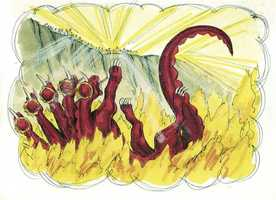

# Apocalipse Cap 19

**1** 	E, DEPOIS destas coisas ouvi no céu uma grande voz de uma grande multidão, que dizia: Aleluia! A salvação, e a glória, e a honra, e o poder pertencem ao Senhor nosso Deus;

**2** 	Porque verdadeiros e justos são os seus juízos, pois julgou a grande prostituta, que havia corrompido a terra com a sua fornicação, e das mãos dela vingou o sangue dos seus servos.

**3** 	E outra vez disseram: Aleluia! E a fumaça dela sobe para todo o sempre.

**4** 	E os vinte e quatro anciãos, e os quatro animais, prostraram-se e adoraram a Deus, que estava assentado no trono, dizendo: Amém. Aleluia!

**5** 	E saiu uma voz do trono, que dizia: Louvai o nosso Deus, vós, todos os seus servos, e vós que o temeis, assim pequenos como grandes.

**6** 	E ouvi como que a voz de uma grande multidão, e como que a voz de muitas águas, e como que a voz de grandes trovões, que dizia: Aleluia! pois já o Senhor Deus Todo-Poderoso reina.

**7** 	Regozijemo-nos, e alegremo-nos, e demos-lhe glória; porque vindas são as bodas do Cordeiro, e já a sua esposa se aprontou.

**8** 	E foi-lhe dado que se vestisse de linho fino, puro e resplandecente; porque o linho fino são as justiças dos santos.

**9** 	E disse-me: Escreve: Bem-aventurados aqueles que são chamados à ceia das bodas do Cordeiro. E disse-me: Estas são as verdadeiras palavras de Deus.

**10** 	E eu lancei-me a seus pés para o adorar; mas ele disse-me: Olha não faças tal; sou teu conservo, e de teus irmãos, que têm o testemunho de Jesus. Adora a Deus; porque o testemunho de Jesus é o espírito de profecia.

**11** 	E vi o céu aberto, e eis um cavalo branco; e o que estava assentado sobre ele chama-se Fiel e Verdadeiro; e julga e peleja com justiça.

**12** 	E os seus olhos eram como chama de fogo; e sobre a sua cabeça havia muitos diademas; e tinha um nome escrito, que ninguém sabia senão ele mesmo.

**13** 	E estava vestido de uma veste tingida em sangue; e o nome pelo qual se chama é A Palavra de Deus.

**14** 	E seguiam-no os exércitos no céu em cavalos brancos, e vestidos de linho fino, branco e puro.

**15** 	E da sua boca saía uma aguda espada, para ferir com ela as nações; e ele as regerá com vara de ferro; e ele mesmo é o que pisa o lagar do vinho do furor e da ira do Deus Todo-Poderoso.

**16** 	E no manto e na sua coxa tem escrito este nome: Rei dos reis, e Senhor dos senhores.

**17** 	E vi um anjo que estava no sol, e clamou com grande voz, dizendo a todas as aves que voavam pelo meio do céu: Vinde, e ajuntai-vos à ceia do grande Deus;

**18** 	Para que comais a carne dos reis, e a carne dos tribunos, e a carne dos fortes, e a carne dos cavalos e dos que sobre eles se assentam; e a carne de todos os homens, livres e servos, pequenos e grandes.

**19** 	E vi a besta, e os reis da terra, e os seus exércitos reunidos, para fazerem guerra àquele que estava assentado sobre o cavalo, e ao seu exército.

**20** 	E a besta foi presa, e com ela o falso profeta, que diante dela fizera os sinais, com que enganou os que receberam o sinal da besta, e adoraram a sua imagem. Estes dois foram lançados vivos no lago de fogo que arde com enxofre.

  

**21** 	E os demais foram mortos com a espada que saía da boca do que estava assentado sobre o cavalo, e todas as aves se fartaram das suas carnes.

> **Cmt MHenry** Intro: " Cristo, a Cabeça gloriosa da Igreja, se apresenta sobre um cavalo branco, o símbolo da justiça e da santidade. Tem muitas coroas, porque é o Rei de reis e o Senhor de senhores. Está vestido com uma roupagem empapada em seu próprio sangue, pelo qual comprou seu poder como Mediador; e no sangue de seus inimigos, sobre os quais sempre prevalece. Seu nome é "o Verbo de Deus", nome que ninguém conhece plenamente senão Ele mesmo; só isto sabemos nós, que este Verbo era Deus manifestado em carne; mas suas perfeições não podem ser plenamente entendidas por nenhuma criatura.\ Seguem-no anjos e santos e são como Cristo em sua armadura de pureza e justiça. Ele vai a executar as ameaças da palavra escrita em seus inimigos. As insígnias de sua autoridade são seu nome; afirma sua autoridade e poder, e adverte aos príncipes mais poderosos que se submetam ou caiam diante dEle.\ As potestades da terra e do inferno fazem seu máximo esforço. Estes versículos declaram fatos importantes anunciados pelos profetas. Estas pessoas não foram escusadas porque fizeram o que seus chefes lhes ordenaram. Quão vão será o depoimento de muitos pecadores nesse grande dia! Nós seguimos a nossos chefes! Fizemos o que vimos que faziam outros! Em sua Palavra, Deus deu uma regra para caminhar; nem o exemplo da maioria, nem o do chefe, devem mover-nos ao contrário; se fizermos como a maioria, deveremos ir para vai a maioria, o lago de fogo. "> Louvar a Deus pelo que temos é orar pelo que ainda fará por nós. Há harmonia entre os anjos e os santos neste cântico triunfal.\ Cristo é o Esposo de sua Igreja resgatada. Esta segunda união será completada no céu, mas o começo do milênio glorioso (pelo qual se significa o Reino de Cristo, ou estado de felicidade por mil anos na terra) pode ser considerado como a celebração de seus esponsais na terra. Então, a Igreja de Cristo, purificada de seus erros, divisões e corrupções de doutrina, disciplina, adoração e prática, estará preparada para ser publicamente reconhecida por Ele como sua delicia e sua amada. A Igreja apareceu, não com o vestido alegre e impudico da mãe das prostitutas, senão com linho fino, limpo e branco. São as vestes da justiça de Cristo, imputada para justificação e ministrada para santificação. As promessas do evangelho, os ditados verdadeiros de Deus, abertas, aplicadas e seladas pelo Espírito de Deus, em santas ordenanças, são seu festejo de núpcias. Isto parece referir-se à abundante graça e consolo que receberão os cristãos nos ditosos dias que devem vir.\ O apóstolo ofereceu honras ao anjo, que as recusou. Dirigiu o apóstolo ao único objeto verdadeiro de adoração religiosa: adora a Deus e somente a Ele. isto condena claramente a prática dos que adoram os elementos do pão e do vinho, e santos, e anjos, e os que não crêem que Cristo é verdadeiramente, e por natureza, Deus, mas lhe rendem uma sorte de adoração. São réus de idolatria por um mensageiro do céu. Estes são os verdadeiros ditados de Deus; do que deve ser adorado como um com o Pai e o Espírito Santo.