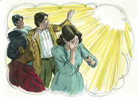
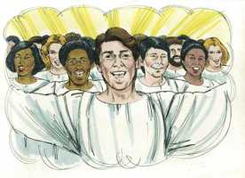
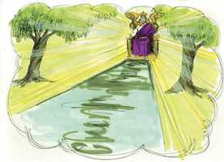
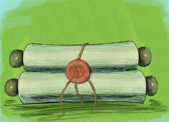

# Apocalipse Cap 21

**1** 	E VI um novo céu, e uma nova terra. Porque já o primeiro céu e a primeira terra passaram, e o mar já não existe.

**2** 	E eu, João, vi a santa cidade, a nova Jerusalém, que de Deus descia do céu, adereçada como uma esposa ataviada para o seu marido.

**3** 	E ouvi uma grande voz do céu, que dizia: Eis aqui o tabernáculo de Deus com os homens, pois com eles habitará, e eles serão o seu povo, e o mesmo Deus estará com eles, e será o seu Deus.

**4** 	E Deus limpará de seus olhos toda a lágrima; e não haverá mais morte, nem pranto, nem clamor, nem dor; porque já as primeiras coisas são passadas.

**5** 	E o que estava assentado sobre o trono disse: Eis que faço novas todas as coisas. E disse-me: Escreve; porque estas palavras são verdadeiras e fiéis.

**6** 	E disse-me mais: Está cumprido. Eu sou o Alfa e o Ômega, o princípio e o fim. A quem quer que tiver sede, de graça lhe darei da fonte da água da vida.

**7** 	Quem vencer, herdará todas as coisas; e eu serei seu Deus, e ele será meu filho.

**8** 	Mas, quanto aos tímidos, e aos incrédulos, e aos abomináveis, e aos homicidas, e aos que se prostituem, e aos feiticeiros, e aos idólatras e a todos os mentirosos, a sua parte será no lago que arde com fogo e enxofre; o que é a segunda morte.

 

**9** 	E veio a mim um dos sete anjos que tinham as sete taças cheias das últimas sete pragas, e falou comigo, dizendo: Vem, mostrar-te-ei a esposa, a mulher do Cordeiro.

 

**10** 	E levou-me em espírito a um grande e alto monte, e mostrou-me a grande cidade, a santa Jerusalém, que de Deus descia do céu.

**11** 	E tinha a glória de Deus; e a sua luz era semelhante a uma pedra preciosíssima, como a pedra de jaspe, como o cristal resplandecente.

**12** 	E tinha um grande e alto muro com doze portas, e nas portas doze anjos, e nomes escritos sobre elas, que são os nomes das doze tribos dos filhos de Israel.

**13** 	Do lado do levante tinha três portas, do lado do norte, três portas, do lado do sul, três portas, do lado do poente, três portas.

**14** 	E o muro da cidade tinha doze fundamentos, e neles os nomes dos doze apóstolos do Cordeiro.

**15** 	E aquele que falava comigo tinha uma cana de ouro, para medir a cidade, e as suas portas, e o seu muro.

**16** 	E a cidade estava situada em quadrado; e o seu comprimento era tanto como a sua largura. E mediu a cidade com a cana até doze mil estádios; e o seu comprimento, largura e altura eram iguais.

**17** 	E mediu o seu muro, de cento e quarenta e quatro côvados, conforme a medida de homem, que é a de um anjo.

**18** 	E a construção do seu muro era de jaspe, e a cidade de ouro puro, semelhante a vidro puro.

**19** 	E os fundamentos do muro da cidade estavam adornados de toda a pedra preciosa. O primeiro fundamento era jaspe; o segundo, safira; o terceiro, calcedônia; o quarto, esmeralda;

**20** 	O quinto, sardônica; o sexto, sárdio; o sétimo, crisólito; o oitavo, berilo; o nono, topázio; o décimo, crisópraso; o undécimo, jacinto; o duodécimo, ametista.

**21** 	E as doze portas eram doze pérolas; cada uma das portas era uma pérola; e a praça da cidade de ouro puro, como vidro transparente.

**22** 	E nela não vi templo, porque o seu templo é o Senhor Deus Todo-Poderoso, e o Cordeiro.

 

**23** 	E a cidade não necessita de sol nem de lua, para que nela resplandeçam, porque a glória de Deus a tem iluminado, e o Cordeiro é a sua lâmpada.

**24** 	E as nações dos salvos andarão à sua luz; e os reis da terra trarão para ela a sua glória e honra.

**25** 	E as suas portas não se fecharão de dia, porque ali não haverá noite.

**26** 	E a ela trarão a glória e honra das nações.

**27** 	E não entrará nela coisa alguma que contamine, e cometa abominação e mentira; mas só os que estão inscritos no livro da vida do Cordeiro.

 

> **Cmt MHenry** Intro: A comunhão perfeita e direta com Deus suprirá com demasia o lugar das instituições do evangelho. E que palavras podem expressar mais plenamente a união de igualdade do Filho com o Pai na Divindade? Que mundo lúgubre seria este se não fosse pela luz do sol! Que há no céu que supra seu lugar? A glória de Deus ilumina a cidade e o Cordeiro é sua Luz. Deus em Cristo será uma Fonte eterna de conhecimento e gozo para os santos do céu. Não há noite, portanto, não é necessário fechar as portas; todo está em paz e seguro. Todo nos mostra que devemos ser guiados mais e mais a pensar no céu como cheio com a glória de Deus, e iluminado pela presença do Senhor Jesus.\ Nada pecador nem imundo, idólatra ou falso e enganoso pode entrar. Todos os habitantes são aperfeiçoados em santidade. Agora os santos sentem uma triste mistura de corrupção que os estorva no serviço de Deus, e interrompe sua comunhão com Ele, mas ao entrar no Lugar Santíssimo são lavados no banho do sangue de Cristo, e são apresentados ao Pai sem mácula.\ Ninguém que opere abominações é admitido no céu. Está livre de hipócritas e de mentirosos. Como nada imundo pode entrar no céu, estimulemo-nos com estes olhares das coisas celestiais para usar toda diligência, e a perfeita santidade no temor de Deus.> Deus tem várias ocupações para seus anjos santos. Às vezes, tocam a trombeta da providência divina e advertem a um mundo indiferente; às vezes, revelam coisas de natureza celestial aos herdeiros da salvação. Os que desejam ter visões claras do céu, devem aproximar-se tanto dele como possam no monte da meditação e da fé. O tema da visão é a Igreja de Deus em perfeito estado triunfante, brilhando em seu fulgor; gloriosa com relação a Cristo, o qual mostra que a alegria do céu consiste na relação com Deus em conformidade com Ele.\ A mudança de símbolos de esposa a cidade, mostra que somente temos de fazer-nos idéias gerais desta descrição.\ A muralha é para seguridade. O céu é um estado seguro; os que ali estão, estão separados de todos os males e inimigos, e assegurados contra eles. Esta cidade é enorme; há lugar para todo o povo de Deus. o cimento do muro é a promessa e o poder de Deus, e a compra de Cristo são os fortes fundamentos da seguridade e felicidade da Igreja. Estes fundamentos estavam feitos de doze classes de pedras preciosas, o qual denota a variedade e a excelência das doutrinas do evangelho, ou das virtudes do Espírito Santo, ou as excelências pessoais do Senhor Jesus Cristo.\ O céu tem porta; há entrada livre para todos os que são santificados; eles não se verão excluídos.\ As portas são pérolas. Cristo é a Pérola de grande preço e Ele é nosso Caminho a Deus. a rua da cidade era de ouro puro, como cristal transparente. Os santos do céu pisam ouro. Os santos estão em repouso ali, mas este não é um estado de sono e ócio; eles têm comunhão não só com Deus, senão os uns com os outros. Todas estas glórias representam só muito debilmente o céu.> O novo céu e a nova terra não estarão separados entre si; a terra dos santos, seus corpos glorificados serão celestiais. O velho mundo com todos seus problemas e tribulações terá passado. Não haverá mar, o que representa adequam a liberdade das paixões contraditórias, das tentações, os problemas, as mudanças e as alarmes; de tido o que possa interromper ou dividir a comunhão dos santos. Esta nova Jerusalém é a Igreja de Deus no novo estado perfeito, a Igreja triunfante. Sua bênção vem totalmente de Deus e depende dEle.\ A presença de Deus com seu povo no céu não será interrompida como é na terra. Ele habitará com eles continuamente. Todos os efeitos de tribulações prévias serão eliminados. Eles têm chorado freqüentemente devido ao pecado, a aflição, as calamidades da Igreja, mas não restarão sinais nem lembranças das tristezas anteriores. Cristo fará novas todas as coisas. Se estivermos dispostos e desejosos de que o Redentor faça novas todas as coisas em nossos corações e natureza, Ele fará novas todas as coisas acerca de nossa situação até que nos leve a desfrutar da felicidade completa. Note-se a certeza da promessa. Deus dá todos seus títulos, Alfa e Ômega, Princípio e Fim, como sinal do cumprimento pleno. Os prazeres pecaminosos e sensuais são águas envenenadas e pantanosas; e os melhores consolos terrenos são como o escasso aprovisionamento de uma cisterna: quando se idealizam, se tornam cisternas quebradas e somente dão vexação. Porém os gozos que reparte Cristo são as águas que brotam de uma fonte, puras, refrescantes, abundantes e eternas. Os consolos santificadores do Espírito Santo nos preparam para a alegria celestial; são correntes que fluem para nós no deserto.\ Os medrosos não se atrevem a enfrentar-se com as dificuldades da religião, seu medo escravizador provém de sua incredulidade; porém os que foram tão cobardes que não se atreveram a tomar a cruz de Cristo estava, não obstante, tão desesperados que se precipitaram na maldade abominável. As agonias e os terrores da primeira morte conduzirão aos terrores e agonias muito superiores da morte eterna.