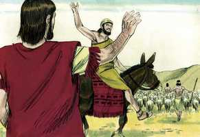

# Gênesis Capítulo 13

**1** 	SUBIU, pois, Abrão do Egito para o lado do sul, ele e sua mulher, e tudo o que tinha, e com ele Ló.

**2** 	E era Abrão muito rico em gado, em prata e em ouro.

**3** 	E fez as suas jornadas do sul até Betel, até ao lugar onde a princípio estivera a sua tenda, entre Betel e Ai;

**4** 	Até ao lugar do altar que outrora ali tinha feito; e Abrão invocou ali o nome do Senhor.

**5** 	E também Ló, que ia com Abrão, tinha rebanhos, gado e tendas.

**6** 	E não tinha capacidade a terra para poderem habitar juntos; porque os seus bens eram muitos; de maneira que não podiam habitar juntos.

**7** 	E houve contenda entre os pastores do gado de Abrão e os pastores do gado de Ló; e os cananeus e os perizeus habitavam então na terra.

 

**8** 	E disse Abrão a Ló: Ora, não haja contenda entre mim e ti, e entre os meus pastores e os teus pastores, porque somos irmãos.

**9** 	Não está toda a terra diante de ti? Eia, pois, aparta-te de mim; e se escolheres a esquerda, irei para a direita; e se a direita escolheres, eu irei para a esquerda.

**10** 	E levantou Ló os seus olhos, e viu toda a campina do Jordão, que era toda bem regada, antes do Senhor ter destruído Sodoma e Gomorra, e era como o jardim do Senhor, como a terra do Egito, quando se entra em Zoar.

 

**11** 	Então Ló escolheu para si toda a campina do Jordão, e partiu Ló para o oriente, e apartaram-se um do outro.

**12** 	Habitou Abrão na terra de Canaã e Ló habitou nas cidades da campina, e armou as suas tendas até Sodoma.

**13** 	Ora, eram maus os homens de Sodoma, e grandes pecadores contra o Senhor.

**14** 	E disse o Senhor a Abrão, depois que Ló se apartou dele: Levanta agora os teus olhos, e olha desde o lugar onde estás, para o lado do norte, e do sul, e do oriente, e do ocidente;

 

**15** 	Porque toda esta terra que vês, te hei de dar a ti, e à tua descendência, para sempre.

**16** 	E farei a tua descendência como o pó da terra; de maneira que se alguém puder contar o pó da terra, também a tua descendência será contada.

**17** 	Levanta-te, percorre essa terra, no seu comprimento e na sua largura; porque a ti a darei.

**18** 	E Abrão mudou as suas tendas, e foi, e habitou nos carvalhais de Manre, que estão junto a Hebrom; e edificou ali um altar ao Senhor.

