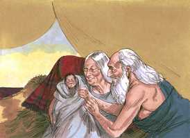

# Gênesis Capítulo 21

**1** 	E O Senhor visitou a Sara, como tinha dito; e fez o Senhor a Sara como tinha prometido.

 

**2** 	E concebeu Sara, e deu a Abraão um filho na sua velhice, ao tempo determinado, que Deus lhe tinha falado.

**3** 	E Abraão pôs no filho que lhe nascera, que Sara lhe dera, o nome de Isaque.

 

**4** 	E Abraão circuncidou o seu filho Isaque, quando era da idade de oito dias, como Deus lhe tinha ordenado.

**5** 	E era Abraão da idade de cem anos, quando lhe nasceu Isaque seu filho.

**6** 	E disse Sara: Deus me tem feito riso; todo aquele que o ouvir se rirá comigo.

**7** 	Disse mais: Quem diria a Abraão que Sara daria de mamar a filhos? Pois lhe dei um filho na sua velhice.

**8** 	E cresceu o menino, e foi desmamado; então Abraão fez um grande banquete no dia em que Isaque foi desmamado.

**9** 	E viu Sara que o filho de Agar, a egípcia, o qual tinha dado a Abraão, zombava.

**10** 	E disse a Abraão: Ponha fora esta serva e o seu filho; porque o filho desta serva não herdará com Isaque, meu filho.

**11** 	E pareceu esta palavra muito má aos olhos de Abraão, por causa de seu filho.

**12** 	Porém Deus disse a Abraão: Não te pareça mal aos teus olhos acerca do moço e acerca da tua serva; em tudo o que Sara te diz, ouve a sua voz; porque em Isaque será chamada a tua descendência.

**13** 	Mas também do filho desta serva farei uma nação, porquanto é tua descendência.

**14** 	Então se levantou Abraão pela manhã de madrugada, e tomou pão e um odre de água e os deu a Agar, pondo-os sobre o seu ombro; também lhe deu o menino e despediu-a; e ela partiu, andando errante no deserto de Berseba.

**15** 	E consumida a água do odre, lançou o menino debaixo de uma das árvores.

**16** 	E foi assentar-se em frente, afastando-se à distância de um tiro de arco; porque dizia: Que eu não veja morrer o menino. E assentou-se em frente, e levantou a sua voz, e chorou.

**17** 	E ouviu Deus a voz do menino, e bradou o anjo de Deus a Agar desde os céus, e disse-lhe: Que tens, Agar? Não temas, porque Deus ouviu a voz do menino desde o lugar onde está.

**18** 	Ergue-te, levanta o menino e pega-lhe pela mão, porque dele farei uma grande nação.

**19** 	E abriu-lhe Deus os olhos, e viu um poço de água; e foi encher o odre de água, e deu de beber ao menino.

**20** 	E era Deus com o menino, que cresceu; e habitou no deserto, e foi flecheiro.

**21** 	E habitou no deserto de Parã; e sua mãe tomou-lhe mulher da terra do Egito.

**22** 	E aconteceu naquele mesmo tempo que Abimeleque, com Ficol, príncipe do seu exército, falou com Abraão, dizendo: Deus é contigo em tudo o que fazes;

**23** 	Agora, pois, jura-me aqui por Deus, que não mentirás a mim, nem a meu filho, nem a meu neto; segundo a beneficência que te fiz, me farás a mim, e à terra onde peregrinaste.

**24** 	E disse Abraão: Eu jurarei.

**25** 	Abraão, porém, repreendeu a Abimeleque por causa de um poço de água, que os servos de Abimeleque haviam tomado à força.

**26** 	Então disse Abimeleque: Eu não sei quem fez isto; e também tu não mo fizeste saber, nem eu o ouvi senão hoje.

**27** 	E tomou Abraão ovelhas e vacas, e deu-as a Abimeleque; e fizeram ambos uma aliança.

**28** 	Pôs Abraão, porém, à parte sete cordeiras do rebanho.

**29** 	E Abimeleque disse a Abraão: Para que estão aqui estas sete cordeiras, que puseste à parte?

**30** 	E disse: Tomarás estas sete cordeiras de minha mão, para que sejam em testemunho que eu cavei este poço.

**31** 	Por isso se chamou aquele lugar Berseba, porquanto ambos juraram ali.

**32** 	Assim fizeram aliança em Berseba. Depois se levantou Abimeleque e Ficol, príncipe do seu exército, e tornaram-se para a terra dos filisteus.

**33** 	E plantou um bosque em Berseba, e invocou lá o nome do Senhor, Deus eterno.

**34** 	E peregrinou Abraão na terra dos filisteus muitos dias.

