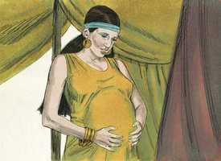
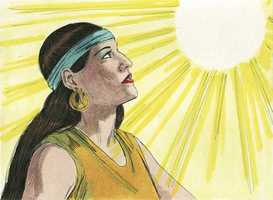
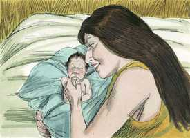
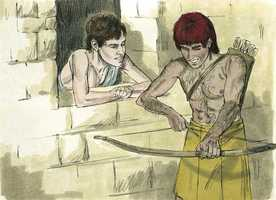
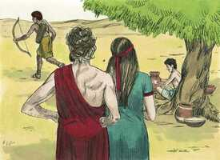
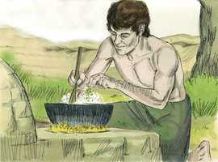
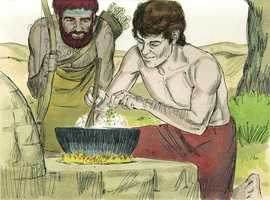
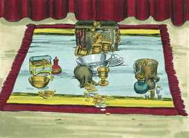

# Gênesis Capítulo 25

**1** 	E ABRAÃO tomou outra mulher; e o seu nome era Quetura;

**2** 	E deu-lhe à luz Zinrã, Jocsã, Medã, Midiã, Jisbaque e Suá.

**3** 	E Jocsã gerou Seba e Dedã; e os filhos de Dedã foram Assurim, Letusim e Leumim.

**4** 	E os filhos de Midiã foram Efá, Efer, Enoque, Abida e Elda. Estes todos foram filhos de Quetura.

**5** 	Porém Abraão deu tudo o que tinha a Isaque;

**6** 	Mas aos filhos das concubinas que Abraão tinha, deu Abraão presentes e, vivendo ele ainda, despediu-os do seu filho Isaque, enviando-os ao oriente, para a terra oriental.

**7** 	Estes, pois, são os dias dos anos da vida de Abraão, que viveu cento e setenta e cinco anos.

**8** 	E Abraão expirou, morrendo em boa velhice, velho e farto de dias; e foi congregado ao seu povo;

**9** 	E Isaque e Ismael, seus filhos, sepultaram-no na cova de Macpela, no campo de Efrom, filho de Zoar, heteu, que estava em frente de Manre,

**10** 	O campo que Abraão comprara aos filhos de Hete. Ali está sepultado Abraão e Sara, sua mulher.

**11** 	E aconteceu depois da morte de Abraão, que Deus abençoou a Isaque seu filho; e habitava Isaque junto ao poço Beer-Laai-Rói.

**12** 	Estas, porém, são as gerações de Ismael filho de Abraão, que a serva de Sara, Agar, egípcia, deu a Abraão.

**13** 	E estes são os nomes dos filhos de Ismael, pelos seus nomes, segundo as suas gerações: O primogênito de Ismael era Nebaiote, depois Quedar, Adbeel e Mibsão,

**14** 	Misma, Dumá, Massá,

**15** 	Hadade, Tema, Jetur, Nafis e Quedemá.

**16** 	Estes são os filhos de Ismael, e estes são os seus nomes pelas suas vilas e pelos seus castelos; doze príncipes segundo as suas famílias.

**17** 	E estes são os anos da vida de Ismael, cento e trinta e sete anos, e ele expirou e, morrendo, foi congregado ao seu povo.

**18** 	E habitaram desde Havilá até Sur, que está em frente do Egito, como quem vai para a Assíria; e fez o seu assento diante da face de todos os seus irmãos.

**19** 	E estas são as gerações de Isaque, filho de Abraão: Abraão gerou a Isaque;

**20** 	E era Isaque da idade de quarenta anos, quando tomou por mulher a Rebeca, filha de Betuel, arameu de Padã-Arã, irmã de Labão, arameu.

 

**21** 	E Isaque orou insistentemente ao Senhor por sua mulher, porquanto era estéril; e o Senhor ouviu as suas orações, e Rebeca sua mulher concebeu.

**22** 	E os filhos lutavam dentro dela; então disse: Se assim é, por que sou eu assim? E foi perguntar ao Senhor.

 

**23** 	E o Senhor lhe disse: Duas nações há no teu ventre, e dois povos se dividirão das tuas entranhas, e um povo será mais forte do que o outro povo, e o maior servirá ao menor.

 

**24** 	E cumprindo-se os seus dias para dar à luz, eis gêmeos no seu ventre.

 

**25** 	E saiu o primeiro ruivo e todo como um vestido de pêlo; por isso chamaram o seu nome Esaú.

**26** 	E depois saiu o seu irmão, agarrada sua mão ao calcanhar de Esaú; por isso se chamou o seu nome Jacó. E era Isaque da idade de sessenta anos quando os gerou.

 

**27** 	E cresceram os meninos, e Esaú foi homem perito na caça, homem do campo; mas Jacó era homem simples, habitando em tendas.

  

**28** 	E amava Isaque a Esaú, porque a caça era de seu gosto, mas Rebeca amava a Jacó.

 

**29** 	E Jacó cozera um guisado; e veio Esaú do campo, e estava ele cansado;

 

**30** 	E disse Esaú a Jacó: Deixa-me, peço-te, comer desse guisado vermelho, porque estou cansado. Por isso se chamou Edom.

 

**31** 	Então disse Jacó: Vende-me hoje a tua primogenitura.

 

**32** 	E disse Esaú: Eis que estou a ponto de morrer; para que me servirá a primogenitura?

  

**33** 	Então disse Jacó: Jura-me hoje. E jurou-lhe e vendeu a sua primogenitura a Jacó.

**34** 	E Jacó deu pão a Esaú e o guisado de lentilhas; e ele comeu, e bebeu, e levantou-se, e saiu. Assim desprezou Esaú a sua primogenitura.

 

