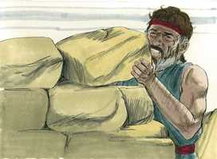
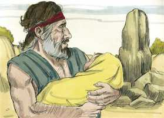
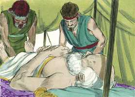

# Gênesis Capítulo 35

**1** 	DEPOIS disse Deus a Jacó: Levanta-te, sobe a Betel, e habita ali; e faze ali um altar ao Deus que te apareceu, quando fugiste da face de Esaú teu irmão.

 

**2** 	Então disse Jacó à sua família, e a todos os que com ele estavam: Tirai os deuses estranhos, que há no meio de vós, e purificai-vos, e mudai as vossas vestes.

**3** 	E levantemo-nos, e subamos a Betel; e ali farei um altar ao Deus que me respondeu no dia da minha angústia, e que foi comigo no caminho que tenho andado.

**4** 	Então deram a Jacó todos os deuses estranhos, que tinham em suas mãos, e as arrecadas que estavam em suas orelhas; e Jacó os escondeu debaixo do carvalho que está junto a Siquém.

**5** 	E partiram; e o terror de Deus foi sobre as cidades que estavam ao redor deles, e não seguiram após os filhos de Jacó.

**6** 	Assim chegou Jacó a Luz, que está na terra de Canaã (esta é Betel), ele e todo o povo que com ele havia.

**7** 	E edificou ali um altar, e chamou aquele lugar El-Betel; porquanto Deus ali se lhe tinha manifestado, quando fugia da face de seu irmão.

**8** 	E morreu Débora, a ama de Rebeca, e foi sepultada ao pé de Betel, debaixo do carvalho cujo nome chamou Alom-Bacute.

**9** 	E apareceu Deus outra vez a Jacó, vindo de Padã-Arã, e abençoou-o.

**10** 	E disse-lhe Deus: O teu nome é Jacó; não te chamarás mais Jacó, mas Israel será o teu nome. E chamou-lhe Israel.

**11** 	Disse-lhe mais Deus: Eu sou o Deus Todo-Poderoso; frutifica e multiplica-te; uma nação, sim, uma multidão de nações sairá de ti, e reis procederão dos teus lombos;

**12** 	E te darei a ti a terra que tenho dado a Abraão e a Isaque, e à tua descendência depois de ti darei a terra.

**13** 	E Deus subiu dele, do lugar onde falara com ele.

**14** 	E Jacó pôs uma coluna no lugar onde falara com ele, uma coluna de pedra; e derramou sobre ela uma libação, e deitou sobre ela azeite.

**15** 	E chamou Jacó aquele lugar, onde Deus falara com ele, Betel.

**16** 	E partiram de Betel; e havia ainda um pequeno espaço de terra para chegar a Efrata, e deu à luz Raquel, e ela teve trabalho em seu parto.

**17** 	E aconteceu que, tendo ela trabalho em seu parto, lhe disse a parteira: Não temas, porque também este filho terás.

**18** 	E aconteceu que, saindo-se-lhe a alma (porque morreu), chamou-lhe Benoni; mas seu pai chamou-lhe Benjamim.

**19** 	Assim morreu Raquel, e foi sepultada no caminho de Efrata; que é Belém.

 

**20** 	E Jacó pôs uma coluna sobre a sua sepultura; esta é a coluna da sepultura de Raquel até o dia de hoje.

**21** 	Então partiu Israel, e estendeu a sua tenda além de Migdal Eder.

**22** 	E aconteceu que, habitando Israel naquela terra, foi Rúben e deitou-se com Bila, concubina de seu pai; e Israel o soube. E eram doze os filhos de Jacó.

**23** 	Os filhos de Lia: Rúben, o primogênito de Jacó, depois Simeão e Levi, e Judá, e Issacar e Zebulom;

**24** 	Os filhos de Raquel: José e Benjamim;

**25** 	E os filhos de Bila, serva de Raquel: Dã e Naftali;

**26** 	E os filhos de Zilpa, serva de Lia: Gade e Aser. Estes são os filhos de Jacó, que lhe nasceram em Padã-Arã.

**27** 	E Jacó veio a seu pai Isaque, a Manre, a Quiriate-Arba (que é Hebrom), onde peregrinaram Abraão e Isaque.

**28** 	E foram os dias de Isaque cento e oitenta anos.

**29** 	E Isaque expirou, e morreu, e foi recolhido ao seu povo, velho e farto de dias; e Esaú e Jacó, seus filhos, o sepultaram.

 

