# Gênesis Capítulo 37

**1** 	E JACÓ habitou na terra das peregrinações de seu pai, na terra de Canaã.

**2** 	Estas são as gerações de Jacó. Sendo José de dezessete anos, apascentava as ovelhas com seus irmãos; sendo ainda jovem, andava com os filhos de Bila, e com os filhos de Zilpa, mulheres de seu pai; e José trazia más notícias deles a seu pai.

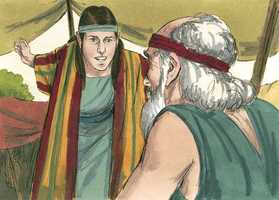 

**3** 	E Israel amava a José mais do que a todos os seus filhos, porque era filho da sua velhice; e fez-lhe uma túnica de várias cores.

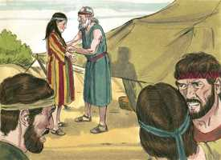 

**4** 	Vendo, pois, seus irmãos que seu pai o amava mais do que a todos eles, odiaram-no, e não podiam falar com ele pacificamente.

**5** 	Teve José um sonho, que contou a seus irmãos; por isso o odiaram ainda mais.

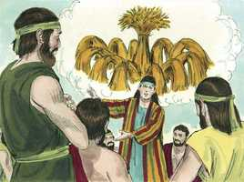 

**6** 	E disse-lhes: Ouvi, peço-vos, este sonho, que tenho sonhado:

**7** 	Eis que estávamos atando molhos no meio do campo, e eis que o meu molho se levantava, e também ficava em pé, e eis que os vossos molhos o rodeavam, e se inclinavam ao meu molho.

**8** 	Então lhe disseram seus irmãos: Tu, pois, deveras reinarás sobre nós? Tu deveras terás domínio sobre nós? Por isso ainda mais o odiavam por seus sonhos e por suas palavras.

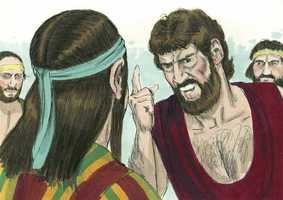 

**9** 	E teve José outro sonho, e o contou a seus irmãos, e disse: Eis que tive ainda outro sonho; e eis que o sol, e a lua, e onze estrelas se inclinavam a mim.

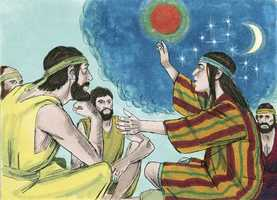 

**10** 	E contando-o a seu pai e a seus irmãos, repreendeu-o seu pai, e disse-lhe: Que sonho é este que tiveste? Porventura viremos, eu e tua mãe, e teus irmãos, a inclinar-nos perante ti em terra?

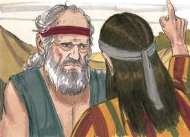 

**11** 	Seus irmãos, pois, o invejavam; seu pai porém guardava este negócio no seu coração.

 

**12** 	E seus irmãos foram apascentar o rebanho de seu pai, junto de Siquém.

 

**13** 	Disse, pois, Israel a José: Não apascentam os teus irmãos junto de Siquém? Vem, e enviar-te-ei a eles. E ele respondeu: Eis-me aqui.

**14** 	E ele lhe disse: Ora vai, vê como estão teus irmãos, e como está o rebanho, e traze-me resposta. Assim o enviou do vale de Hebrom, e foi a Siquém.

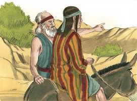 

**15** 	E achou-o um homem, porque eis que andava errante pelo campo, e perguntou-lhe o homem, dizendo: Que procuras?

**16** 	E ele disse: Procuro meus irmãos; dize-me, peço-te, onde eles apascentam.

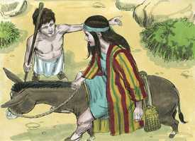 

**17** 	E disse aquele homem: Foram-se daqui; porque ouvi-os dizer: Vamos a Dotã. José, pois, seguiu atrás de seus irmãos, e achou-os em Dotã.

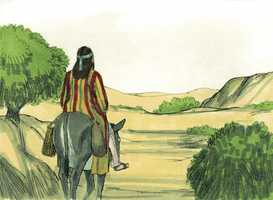 

**18** 	E viram-no de longe e, antes que chegasse a eles, conspiraram contra ele para o matarem.

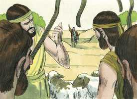 

**19** 	E disseram um ao outro: Eis lá vem o sonhador-mor!

 

**20** 	Vinde, pois, agora, e matemo-lo, e lancemo-lo numa destas covas, e diremos: Uma fera o comeu; e veremos que será dos seus sonhos.

**21** 	E ouvindo-o Rúben, livrou-o das suas mãos, e disse: Não lhe tiremos a vida.

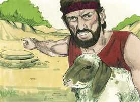 

**22** 	Também lhes disse Rúben: Não derrameis sangue; lançai-o nesta cova, que está no deserto, e não lanceis mãos nele; isto disse para livrá-lo das mãos deles e para torná-lo a seu pai.

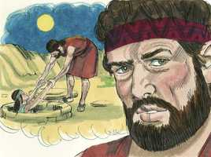 

**23** 	E aconteceu que, chegando José a seus irmãos, tiraram de José a sua túnica, a túnica de várias cores, que trazia.

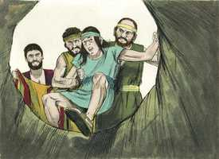 

**24** 	E tomaram-no, e lançaram-no na cova; porém a cova estava vazia, não havia água nela.

**25** 	Depois assentaram-se a comer pão; e levantaram os seus olhos, e olharam, e eis que uma companhia de ismaelitas vinha de Gileade; e seus camelos traziam especiarias e bálsamo e mirra, e iam levá-los ao Egito.

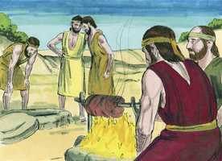 

**26** 	Então Judá disse aos seus irmãos: Que proveito haverá que matemos a nosso irmão e escondamos o seu sangue?

**27** 	Vinde e vendamo-lo a estes ismaelitas, e não seja nossa mão sobre ele; porque ele é nosso irmão, nossa carne. E seus irmãos obedeceram.

 

**28** 	Passando, pois, os mercadores midianitas, tiraram e alçaram a José da cova, e venderam José por vinte moedas de prata, aos ismaelitas, os quais levaram José ao Egito.

**29** 	Voltando, pois, Rúben à cova, eis que José não estava na cova; então rasgou as suas vestes.

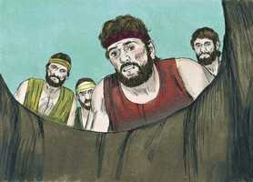 

**30** 	E voltou a seus irmãos e disse: O menino não está; e eu aonde irei?

**31** 	Então tomaram a túnica de José, e mataram um cabrito, e tingiram a túnica no sangue.

**32** 	E enviaram a túnica de várias cores, mandando levá-la a seu pai, e disseram: Temos achado esta túnica; conhece agora se esta será ou não a túnica de teu filho.

**33** 	E conheceu-a, e disse: É a túnica de meu filho; uma fera o comeu; certamente José foi despedaçado.

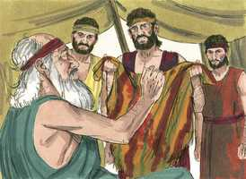 

**34** 	Então Jacó rasgou as suas vestes, pôs saco sobre os seus lombos e lamentou a seu filho muitos dias.

 

**35** 	E levantaram-se todos os seus filhos e todas as suas filhas, para o consolarem; recusou porém ser consolado, e disse: Porquanto com choro hei de descer ao meu filho até à sepultura. Assim o chorou seu pai.

**36** 	E os midianitas venderam-no no Egito a Potifar, oficial de Faraó, capitão da guarda.

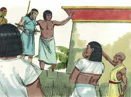 

