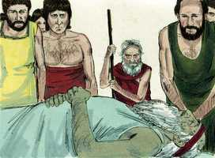

# Gênesis Capítulo 5

**1** 	ESTE é o livro das gerações de Adão. No dia em que Deus criou o homem, à semelhança de Deus o fez.

**2** 	Homem e mulher os criou; e os abençoou e chamou o seu nome Adão, no dia em que foram criados.

**3** 	E Adão viveu cento e trinta anos, e gerou um filho à sua semelhança, conforme a sua imagem, e pôs-lhe o nome de Sete.

**4** 	E foram os dias de Adão, depois que gerou a Sete, oitocentos anos, e gerou filhos e filhas.

**5** 	E foram todos os dias que Adão viveu, novecentos e trinta anos, e morreu.

 

**6** 	E viveu Sete cento e cinco anos, e gerou a Enos.

**7** 	E viveu Sete, depois que gerou a Enos, oitocentos e sete anos, e gerou filhos e filhas.

**8** 	E foram todos os dias de Sete novecentos e doze anos, e morreu.

**9** 	E viveu Enos noventa anos, e gerou a Cainã.

**10** 	E viveu Enos, depois que gerou a Cainã, oitocentos e quinze anos, e gerou filhos e filhas.

**11** 	E foram todos os dias de Enos novecentos e cinco anos, e morreu.

**12** 	E viveu Cainã setenta anos, e gerou a Maalalel.

**13** 	E viveu Cainã, depois que gerou a Maalalel, oitocentos e quarenta anos, e gerou filhos e filhas.

**14** 	E foram todos os dias de Cainã novecentos e dez anos, e morreu.

**15** 	E viveu Maalalel sessenta e cinco anos, e gerou a Jerede.

**16** 	E viveu Maalalel, depois que gerou a Jerede, oitocentos e trinta anos, e gerou filhos e filhas.

**17** 	E foram todos os dias de Maalalel oitocentos e noventa e cinco anos, e morreu.

**18** 	E viveu Jerede cento e sessenta e dois anos, e gerou a Enoque.

**19** 	E viveu Jerede, depois que gerou a Enoque, oitocentos anos, e gerou filhos e filhas.

**20** 	E foram todos os dias de Jerede novecentos e sessenta e dois anos, e morreu.

**21** 	E viveu Enoque sessenta e cinco anos, e gerou a Matusalém.

**22** 	E andou Enoque com Deus, depois que gerou a Matusalém, trezentos anos, e gerou filhos e filhas.

**23** 	E foram todos os dias de Enoque trezentos e sessenta e cinco anos.

**24** 	E andou Enoque com Deus; e não apareceu mais, porquanto Deus para si o tomou.

**25** 	E viveu Matusalém cento e oitenta e sete anos, e gerou a Lameque.

**26** 	E viveu Matusalém, depois que gerou a Lameque, setecentos e oitenta e dois anos, e gerou filhos e filhas.

**27** 	E foram todos os dias de Matusalém novecentos e sessenta e nove anos, e morreu.

**28** 	E viveu Lameque cento e oitenta e dois anos, e gerou um filho,

**29** 	A quem chamou Noé, dizendo: Este nos consolará acerca de nossas obras e do trabalho de nossas mãos, por causa da terra que o Senhor amaldiçoou.

**30** 	E viveu Lameque, depois que gerou a Noé, quinhentos e noventa e cinco anos, e gerou filhos e filhas.

**31** 	E foram todos os dias de Lameque setecentos e setenta e sete anos, e morreu.

**32** 	E era Noé da idade de quinhentos anos, e gerou Noé a Sem, Cão e Jafé.

