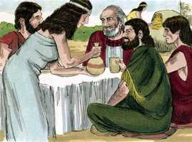
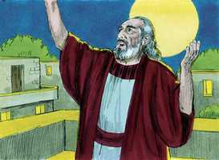
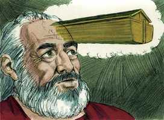
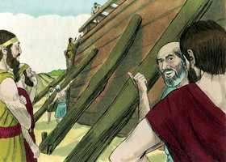
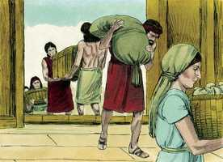

# Gênesis Capítulo 6

**1** 	E ACONTECEU que, como os homens começaram a multiplicar-se sobre a face da terra, e lhes nasceram filhas,

**2** 	Viram os filhos de Deus que as filhas dos homens eram formosas; e tomaram para si mulheres de todas as que escolheram.

 

**3** 	Então disse o Senhor: Não contenderá o meu Espírito para sempre com o homem; porque ele também é carne; porém os seus dias serão cento e vinte anos.

**4** 	Havia naqueles dias gigantes na terra; e também depois, quando os filhos de Deus entraram às filhas dos homens e delas geraram filhos; estes eram os valentes que houve na antiguidade, os homens de fama.

**5** 	E viu o Senhor que a maldade do homem se multiplicara sobre a terra e que toda a imaginação dos pensamentos de seu coração era só má continuamente.

  

**6** 	Então arrependeu-se o Senhor de haver feito o homem sobre a terra e pesou-lhe em seu coração.

**7** 	E disse o Senhor: Destruirei o homem que criei de sobre a face da terra, desde o homem até ao animal, até ao réptil, e até à ave dos céus; porque me arrependo de os haver feito.

**8** 	Noé, porém, achou graça aos olhos do Senhor.

**9** 	Estas são as gerações de Noé. Noé era homem justo e perfeito em suas gerações; Noé andava com Deus.

 

**10** 	E gerou Noé três filhos: Sem, Cão e Jafé.

**11** 	A terra, porém, estava corrompida diante da face de Deus; e encheu-se a terra de violência.

**12** 	E viu Deus a terra, e eis que estava corrompida; porque toda a carne havia corrompido o seu caminho sobre a terra.

**13** 	Então disse Deus a Noé: O fim de toda a carne é vindo perante a minha face; porque a terra está cheia de violência; e eis que os desfarei com a terra.

 

**14** 	Faze para ti uma arca da madeira de gofer; farás compartimentos na arca e a betumarás por dentro e por fora com betume.

  

**15** 	E desta maneira a farás: De trezentos côvados o comprimento da arca, e de cinqüenta côvados a sua largura, e de trinta côvados a sua altura.

**16** 	Farás na arca uma janela, e de um côvado a acabarás em cima; e a porta da arca porás ao seu lado; far-lhe-ás andares, baixo, segundo e terceiro.

**17** 	Porque eis que eu trago um dilúvio de águas sobre a terra, para desfazer toda a carne em que há espírito de vida debaixo dos céus; tudo o que há na terra expirará.

**18** 	Mas contigo estabelecerei a minha aliança; e entrarás na arca, tu e os teus filhos, tua mulher e as mulheres de teus filhos contigo.

**19** 	E de tudo o que vive, de toda a carne, dois de cada espécie, farás entrar na arca, para os conservar vivos contigo; macho e fêmea serão.

 

**20** 	Das aves conforme a sua espécie, e dos animais conforme a sua espécie, de todo o réptil da terra conforme a sua espécie, dois de cada espécie virão a ti, para os conservar em vida.

**21** 	E leva contigo de toda a comida que se come e ajunta-a para ti; e te será para mantimento, a ti e a eles.

 

**22** 	Assim fez Noé; conforme a tudo o que Deus lhe mandou, assim o fez.

