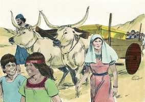
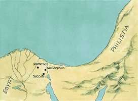

# Êxodo Capítulo 13

**1** 	ENTÃO falou o Senhor a Moisés, dizendo:

**2** 	Santifica-me todo o primogênito, o que abrir toda a madre entre os filhos de Israel, de homens e de animais; porque meu é.

**3** 	E Moisés disse ao povo: Lembrai-vos deste mesmo dia, em que saístes do Egito, da casa da servidão; pois com mão forte o Senhor vos tirou daqui; portanto não comereis pão levedado.

 

**4** 	Hoje, no mês de Abibe, vós saís.

**5** 	E acontecerá que, quando o Senhor te houver introduzido na terra dos cananeus, e dos heteus, e dos amorreus, e dos heveus, e dos jebuseus, a qual jurou a teus pais que te daria, terra que mana leite e mel, guardarás este culto neste mês.

**6** 	Sete dias comerás pães ázimos, e ao sétimo dia haverá festa ao Senhor.

**7** 	Sete dias se comerá pães ázimos, e o levedado não se verá contigo, nem ainda fermento será visto em todos os teus termos.

**8** 	E naquele mesmo dia farás saber a teu filho, dizendo: Isto é pelo que o Senhor me tem feito, quando eu saí do Egito.

**9** 	E te será por sinal sobre tua mão e por lembrança entre teus olhos, para que a lei do Senhor esteja em tua boca; porquanto com mão forte o Senhor te tirou do Egito.

**10** 	Portanto tu guardarás este estatuto a seu tempo, de ano em ano.

**11** 	Também acontecerá que, quando o Senhor te houver introduzido na terra dos cananeus, como jurou a ti e a teus pais, quando ta houver dado,

**12** 	Separarás para o Senhor tudo o que abrir a madre e todo o primogênito dos animais que tiveres; os machos serão do Senhor.

**13** 	Porém, todo o primogênito da jumenta resgatarás com um cordeiro; e se o não resgatares, cortar-lhe-ás a cabeça; mas todo o primogênito do homem, entre teus filhos, resgatarás.

**14** 	E quando teu filho te perguntar no futuro, dizendo: Que é isto? Dir-lhe-ás: O Senhor nos tirou com mão forte do Egito, da casa da servidão.

**15** 	Porque sucedeu que, endurecendo-se Faraó, para não nos deixar ir, o Senhor matou todos os primogênitos na terra do Egito, desde o primogênito do homem até o primogênito dos animais; por isso eu sacrifico ao Senhor todos os primogênitos, sendo machos; porém a todo o primogênito de meus filhos eu resgato.

**16** 	E será isso por sinal sobre tua mão, e por frontais entre os teus olhos; porque o Senhor, com mão forte, nos tirou do Egito.

**17** 	E aconteceu que, quando Faraó deixou ir o povo, Deus não os levou pelo caminho da terra dos filisteus, que estava mais perto; porque Deus disse: Para que porventura o povo não se arrependa, vendo a guerra, e volte ao Egito.

 

**18** 	Mas Deus fez o povo rodear pelo caminho do deserto do Mar Vermelho; e armados, os filhos de Israel subiram da terra do Egito.

**19** 	E Moisés levou consigo os ossos de José, porquanto havia este solenemente ajuramentado os filhos de Israel, dizendo: Certamente Deus vos visitará; fazei, pois, subir daqui os meus ossos convosco.

**20** 	Assim partiram de Sucote, e acamparam-se em Etã, à entrada do deserto.

**21** 	E o Senhor ia adiante deles, de dia numa coluna de nuvem para os guiar pelo caminho, e de noite numa coluna de fogo para os iluminar, para que caminhassem de dia e de noite.

 

**22** 	Nunca tirou de diante do povo a coluna de nuvem, de dia, nem a coluna de fogo, de noite.

