# Êxodo Capítulo 2

**1** 	E FOI um homem da casa de Levi e casou com uma filha de Levi.

**2** 	E a mulher concebeu e deu à luz um filho; e, vendo que ele era formoso, escondeu-o três meses.

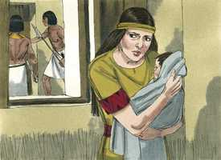 

**3** 	Não podendo, porém, mais escondê-lo, tomou uma arca de juncos, e a revestiu com barro e betume; e, pondo nela o menino, a pôs nos juncos à margem do rio.

 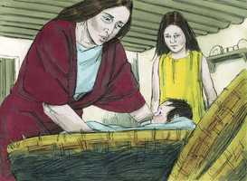 

**4** 	E sua irmã postou-se de longe, para saber o que lhe havia de acontecer.

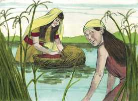 

**5** 	E a filha de Faraó desceu a lavar-se no rio, e as suas donzelas passeavam, pela margem do rio; e ela viu a arca no meio dos juncos, e enviou a sua criada, que a tomou.

 

**6** 	E abrindo-a, viu ao menino e eis que o menino chorava; e moveu-se de compaixão dele, e disse: Dos meninos dos hebreus é este.

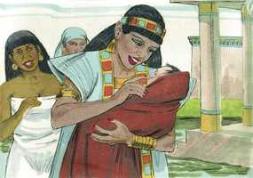 

**7** 	Então disse sua irmã à filha de Faraó: Irei chamar uma ama das hebréias, que crie este menino para ti?

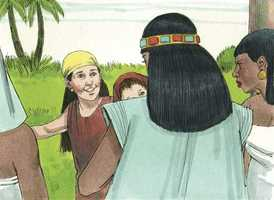 

**8** 	E a filha de Faraó disse-lhe: Vai. Foi, pois, a moça, e chamou a mãe do menino.

**9** 	Então lhe disse a filha de Faraó: Leva este menino, e cria-mo; eu te darei teu salário. E a mulher tomou o menino, e criou-o.

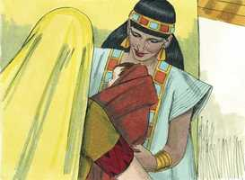 

**10** 	E, quando o menino já era grande, ela o trouxe à filha de Faraó, a qual o adotou; e chamou-lhe Moisés, e disse: Porque das águas o tenho tirado.

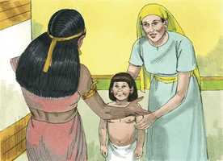 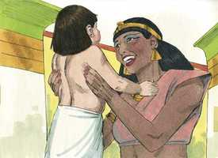 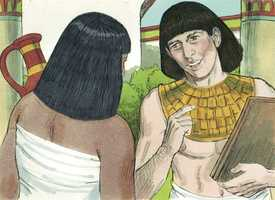 

**11** 	E aconteceu naqueles dias que, sendo Moisés já homem, saiu a seus irmãos, e atentou para as suas cargas; e viu que um egípcio feria a um hebreu, homem de seus irmãos.

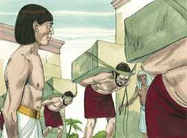 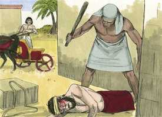 

**12** 	E olhou a um e a outro lado e, vendo que não havia ninguém ali, matou ao egípcio, e escondeu-o na areia.

 

**13** 	E tornou a sair no dia seguinte, e eis que dois homens hebreus contendiam; e disse ao injusto: Por que feres a teu próximo?

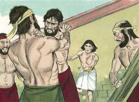 

**14** 	O qual disse: Quem te tem posto a ti por maioral e juiz sobre nós? Pensas matar-me, como mataste o egípcio? Então temeu Moisés, e disse: Certamente este negócio foi descoberto.

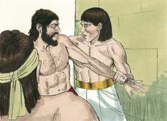 

**15** 	Ouvindo, pois, Faraó este caso, procurou matar a Moisés; mas Moisés fugiu de diante da face de Faraó, e habitou na terra de Midiã, e assentou-se junto a um poço.

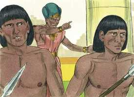 

**16** 	E o sacerdote de Midiã tinha sete filhas, as quais vieram tirar água, e encheram os bebedouros, para dar de beber ao rebanho de seu pai.

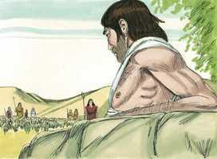 

**17** 	Então vieram os pastores, e expulsaram-nas dali; Moisés, porém, levantou-se e defendeu-as, e deu de beber ao rebanho.

 

**18** 	E voltando elas a Reuel seu pai, ele disse: Por que hoje tornastes tão depressa?

**19** 	E elas disseram: Um homem egípcio nos livrou da mão dos pastores; e também nos tirou água em abundância, e deu de beber ao rebanho.

 

**20** 	E disse a suas filhas: E onde está ele? Por que deixastes o homem? Chamai-o para que coma pão.

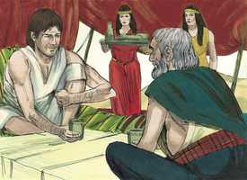 

**21** 	E Moisés consentiu em morar com aquele homem; e ele deu a Moisés sua filha Zípora,

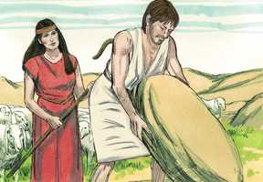 

**22** 	A qual deu à luz um filho, a quem ele chamou Gérson, porque disse: Peregrino fui em terra estranha.

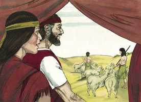 

**23** 	E aconteceu, depois de muitos dias, que morrendo o rei do Egito, os filhos de Israel suspiraram por causa da servidão, e clamaram; e o seu clamor subiu a Deus por causa de sua servidão.

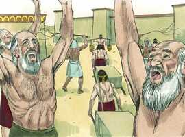 

**24** 	E ouviu Deus o seu gemido, e lembrou-se Deus da sua aliança com Abraão, com Isaque, e com Jacó;

 

**25** 	E viu Deus os filhos de Israel, e atentou Deus para a sua condição.

