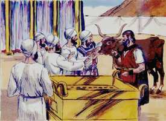
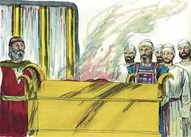
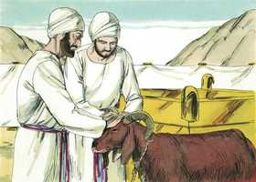
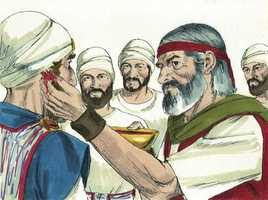
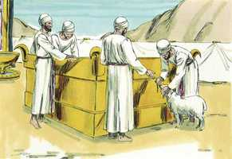
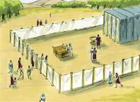

# Êxodo Capítulo 29

**1** 	ISTO é o que lhes hás de fazer, para os santificar, para que me administrem o sacerdócio: Toma um novilho e dois carneiros sem mácula,

**2** 	E pão ázimo, e bolos ázimos, amassados com azeite, e coscorões ázimos, untados com azeite; com flor de farinha de trigo os farás,

**3** 	E os porás num cesto, e os trarás no cesto, com o novilho e os dois carneiros.

**4** 	Então farás chegar a Arão e a seus filhos à porta da tenda da congregação, e os lavarás com água;

**5** 	Depois tomarás as vestes, e vestirás a Arão da túnica e do manto do éfode, e do éfode, e do peitoral; e o cingirás com o cinto de obra de artífice do éfode.

**6** 	E a mitra porás sobre a sua cabeça; a coroa da santidade porás sobre a mitra.

**7** 	E tomarás o azeite da unção, e o derramarás sobre a sua cabeça; assim o ungirás.

**8** 	Depois farás chegar seus filhos, e lhes farás vestir túnicas.

**9** 	E os cingirás com o cinto, a Arão e a seus filhos, e lhes atarás as tiaras, para que tenham o sacerdócio por estatuto perpétuo, e consagrarás a Arão e a seus filhos;

**10** 	E farás chegar o novilho diante da tenda da congregação, e Arão e seus filhos porão as suas mãos sobre a cabeça do novilho;

 

**11** 	E imolarás o novilho perante o Senhor, à porta da tenda da congregação.

**12** 	Depois tomarás do sangue do novilho, e o porás com o teu dedo sobre as pontas do altar, e todo o sangue restante derramarás à base do altar.

**13** 	Também tomarás toda a gordura que cobre as entranhas, e o redenho de sobre o fígado, e ambos os rins, e a gordura que houver neles, e queimá-los-ás sobre o altar;

**14** 	Mas a carne do novilho, e a sua pele, e o seu esterco queimarás com fogo fora do arraial; é sacrifício pelo pecado.

**15** 	Depois tomarás um carneiro, e Arão e seus filhos porão as suas mãos sobre a cabeça do carneiro,

 

**16** 	E imolarás o carneiro, e tomarás o seu sangue, e o espalharás sobre o altar ao redor;

**17** 	E partirás o carneiro por suas partes, e lavarás as suas entranhas e as suas pernas, e as porás sobre as suas partes e sobre a sua cabeça.

**18** 	Assim queimarás todo o carneiro sobre o altar; é um holocausto para o Senhor, cheiro suave; uma oferta queimada ao Senhor.

**19** 	Depois tomarás o outro carneiro, e Arão e seus filhos porão as suas mãos sobre a sua cabeça;

 

**20** 	E imolarás o carneiro e tomarás do seu sangue, e o porás sobre a ponta da orelha direita de Arão, e sobre as pontas das orelhas direitas de seus filhos, como também sobre os dedos polegares das suas mãos direitas, e sobre os dedos polegares dos seus pés direitos; e o restante do sangue espalharás sobre o altar ao redor;

 

**21** 	Então tomarás do sangue, que estará sobre o altar, e do azeite da unção, e o espargirás sobre Arão e sobre as suas vestes, e sobre seus filhos, e sobre as vestes de seus filhos com ele; para que ele seja santificado, e as suas vestes, também seus filhos, e as vestes de seus filhos com ele.

**22** 	Depois tomarás do carneiro a gordura, e a cauda, e a gordura que cobre as entranhas, e o redenho do fígado, e ambos os rins com a gordura que houver neles, e o ombro direito, porque é carneiro das consagrações;

**23** 	E um pão, e um bolo de pão azeitado, e um coscorão do cesto dos pães ázimos que estão diante do Senhor.

**24** 	E tudo porás nas mãos de Arão, e nas mãos de seus filhos; e com movimento oferecerás perante o Senhor.

**25** 	Depois o tomarás das suas mãos e o queimarás no altar sobre o holocausto por cheiro suave perante o Senhor; é oferta queimada ao Senhor.

**26** 	E tomarás o peito do carneiro das consagrações, que é de Arão, e com movimento oferecerás perante o Senhor; e isto será a tua porção.

**27** 	E santificarás o peito da oferta de movimento e o ombro da oferta alçada, que foi movido e alçado do carneiro das consagrações, que for de Arão e de seus filhos.

**28** 	E será para Arão e para seus filhos por estatuto perpétuo dos filhos de Israel, porque é oferta alçada; e a oferta alçada será dos filhos de Israel, dos seus sacrifícios pacíficos; a sua oferta alçada será para o Senhor.

**29** 	E as vestes sagradas, que são de Arão, serão de seus filhos depois dele, para serem ungidos com elas para serem consagrados com elas.

**30** 	Sete dias as vestirá aquele que de seus filhos for sacerdote em seu lugar, quando entrar na tenda da congregação para ministrar no santuário.

**31** 	E tomarás o carneiro das consagrações e cozerás a sua carne no lugar santo;

**32** 	E Arão e seus filhos comerão a carne deste carneiro, e o pão que está no cesto, à porta da tenda da congregação.

**33** 	E comerão as coisas com que for feita expiação, para consagrá-los, e para santificá-los; mas o estranho delas não comerá, porque são santas.

**34** 	E se sobejar alguma coisa da carne das consagrações ou do pão até pela manhã, o que sobejar queimarás com fogo; não se comerá, porque é santo.

**35** 	Assim, pois, farás a Arão e a seus filhos conforme a tudo o que eu te tenho ordenado; por sete dias os consagrarás.

**36** 	Também cada dia prepararás um novilho por sacrifício pelo pecado para as expiações, e purificarás o altar, fazendo expiação sobre ele; e o ungirás para santificá-lo.

**37** 	Sete dias farás expiação pelo altar, e o santificarás; e o altar será santíssimo; tudo o que tocar o altar será santo.

**38** 	Isto, pois, é o que oferecereis sobre o altar: dois cordeiros de um ano, cada dia, continuamente.

 

**39** 	Um cordeiro oferecerás pela manhã, e o outro cordeiro oferecerás à tarde.

**40** 	Com um cordeiro a décima parte de flor de farinha, misturada com a quarta parte de um him de azeite batido, e para libação a quarta parte de um him de vinho,

**41** 	E o outro cordeiro oferecerás à tarde, e com ele farás como com a oferta da manhã, e conforme à sua libação, por cheiro suave; oferta queimada é ao Senhor.

**42** 	Este será o holocausto contínuo por vossas gerações, à porta da tenda da congregação, perante o Senhor, onde vos encontrarei, para falar contigo ali.

**43** 	E ali virei aos filhos de Israel, para que por minha glória sejam santificados.

**44** 	E santificarei a tenda da congregação e o altar; também santificarei a Arão e seus filhos, para que me administrem o sacerdócio.

 

**45** 	E habitarei no meio dos filhos de Israel, e lhes serei o seu Deus,

**46** 	E saberão que eu sou o Senhor seu Deus, que os tenho tirado da terra do Egito, para habitar no meio deles. Eu sou o Senhor seu Deus.

