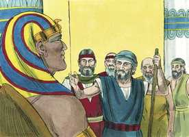
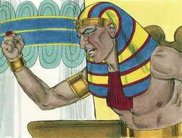
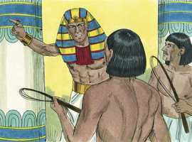
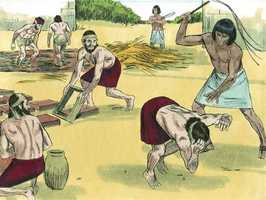
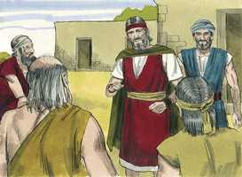
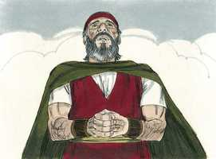

# Êxodo Capítulo 5

**1** 	E DEPOIS foram Moisés e Arão e disseram a Faraó: Assim diz o Senhor Deus de Israel: Deixa ir o meu povo, para que me celebre uma festa no deserto.

 

**2** 	Mas Faraó disse: Quem é o Senhor, cuja voz eu ouvirei, para deixar ir Israel? Não conheço o Senhor, nem tampouco deixarei ir Israel.

 

**3** 	E eles disseram: O Deus dos hebreus nos encontrou; portanto deixa-nos agora ir caminho de três dias ao deserto, para que ofereçamos sacrifícios ao Senhor nosso Deus, e ele não venha sobre nós com pestilência ou com espada.

**4** 	Então disse-lhes o rei do Egito: Moisés e Arão, por que fazeis cessar o povo das suas obras? Ide às vossas cargas.

 

**5** 	E disse também Faraó: Eis que o povo da terra já é muito, e vós os fazeis abandonar as suas cargas.

**6** 	Portanto deu ordem Faraó, naquele mesmo dia, aos exatores do povo, e aos seus oficiais, dizendo:

 

**7** 	Daqui em diante não torneis a dar palha ao povo, para fazer tijolos, como fizestes antes: vão eles mesmos, e colham palha para si.

**8** 	E lhes imporeis a conta dos tijolos que fizeram antes; nada diminuireis dela, porque eles estão ociosos; por isso clamam, dizendo: Vamos, sacrifiquemos ao nosso Deus.

**9** 	Agrave-se o serviço sobre estes homens, para que se ocupem nele e não confiem em palavras mentirosas.

**10** 	Então saíram os exatores do povo, e seus oficiais, e falaram ao povo, dizendo: Assim diz Faraó: Eu não vos darei palha;

**11** 	Ide vós mesmos, e tomai vós palha onde a achardes; porque nada se diminuirá de vosso serviço.

**12** 	Então o povo se espalhou por toda a terra do Egito, a colher restolho em lugar de palha.

**13** 	E os exatores os apertavam, dizendo: Acabai vossa obra, a tarefa de cada dia, como quando havia palha.

**14** 	E foram açoitados os oficiais dos filhos de Israel, que os exatores de Faraó tinham posto sobre eles, dizendo estes: Por que não acabastes vossa tarefa, fazendo tijolos como antes, assim também ontem e hoje?

**15** 	Por isso, os oficiais dos filhos de Israel, foram e clamaram a Faraó, dizendo: Por que fazes assim a teus servos?

**16** 	Palha não se dá a teus servos, e nos dizem: Fazei tijolos; e eis que teus servos são açoitados; porém o teu povo tem a culpa.

**17** 	Mas ele disse: Vós sois ociosos; vós sois ociosos; por isso dizeis: Vamos, sacrifiquemos ao Senhor.

**18** 	Ide, pois, agora, trabalhai; palha porém não se vos dará; contudo, dareis a conta dos tijolos.

**19** 	Então os oficiais dos filhos de Israel viram-se em aflição, porquanto se dizia: Nada diminuireis de vossos tijolos, da tarefa do dia no seu dia.

 

**20** 	E encontraram a Moisés e a Arão, que estavam defronte deles, quando saíram de Faraó.

 

**21** 	E disseram-lhes: O Senhor atente sobre vós, e julgue isso, porquanto fizestes o nosso caso repelente diante de Faraó, e diante de seus servos, dando-lhes a espada nas mãos, para nos matar.

**22** 	Então, tornando-se Moisés ao Senhor, disse: Senhor! por que fizeste mal a este povo? por que me enviaste?

  

**23** 	Porque desde que me apresentei a Faraó para falar em teu nome, ele maltratou a este povo; e de nenhuma sorte livraste o teu povo.

