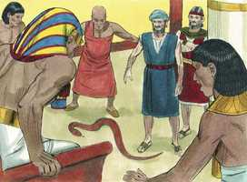
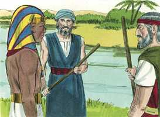
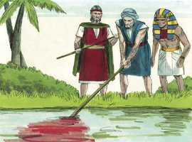

# Êxodo Capítulo 7

**1** 	ENTÃO disse o Senhor a Moisés: Eis que te tenho posto por deus sobre Faraó, e Arão, teu irmão, será o teu profeta.

**2** 	Tu falarás tudo o que eu te mandar; e Arão, teu irmão, falará a Faraó, que deixe ir os filhos de Israel da sua terra.

**3** 	Eu, porém, endurecerei o coração de Faraó, e multiplicarei na terra do Egito os meus sinais e as minhas maravilhas.

**4** 	Faraó, pois, não vos ouvirá; e eu porei minha mão sobre o Egito, e tirarei meus exércitos, meu povo, os filhos de Israel, da terra do Egito, com grandes juízos.

**5** 	Então os egípcios saberão que eu sou o Senhor, quando estender a minha mão sobre o Egito, e tirar os filhos de Israel do meio deles.

**6** 	Assim fizeram Moisés e Arão; como o Senhor lhes ordenara, assim fizeram.

**7** 	E Moisés era da idade de oitenta anos, e Arão da idade de oitenta e três anos quando falaram a Faraó.

**8** 	E o Senhor falou a Moisés e a Arão, dizendo:

**9** 	Quando Faraó vos falar, dizendo: Fazei vós um milagre, dirás a Arão: Toma a tua vara, e lança-a diante de Faraó; e se tornará em serpente.

**10** 	Então Moisés e Arão foram a Faraó, e fizeram assim como o Senhor ordenara; e lançou Arão a sua vara diante de Faraó, e diante dos seus servos, e tornou-se em serpente.

 

**11** 	E Faraó também chamou os sábios e encantadores; e os magos do Egito fizeram também o mesmo com os seus encantamentos.

**12** 	Porque cada um lançou sua vara, e tornaram-se em serpentes; mas a vara de Arão tragou as varas deles.

 

**13** 	Porém o coração de Faraó se endureceu, e não os ouviu, como o Senhor tinha falado.

**14** 	Então disse o Senhor a Moisés: O coração de Faraó está endurecido, recusa deixar ir o povo.

**15** 	Vai pela manhã a Faraó; eis que ele sairá às águas; põe-te em frente dele na beira do rio, e tomarás em tua mão a vara que se tornou em cobra.

**16** 	E lhe dirás: O Senhor Deus dos hebreus me tem enviado a ti, dizendo: Deixa ir o meu povo, para que me sirva no deserto; porém eis que até agora não tens ouvido.

**17** 	Assim diz o Senhor: Nisto saberás que eu sou o Senhor: Eis que eu com esta vara, que tenho em minha mão, ferirei as águas que estão no rio, e tornar-se-ão em sangue.

**18** 	E os peixes, que estão no rio, morrerão, e o rio cheirará mal; e os egípcios terão nojo de beber da água do rio.

**19** 	Disse mais o Senhor a Moisés: Dize a Arão: Toma tua vara, e estende a tua mão sobre as águas do Egito, sobre as suas correntes, sobre os seus rios, e sobre os seus tanques, e sobre todo o ajuntamento das suas águas, para que se tornem em sangue; e haja sangue em toda a terra do Egito, assim nos vasos de madeira como nos de pedra.

**20** 	E Moisés e Arão fizeram assim como o Senhor tinha mandado; e Arão levantou a vara, e feriu as águas que estavam no rio, diante dos olhos de Faraó, e diante dos olhos de seus servos; e todas as águas do rio se tornaram em sangue,

  

**21** 	E os peixes, que estavam no rio, morreram, e o rio cheirou mal, e os egípcios não podiam beber a água do rio; e houve sangue por toda a terra do Egito.

**22** 	Porém os magos do Egito também fizeram o mesmo com os seus encantamentos; de modo que o coração de Faraó se endureceu, e não os ouviu, como o Senhor tinha dito.

 

**23** 	E virou-se Faraó, e foi para sua casa; nem ainda nisto pôs seu coração.

**24** 	E todos os egípcios cavaram poços junto ao rio, para beberem água; porquanto não podiam beber da água do rio.

**25** 	Assim se cumpriram sete dias, depois que o Senhor ferira o rio.

