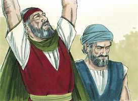
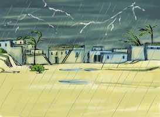
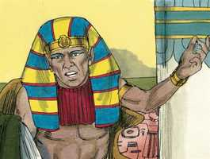

# Êxodo Capítulo 9

**1** 	DEPOIS o Senhor disse a Moisés: Vai a Faraó, e dize-lhe: Assim diz o Senhor Deus dos hebreus: Deixa ir o meu povo, para que me sirva.

**2** 	Porque se recusares deixá-los ir, e ainda por força os detiveres,

**3** 	Eis que a mão do Senhor será sobre teu gado, que está no campo, sobre os cavalos, sobre os jumentos, sobre os camelos, sobre os bois, e sobre as ovelhas, com pestilência gravíssima.

**4** 	E o Senhor fará separação entre o gado dos israelitas e o gado dos egípcios, para que nada morra de tudo o que for dos filhos de Israel.

**5** 	E o Senhor assinalou certo tempo, dizendo: Amanhã fará o Senhor esta coisa na terra.

**6** 	E o Senhor fez isso no dia seguinte, e todo o gado dos egípcios morreu; porém do gado dos filhos de Israel não morreu nenhum.

 

**7** 	E Faraó enviou a ver, e eis que do gado de Israel não morrera nenhum; porém o coração de Faraó se agravou, e não deixou ir o povo.

**8** 	Então disse o Senhor a Moisés e a Arão: Tomai vossas mãos cheias de cinza do forno, e Moisés a espalhe para o céu diante dos olhos de Faraó;

**9** 	E tornar-se-á em pó miúdo sobre toda a terra do Egito, e se tornará em sarna, que arrebente em úlceras, nos homens e no gado, por toda a terra do Egito.

**10** 	E eles tomaram a cinza do forno, e puseram-se diante de Faraó, e Moisés a espalhou para o céu; e tornou-se em sarna, que arrebentava em úlceras nos homens e no gado;

 

**11** 	De maneira que os magos não podiam parar diante de Moisés, por causa da sarna; porque havia sarna nos magos, e em todos os egípcios.

**12** 	Porém o Senhor endureceu o coração de Faraó, e não os ouviu, como o Senhor tinha dito a Moisés.

**13** 	Então disse o Senhor a Moisés: Levanta-te pela manhã cedo, e põe-te diante de Faraó, e dize-lhe: Assim diz o Senhor Deus dos hebreus: Deixa ir o meu povo, para que me sirva;

**14** 	Porque esta vez enviarei todas as minhas pragas sobre o teu coração, e sobre os teus servos, e sobre o teu povo, para que saibas que não há outro como eu em toda a terra.

**15** 	Porque agora tenho estendido minha mão, para te ferir a ti e ao teu povo com pestilência, e para que sejas destruído da terra;

**16** 	Mas, deveras, para isto te mantive, para mostrar meu poder em ti, e para que o meu nome seja anunciado em toda a terra.

**17** 	Tu ainda te exaltas contra o meu povo, para não o deixar ir?

**18** 	Eis que amanhã por este tempo farei chover saraiva mui grave, qual nunca houve no Egito, desde o dia em que foi fundado até agora.

**19** 	Agora, pois, envia, recolhe o teu gado, e tudo o que tens no campo; todo o homem e animal, que for achado no campo, e não for recolhido à casa, a saraiva cairá sobre eles, e morrerão.

 

**20** 	Quem dos servos de Faraó temia a palavra do Senhor, fez fugir os seus servos e o seu gado para as casas;

**21** 	Mas aquele que não tinha considerado a palavra do Senhor deixou os seus servos e o seu gado no campo.

**22** 	Então disse o Senhor a Moisés: Estende a tua mão para o céu, e haverá saraiva em toda a terra do Egito, sobre os homens e sobre o gado, e sobre toda a erva do campo, na terra do Egito.

 

**23** 	E Moisés estendeu a sua vara para o céu, e o Senhor deu trovões e saraiva, e fogo corria pela terra; e o Senhor fez chover saraiva sobre a terra do Egito.

 

**24** 	E havia saraiva, e fogo misturado entre a saraiva, tão grave, qual nunca houve em toda a terra do Egito desde que veio a ser uma nação.

**25** 	E a saraiva feriu, em toda a terra do Egito, tudo quanto havia no campo, desde os homens até aos animais; também a saraiva feriu toda a erva do campo, e quebrou todas as árvores do campo.

**26** 	Somente na terra de Gósen, onde estavam os filhos de Israel, não havia saraiva.

**27** 	Então Faraó mandou chamar a Moisés e a Arão, e disse-lhes: Esta vez pequei; o Senhor é justo, mas eu e o meu povo ímpios.

 

**28** 	Orai ao Senhor (pois que basta) para que não haja mais trovões de Deus nem saraiva; e eu vos deixarei ir, e não ficareis mais aqui.

**29** 	Então lhe disse Moisés: Em saindo da cidade estenderei minhas mãos ao Senhor; os trovões cessarão, e não haverá mais saraiva; para que saibas que a terra é do Senhor.

**30** 	Todavia, quanto a ti e aos teus servos, eu sei que ainda não temereis diante do Senhor Deus.

**31** 	E o linho e a cevada foram feridos, porque a cevada já estava na espiga, e o linho na haste.

**32** 	Mas o trigo e o centeio não foram feridos, porque estavam cobertos.

**33** 	Saiu, pois, Moisés da presença de Faraó, da cidade, e estendeu as suas mãos ao Senhor; e cessaram os trovões e a saraiva, e a chuva não caiu mais sobre a terra.

**34** 	Vendo Faraó que cessou a chuva, e a saraiva, e os trovões, pecou ainda mais; e endureceu o seu coração, ele e os seus servos.

**35** 	Assim o coração de Faraó se endureceu, e não deixou ir os filhos de Israel, como o Senhor tinha dito por Moisés.

