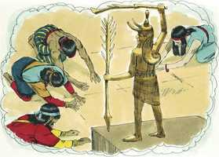

# Levítico Capítulo 26

**1** 	NÃO fareis para vós ídolos, nem vos levantareis imagem de escultura, nem estátua, nem poreis pedra figurada na vossa terra, para inclinar-vos a ela; porque eu sou o Senhor vosso Deus.

 

**2** 	Guardareis os meus sábados, e reverenciareis o meu santuário. Eu sou o Senhor.

**3** 	Se andardes nos meus estatutos, e guardardes os meus mandamentos, e os cumprirdes,

**4** 	Então eu vos darei as chuvas a seu tempo; e a terra dará a sua colheita, e a árvore do campo dará o seu fruto;

**5** 	E a debulha se vos chegará à vindima, e a vindima se chegará à sementeira; e comereis o vosso pão a fartar, e habitareis seguros na vossa terra.

**6** 	Também darei paz na terra, e dormireis seguros, e não haverá quem vos espante; e farei cessar os animais nocivos da terra, e pela vossa terra não passará espada.

**7** 	E perseguireis os vossos inimigos, e cairão à espada diante de vós.

**8** 	Cinco de vós perseguirão a um cento deles, e cem de vós perseguirão a dez mil; e os vossos inimigos cairão à espada diante de vós.

**9** 	E para vós olharei, e vos farei frutificar, e vos multiplicarei, e confirmarei a minha aliança convosco.

**10** 	E comereis da colheita velha, há muito tempo guardada, e tirareis fora a velha por causa da nova.

**11** 	E porei o meu tabernáculo no meio de vós, e a minha alma de vós não se enfadará.

**12** 	E andarei no meio de vós, e eu vos serei por Deus, e vós me sereis por povo.

**13** 	Eu sou o Senhor vosso Deus, que vos tirei da terra dos egípcios, para que não fôsseis seus escravos; e quebrei os timões do vosso jugo, e vos fiz andar eretos.

**14** 	Mas, se não me ouvirdes, e não cumprirdes todos estes mandamentos,

**15** 	E se rejeitardes os meus estatutos, e a vossa alma se enfadar dos meus juízos, não cumprindo todos os meus mandamentos, para invalidar a minha aliança,

**16** 	Então eu também vos farei isto: porei sobre vós terror, a tísica e a febre ardente, que consumam os olhos e atormentem a alma; e semeareis em vão a vossa semente, pois os vossos inimigos a comerão.

**17** 	E porei a minha face contra vós, e sereis feridos diante de vossos inimigos; e os que vos odeiam, de vós se assenhorearão, e fugireis, sem ninguém vos perseguir.

**18** 	E, se ainda com estas coisas não me ouvirdes, então eu prosseguirei a castigar-vos sete vezes mais, por causa dos vossos pecados.

**19** 	Porque quebrarei a soberba da vossa força; e farei que os vossos céus sejam como ferro e a vossa terra como cobre.

**20** 	E em vão se gastará a vossa força; a vossa terra não dará a sua colheita, e as árvores da terra não darão o seu fruto.

**21** 	E se andardes contrariamente para comigo, e não me quiserdes ouvir, trar-vos-ei pragas sete vezes mais, conforme os vossos pecados.

**22** 	Porque enviarei entre vós as feras do campo, as quais vos desfilharão, e desfarão o vosso gado, e vos diminuirão; e os vossos caminhos serão desertos.

**23** 	Se ainda com estas coisas não vos corrigirdes voltando para mim, mas ainda andardes contrariamente para comigo,

**24** 	Eu também andarei contrariamente para convosco, e eu, eu mesmo, vos ferirei sete vezes mais por causa dos vossos pecados.

**25** 	Porque trarei sobre vós a espada, que executará a vingança da aliança; e ajuntados sereis nas vossas cidades; então enviarei a peste entre vós, e sereis entregues na mão do inimigo.

**26** 	Quando eu vos quebrar o sustento do pão, então dez mulheres cozerão o vosso pão num só forno, e devolver-vos-ão o vosso pão por peso; e comereis, mas não vos fartareis.

**27** 	E se com isto não me ouvirdes, mas ainda andardes contrariamente para comigo,

**28** 	Também eu para convosco andarei contrariamente em furor; e vos castigarei sete vezes mais por causa dos vossos pecados.

**29** 	Porque comereis a carne de vossos filhos, e a carne de vossas filhas.

**30** 	E destruirei os vossos altos, e desfarei as vossas imagens, e lançarei os vossos cadáveres sobre os cadáveres dos vossos deuses; a minha alma se enfadará de vós.

**31** 	E reduzirei as vossas cidades a deserto, e assolarei os vossos santuários, e não cheirarei o vosso cheiro suave.

**32** 	E assolarei a terra e se espantarão disso os vossos inimigos que nela morarem.

**33** 	E espalhar-vos-ei entre as nações, e desembainharei a espada atrás de vós; e a vossa terra será assolada, e as vossas cidades serão desertas.

**34** 	Então a terra folgará nos seus sábados, todos os dias da sua assolação, e vós estareis na terra dos vossos inimigos; então a terra descansará, e folgará nos seus sábados.

**35** 	Todos os dias da assolação descansará, porque não descansou nos vossos sábados, quando habitáveis nela.

**36** 	E, quanto aos que de vós ficarem, eu porei tal pavor nos seus corações, nas terras dos seus inimigos, que o ruído de uma folha movida os perseguirá; e fugirão como quem foge da espada; e cairão sem ninguém os perseguir.

**37** 	E cairão uns sobre os outros como diante da espada, sem ninguém os perseguir; e não podereis resistir diante dos vossos inimigos.

**38** 	E perecereis entre as nações, e a terra dos vossos inimigos vos consumirá.

**39** 	E aqueles que entre vós ficarem se consumirão pela sua iniqüidade nas terras dos vossos inimigos, e pela iniqüidade de seus pais com eles se consumirão.

**40** 	Então confessarão a sua iniqüidade, e a iniqüidade de seus pais, com as suas transgressões, com que transgrediram contra mim; como também eles andaram contrariamente para comigo.

**41** 	Eu também andei para com eles contrariamente, e os fiz entrar na terra dos seus inimigos; se então o seu coração incircunciso se humilhar, e então tomarem por bem o castigo da sua iniqüidade,

**42** 	Também eu me lembrarei da minha aliança com Jacó, e também da minha aliança com Isaque, e também da minha aliança com Abraão me lembrarei, e da terra me lembrarei.

**43** 	E a terra será abandonada por eles, e folgará nos seus sábados, sendo assolada por causa deles; e tomarão por bem o castigo da sua iniqüidade, em razão mesmo de que rejeitaram os meus juízos e a sua alma se enfastiou dos meus estatutos.

**44** 	E, demais disto também, estando eles na terra dos seus inimigos, não os rejeitarei nem me enfadarei deles, para consumi-los e invalidar a minha aliança com eles, porque eu sou o Senhor seu Deus.

**45** 	Antes por amor deles me lembrarei da aliança com os seus antepassados, que tirei da terra do Egito perante os olhos dos gentios, para lhes ser por Deus. Eu sou o Senhor.

**46** 	Estes são os estatutos, e os juízos, e as leis que deu o Senhor entre si e os filhos de Israel, no monte Sinai, pela mão de Moisés.

