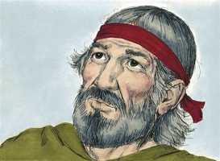
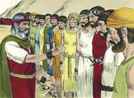
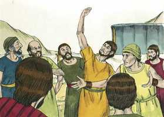
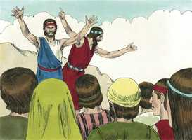

# Números Capítulo 13

**1** 	E FALOU o Senhor a Moisés, dizendo:

 

**2** 	Envia homens que espiem a terra de Canaã, que eu hei de dar aos filhos de Israel; de cada tribo de seus pais enviareis um homem, sendo cada um príncipe entre eles.

**3** 	E enviou-os Moisés do deserto de Parã, segundo a ordem do Senhor; todos aqueles homens eram cabeças dos filhos de Israel.

 

**4** 	E estes são os seus nomes: Da tribo de Rúben, Samua, filho de Zacur;

**5** 	Da tribo de Simeão, Safate, filho de Hori;

**6** 	Da tribo de Judá, Calebe, filho de Jefoné;

**7** 	Da tribo de Issacar, Jigeal, filho de José;

**8** 	Da tribo de Efraim, Oséias, filho de Num;

**9** 	Da tribo de Benjamim, Palti, filho de Rafu;

**10** 	Da tribo de Zebulom, Gadiel, filho de Sodi;

**11** 	Da tribo de José, pela tribo de Manassés, Gadi filho de Susi;

**12** 	Da tribo de Dã, Amiel, filho de Gemali;

**13** 	Da tribo de Aser, Setur, filho de Micael;

**14** 	Da tribo de Naftali, Nabi, filho de Vofsi;

**15** 	Da tribo de Gade, Geuel, filho de Maqui.

**16** 	Estes são os nomes dos homens que Moisés enviou a espiar aquela terra; e a Oséias, filho de Num, Moisés chamou Josué.

 

**17** 	Enviou-os, pois, Moisés a espiar a terra de Canaã; e disse-lhes: Subi por aqui para o lado do sul, e subi à montanha:

**18** 	E vede que terra é, e o povo que nela habita; se é forte ou fraco; se pouco ou muito.

**19** 	E como é a terra em que habita, se boa ou má; e quais são as cidades em que eles habitam; se em arraiais, ou em fortalezas.

**20** 	Também como é a terra, se fértil ou estéril; se nela há árvores, ou não; e esforçai-vos, e tomai do fruto da terra. E eram aqueles dias os dias das primícias das uvas.

**21** 	Assim subiram e espiaram a terra desde o deserto de Zim, até Reobe, à entrada de Hamate.

**22** 	E subiram para o lado do sul, e vieram até Hebrom; e estavam ali Aimã, Sesai e Talmai, filhos de Anaque (Hebrom foi edificada sete anos antes de Zoã no Egito).

**23** 	Depois foram até ao vale de Escol, e dali cortaram um ramo de vide com um cacho de uvas, o qual trouxeram dois homens, sobre uma vara; como também das romãs e dos figos.

**24** 	Chamaram àquele lugar o vale de Escol, por causa do cacho que dali cortaram os filhos de Israel.

**25** 	E eles voltaram de espiar a terra, ao fim de quarenta dias.

**26** 	E caminharam, e vieram a Moisés e a Arão, e a toda a congregação dos filhos de Israel no deserto de Parã, em Cades; e deram-lhes notícias, a eles, e a toda a congregação, e mostraram-lhes o fruto da terra.

 

**27** 	E contaram-lhe, e disseram: Fomos à terra a que nos enviaste; e verdadeiramente mana leite e mel, e este é o seu fruto.

**28** 	O povo, porém, que habita nessa terra é poderoso, e as cidades fortificadas e mui grandes; e também ali vimos os filhos de Anaque.

 

**29** 	Os amalequitas habitam na terra do sul; e os heteus, e os jebuseus, e os amorreus habitam na montanha; e os cananeus habitam junto do mar, e pela margem do Jordão.

 

**30** 	Então Calebe fez calar o povo perante Moisés, e disse: Certamente subiremos e a possuiremos em herança; porque seguramente prevaleceremos contra ela.

 

**31** 	Porém, os homens que com ele subiram disseram: Não poderemos subir contra aquele povo, porque é mais forte do que nós.

**32** 	E infamaram a terra que tinham espiado, dizendo aos filhos de Israel: A terra, pela qual passamos a espiá-la, é terra que consome os seus moradores; e todo o povo que vimos nela são homens de grande estatura.

**33** 	Também vimos ali gigantes, filhos de Anaque, descendentes dos gigantes; e éramos aos nossos olhos como gafanhotos, e assim também éramos aos seus olhos.

