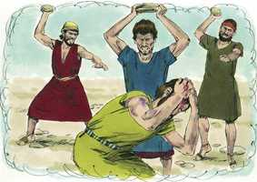

# Deuteronomio Capítulo 21

**1** 	QUANDO na terra que te der o Senhor teu Deus, para possuí-la, se achar um morto, caído no campo, sem que se saiba quem o matou,

**2** 	Então sairão os teus anciãos e os teus juízes, e medirão a distância até as cidades que estiverem em redor do morto;

**3** 	E, na cidade mais próxima ao morto, os anciãos da mesma cidade tomarão uma novilha da manada, que não tenha trabalhado nem tenha puxado com o jugo;

**4** 	E os anciãos daquela cidade trarão a novilha a um vale áspero, que nunca foi lavrado nem semeado; e ali, naquele vale, degolarão a novilha;

**5** 	Então se achegarão os sacerdotes, filhos de Levi; pois o Senhor teu Deus os escolheu para o servirem, e para abençoarem em nome do Senhor; e pela sua palavra se decidirá toda a demanda e todo o ferimento;

**6** 	E todos os anciãos da mesma cidade, mais próxima ao morto, lavarão as suas mãos sobre a novilha degolada no vale;

**7** 	E protestarão, e dirão: As nossas mãos não derramaram este sangue, e os nossos olhos o não viram.

**8** 	Sê propício ao teu povo Israel, que tu, ó Senhor, resgataste, e não ponhas o sangue inocente no meio do teu povo Israel. E aquele sangue lhes será expiado.

**9** 	Assim tirarás o sangue inocente do meio de ti; pois farás o que é reto aos olhos do Senhor.

**10** 	Quando saíres à peleja contra os teus inimigos, e o Senhor teu Deus os entregar nas tuas mãos, e tu deles levares prisioneiros,

**11** 	E tu entre os presos vires uma mulher formosa à vista, e a cobiçares, e a tomares por mulher,

**12** 	Então a trarás para a tua casa; e ela rapará a cabeça e cortará as suas unhas.

**13** 	E despirá o vestido do seu cativeiro, e se assentará na tua casa, e chorará a seu pai e a sua mãe um mês inteiro; e depois chegarás a ela, e tu serás seu marido e ela tua mulher.

**14** 	E será que, se te não contentares dela, a deixarás ir à sua vontade; mas de modo algum a venderás por dinheiro, nem a tratarás como escrava, pois a tens humilhado.

**15** 	Quando um homem tiver duas mulheres, uma a quem ama e outra a quem despreza, e a amada e a desprezada lhe derem filhos, e o filho primogênito for da desprezada,

**16** 	Será que, no dia em que fizer herdar a seus filhos o que tiver, não poderá dar a primogenitura ao filho da amada, preferindo-o ao filho da desprezada, que é o primogênito.

**17** 	Mas ao filho da desprezada reconhecerá por primogênito, dando-lhe dobrada porção de tudo quanto tiver; porquanto aquele é o princípio da sua força, o direito da primogenitura é dele.

**18** 	Quando alguém tiver um filho contumaz e rebelde, que não obedecer à voz de seu pai e à voz de sua mãe, e, castigando-o eles, lhes não der ouvidos,

**19** 	Então seu pai e sua mãe pegarão nele, e o levarão aos anciãos da sua cidade, e à porta do seu lugar;

**20** 	E dirão aos anciãos da cidade: Este nosso filho é rebelde e contumaz, não dá ouvidos à nossa voz; é um comilão e um beberrão.

**21** 	Então todos os homens da sua cidade o apedrejarão, até que morra; e tirarás o mal do meio de ti, e todo o Israel ouvirá e temerá.

 

**22** 	Quando também em alguém houver pecado, digno do juízo de morte, e for morto, e o pendurares num madeiro,

**23** 	O seu cadáver não permanecerá no madeiro, mas certamente o enterrarás no mesmo dia; porquanto o pendurado é maldito de Deus; assim não contaminarás a tua terra, que o Senhor teu Deus te dá em herança.

