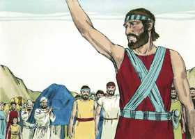
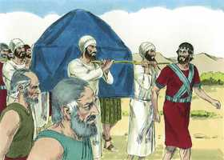

# Josué Capítulo 3

**1** 	LEVANTOU-SE, pois, Josué de madrugada, e partiram de Sitim, ele e todos os filhos de Israel; e vieram até ao Jordão, e pousaram ali, antes que passassem.

 

**2** 	E sucedeu, ao fim de três dias, que os oficiais passaram pelo meio do arraial;

**3** 	E ordenaram ao povo, dizendo: Quando virdes a arca da aliança do Senhor vosso Deus, e que os sacerdotes levitas a levam, partireis vós também do vosso lugar, e a seguireis.

**4** 	Haja contudo, entre vós e ela, uma distância de dois mil côvados; e não vos chegueis a ela, para que saibais o caminho pelo qual haveis de ir; porquanto por este caminho nunca passastes antes.

**5** 	Disse Josué também ao povo: Santificai-vos, porque amanhã fará o Senhor maravilhas no meio de vós.

**6** 	E falou Josué aos sacerdotes, dizendo: Levantai a arca da aliança, e passai adiante deste povo. Levantaram, pois, a arca da aliança, e foram andando adiante do povo.

 

**7** 	E o Senhor disse a Josué: Hoje começarei a engrandecer-te perante os olhos de todo o Israel, para que saibam que, assim como fui com Moisés, assim serei contigo.

**8** 	Tu, pois, ordenarás aos sacerdotes que levam a arca da aliança, dizendo: Quando chegardes à beira das águas do Jordão, parareis aí.

**9** 	Então disse Josué aos filhos de Israel: Chegai-vos para cá, e ouvi as palavras do Senhor vosso Deus.

 

**10** 	Disse mais Josué: Nisto conhecereis que o Deus vivo está no meio de vós; e que certamente lançará de diante de vós aos cananeus, e aos heteus, e aos heveus, e aos perizeus, e aos girgaseus, e aos amorreus, e aos jebuseus.

**11** 	Eis que a arca da aliança do Senhor de toda a terra passa o Jordão diante de vós.

**12** 	Tomai, pois, agora doze homens das tribos de Israel, de cada tribo um homem;

**13** 	Porque há de acontecer que, assim que as plantas dos pés dos sacerdotes, que levam a arca do Senhor, o Senhor de toda a terra, repousem nas águas do Jordão, se separarão as águas do Jordão, e as águas, que vêm de cima, pararão amontoadas.

**14** 	E aconteceu que, partindo o povo das suas tendas, para passar o Jordão, levavam os sacerdotes a arca da aliança adiante do povo.

 

**15** 	E quando os que levavam a arca, chegaram ao Jordão, e os seus pés se molharam na beira das águas (porque o Jordão transbordava sobre todas as suas ribanceiras, todos os dias da ceifa),

**16** 	Pararam-se as águas, que vinham de cima; levantaram-se num montão, mui longe da cidade de Adão, que está ao lado de Zaretã; e as que desciam ao mar das campinas, que é o Mar Salgado, foram de todo separadas; então passou o povo em frente de Jericó.

 

**17** 	Porém os sacerdotes, que levavam a arca da aliança do Senhor, pararam firmes, em seco, no meio do Jordão, e todo o Israel passou a seco, até que todo o povo acabou de passar o Jordão.

