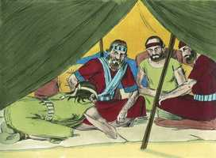
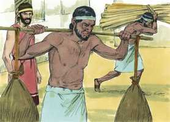

# Josué Capítulo 9

**1** 	E SUCEDEU que, ouvindo isto todos os reis, que estavam aquém do Jordão, nas montanhas, e nas campinas, em toda a costa do grande mar, em frente do Líbano, os heteus, e os amorreus, os cananeus, os perizeus, os heveus, e os jebuseus,

**2** 	Se ajuntaram eles de comum acordo, para pelejar contra Josué e contra Israel.

**3** 	E os moradores de Gibeom, ouvindo o que Josué fizera com Jericó e com Ai,

**4** 	Usaram de astúcia, e foram e se fingiram embaixadores, e levando sacos velhos sobre os seus jumentos, e odres de vinho, velhos, e rotos, e remendados;

**5** 	E nos seus pés sapatos velhos e remendados, e roupas velhas sobre si; e todo o pão que traziam para o caminho era seco e bolorento.

**6** 	E vieram a Josué, ao arraial, a Gilgal, e disseram a ele e aos homens de Israel: Viemos de uma terra distante; fazei, pois, agora, acordo conosco.

 

**7** 	E os homens de Israel responderam aos heveus: Porventura habiteis no meio de nós; como pois faremos acordo convosco?

**8** 	Então disseram a Josué: Nós somos teus servos. E disse-lhes Josué: Quem sois vós, e de onde vindes?

**9** 	E lhe responderam: Teus servos vieram de uma terra mui distante, por causa do nome do Senhor teu Deus, porquanto ouvimos a sua fama, e tudo quanto fez no Egito;

**10** 	E tudo quanto fez aos dois reis dos amorreus, que estavam além do Jordão, a Siom rei de Hesbom, e a Ogue, rei de Basã, que estava em Astarote.

**11** 	Por isso nossos anciãos e todos os moradores da nossa terra nos falaram, dizendo: Tomai em vossas mãos provisão para o caminho, e ide-lhes ao encontro e dizei-lhes: Nós somos vossos servos; fazei, pois, agora acordo conosco.

**12** 	Este nosso pão tomamos quente das nossas casas para nossa provisão, no dia em que saímos para vir a vós; e ei-lo aqui agora já seco e bolorento;

**13** 	E estes odres, que enchemos de vinho, eram novos, e ei-los aqui já rotos; e estas nossas roupas e nossos sapatos já se têm envelhecido, por causa do mui longo caminho.

**14** 	Então os homens de Israel tomaram da provisão deles e não pediram conselho ao Senhor.

**15** 	E Josué fez paz com eles, e fez um acordo com eles, que lhes daria a vida; e os príncipes da congregação lhes prestaram juramento.

**16** 	E sucedeu que, ao fim de três dias, depois de fazerem acordo com eles, ouviram que eram seus vizinhos, e que moravam no meio deles.

**17** 	Porque, partindo os filhos de Israel, chegaram às cidades deles ao terceiro dia; e suas cidades eram Gibeom e Cefira, e Beerote, e Quiriate-Jearim.

**18** 	E os filhos de Israel não os feriram; porquanto os príncipes da congregação lhes juraram pelo Senhor Deus de Israel; por isso toda a congregação murmurava contra os príncipes.

**19** 	Então todos os príncipes disseram a toda a congregação: Nós juramos-lhes pelo Senhor Deus de Israel, pelo que não lhes podemos tocar.

**20** 	Isto, porém, lhes faremos: conservar-lhes-emos a vida, para que não haja grande ira sobre nós, por causa do juramento que já lhes fizemos.

**21** 	Disseram-lhes, pois, os príncipes: Vivam, e sejam rachadores de lenha e tiradores de água para toda a congregação, como os príncipes lhes disseram.

**22** 	E Josué os chamou, e falou-lhes dizendo: Por que nos enganastes dizendo: Mui longe de vós habitamos, morando vós no meio de nós?

**23** 	Agora, pois, sereis malditos; e dentre vós não deixará de haver servos, nem rachadores de lenha, nem tiradores de água, para a casa do meu Deus.

**24** 	Então responderam a Josué, e disseram: Porquanto com certeza foi anunciado aos teus servos que o Senhor teu Deus ordenou a Moisés, seu servo, que a vós daria toda esta terra, e destruiria todos os moradores da terra diante de vós, tememos muito por nossas vidas por causa de vós; por isso fizemos assim.

**25** 	E eis que agora estamos na tua mão; faze-nos aquilo que te pareça bom e reto.

**26** 	Assim pois lhes fez, e livrou-os das mãos dos filhos de Israel, e não os mataram.

**27** 	E naquele dia, Josué os fez rachadores de lenha e tiradores de água para a congregação e para o altar do Senhor, até ao dia de hoje, no lugar que ele escolhesse.

 

