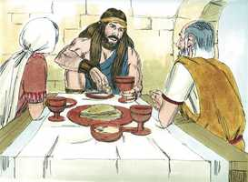
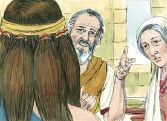
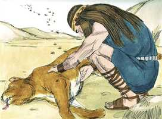
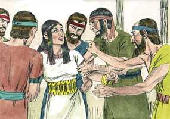
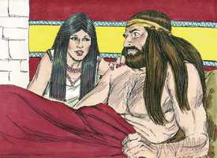
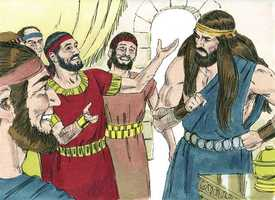

# Juízes Capítulo 14

**1** 	E DESCEU Sansão a Timnate; e, vendo em Timnate uma mulher das filhas dos filisteus,

**2** 	Subiu, e declarou-o a seu pai e a sua mãe, e disse: Vi uma mulher em Timnate, das filhas dos filisteus; agora, pois, tomai-ma por mulher.

 

**3** 	Porém seu pai e sua mãe lhe disseram: Não há, porventura, mulher entre as filhas de teus irmãos, nem entre todo o meu povo, para que tu vás tomar mulher dos filisteus, daqueles incircuncisos? E disse Sansão a seu pai: Toma-me esta, porque ela agrada aos meus olhos.

 

**4** 	Mas seu pai e sua mãe não sabiam que isto vinha do Senhor; pois buscava ocasião contra os filisteus; porquanto naquele tempo os filisteus dominavam sobre Israel.

**5** 	Desceu, pois, Sansão com seu pai e com sua mãe a Timnate; e, chegando às vinhas de Timnate eis que um filho de leão, rugindo, lhe saiu ao encontro.

**6** 	Então o Espírito do Senhor se apossou dele tão poderosamente que despedaçou o leão, como quem despedaça um cabrito, sem ter nada na sua mão; porém nem a seu pai nem a sua mãe deu a saber o que tinha feito.

**7** 	E desceu, e falou àquela mulher, e ela agradou aos olhos de Sansão.

**8** 	E depois de alguns dias voltou ele para tomá-la; e, apartando-se do caminho para ver o corpo do leão morto, eis que nele havia um enxame de abelhas com mel.

 

**9** 	E tomou-o nas suas mãos, e foi andando e comendo dele; e foi a seu pai e a sua mãe, e deu-lhes do mel, e comeram; porém não lhes deu a saber que tomara o mel do corpo do leão.

**10** 	Descendo, pois, seu pai àquela mulher, fez Sansão ali um banquete; porque assim os moços costumavam fazer.

**11** 	E sucedeu que, como o vissem, trouxeram trinta companheiros para estarem com ele.

**12** 	Disse-lhes, pois, Sansão: Eu vos darei um enigma para decifrar; e, se nos sete dias das bodas o decifrardes e descobrirdes, eu vos darei trinta lençóis e trinta mudas de roupas.

 

**13** 	E, se não puderdes decifrar, vós me dareis a mim trinta lençóis e as trinta mudas de roupas. E eles lhe disseram: Dá-nos o teu enigma a decifrar, para que o ouçamos.

**14** 	Então lhes disse: Do comedor saiu comida, e do forte saiu doçura. E em três dias não puderam decifrar o enigma.

**15** 	E sucedeu que, ao sétimo dia, disseram à mulher de Sansão: Persuade a teu marido que nos declare o enigma, para que porventura não queimemos a fogo a ti e à casa de teu pai; chamastes-nos aqui para vos apossardes do que é nosso, não é assim?

 

**16** 	E a mulher de Sansão chorou diante dele, e disse: Tão-somente me desprezas, e não me amas; pois deste aos filhos do meu povo um enigma para decifrar, e ainda não o declaraste a mim. E ele lhe disse: Eis que nem a meu pai nem a minha mãe o declarei, e to declararia a ti?

 

**17** 	E chorou diante dele os sete dias em que celebravam as bodas; sucedeu, pois, que ao sétimo dia lho declarou, porquanto o importunava; então ela declarou o enigma aos filhos do seu povo.

**18** 	Disseram, pois, a Sansão os homens daquela cidade, ao sétimo dia, antes de se pôr o sol: Que coisa há mais doce do que o mel? E que coisa há mais forte do que o leão? E ele lhes disse: Se vós não lavrásseis com a minha novilha, nunca teríeis descoberto o meu enigma.

 

**19** 	Então o Espírito do Senhor tão poderosamente se apossou dele, que desceu aos ascalonitas, e matou deles trinta homens, e tomou as suas roupas, e deu as mudas de roupas aos que declararam o enigma; porém acendeu-se a sua ira, e subiu à casa de seu pai.

 

**20** 	E a mulher de Sansão foi dada ao seu companheiro que antes o acompanhava.

