# Juízes Capítulo 16

**1** 	E FOI Sansão a Gaza, e viu ali uma mulher prostituta, e entrou a ela.

**2** 	E foi dito aos gazitas: Sansão entrou aqui. Cercaram-no, e toda a noite lhe puseram espias à porta da cidade; porém toda a noite estiveram quietos, dizendo: Até à luz da manhã esperaremos; então o mataremos.

**3** 	Porém Sansão deitou-se até à meia-noite, e à meia-noite se levantou, e arrancou as portas da entrada da cidade com ambas as umbreiras, e juntamente com a tranca as tomou, pondo-as sobre os ombros; e levou-as para cima até ao cume do monte que está defronte de Hebrom.

**4** 	E depois disto aconteceu que se afeiçoou a uma mulher do vale de Soreque, cujo nome era Dalila.

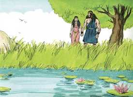 

**5** 	Então os príncipes dos filisteus subiram a ela, e lhe disseram: Persuade-o, e vê em que consiste a sua grande força, e como poderíamos assenhorear-nos dele e amarrá-lo, para assim o afligirmos; e te daremos, cada um de nós, mil e cem moedas de prata.

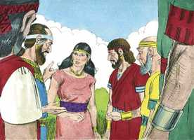 

**6** 	Disse, pois, Dalila a Sansão: Declara-me, peço-te, em que consiste a tua grande força, e com que poderias ser amarrado para te poderem afligir.

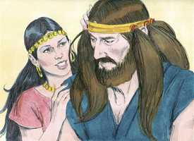 

**7** 	Disse-lhe Sansão: Se me amarrassem com sete vergas de vimes frescos, que ainda não estivessem secos, então me enfraqueceria, e seria como qualquer outro homem.

**8** 	Então os príncipes dos filisteus lhe trouxeram sete vergas de vimes frescos, que ainda não estavam secos; e amarraram-no com elas.

**9** 	E o espia estava com ela na câmara interior. Então ela lhe disse: Os filisteus vêm sobre ti, Sansão. Então quebrou as vergas de vimes, como se quebra o fio da estopa ao cheiro do fogo; assim não se soube em que consistia a sua força.

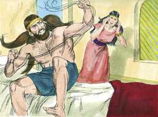 

**10** 	Então disse Dalila a Sansão: Eis que zombaste de mim, e me disseste mentiras; ora declara-me agora com que poderias ser amarrado.

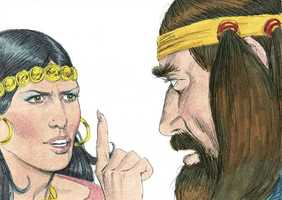 

**11** 	E ele disse: Se me amarrassem fortemente com cordas novas, que ainda não houvessem sido usadas, então me enfraqueceria, e seria como qualquer outro homem.

**12** 	Então Dalila tomou cordas novas, e o amarrou com elas, e disse-lhe: Os filisteus vêm sobre ti, Sansão. E o espia estava na recâmara interior. Então as quebrou de seus braços como a um fio.

**13** 	E disse Dalila a Sansão: Até agora zombaste de mim, e me disseste mentiras; declara-me pois, agora, com que poderias ser amarrado? E ele lhe disse: Se teceres sete tranças dos cabelos da minha cabeça com o liço da teia.

**14** 	E ela as fixou com uma estaca, e disse-lhe: Os filisteus vêm sobre ti, Sansão: Então ele despertou do seu sono, e arrancou a estaca das tranças tecidas, juntamente com o liço da teia.

**15** 	Então ela lhe disse: Como dirás: Tenho-te amor, não estando comigo o teu coração? Já três vezes zombaste de mim, e ainda não me declaraste em que consiste a tua força.

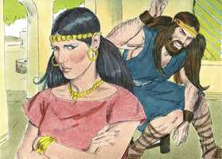 

**16** 	E sucedeu que, importunando-o ela todos os dias com as suas palavras, e molestando-o, a sua alma se angustiou até a morte.

**17** 	E descobriu-lhe todo o seu coração, e disse-lhe: Nunca passou navalha pela minha cabeça, porque sou nazireu de Deus desde o ventre de minha mãe; se viesse a ser rapado, ir-se-ia de mim a minha força, e me enfraqueceria, e seria como qualquer outro homem.

**18** 	Vendo, pois, Dalila que já lhe descobrira todo o seu coração, mandou chamar os príncipes dos filisteus, dizendo: Subi esta vez, porque agora me descobriu ele todo o seu coração. E os príncipes dos filisteus subiram a ter com ela, trazendo com eles o dinheiro.

**19** 	Então ela o fez dormir sobre os seus joelhos, e chamou a um homem, e rapou-lhe as sete tranças do cabelo de sua cabeça; e começou a afligi-lo, e retirou-se dele a sua força.

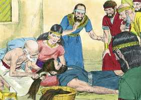 

**20** 	E disse ela: Os filisteus vêm sobre ti, Sansão. E despertou ele do seu sono, e disse: Sairei ainda esta vez como dantes, e me sacudirei. Porque ele não sabia que já o Senhor se tinha retirado dele.

**21** 	Então os filisteus pegaram nele, e arrancaram-lhe os olhos, e fizeram-no descer a Gaza, e amarraram-no com duas cadeias de bronze, e girava ele um moinho no cárcere.

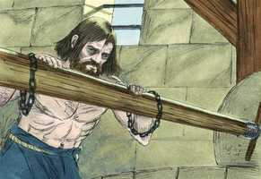 

**22** 	E o cabelo da sua cabeça começou a crescer, como quando foi rapado.

**23** 	Então os príncipes dos filisteus se ajuntaram para oferecer um grande sacrifício ao seu deus Dagom, e para se alegrarem, e diziam: Nosso deus nos entregou nas mãos a Sansão, nosso inimigo.

 

**24** 	Semelhantemente, vendo-o o povo, louvava ao seu deus; porque dizia: Nosso deus nos entregou nas mãos o nosso inimigo, e ao que destruía a nossa terra, e ao que multiplicava os nossos mortos.

**25** 	E sucedeu que, alegrando-se-lhes o coração, disseram: Chamai a Sansão, para que brinque diante de nós. E chamaram a Sansão do cárcere, que brincava diante deles, e fizeram-no estar em pé entre as colunas.

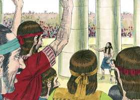 

**26** 	Então disse Sansão ao moço que o tinha pela mão: Guia-me para que apalpe as colunas em que se sustém a casa, para que me encoste a elas.

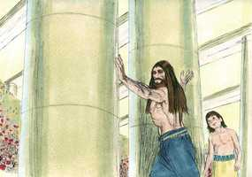 

**27** 	Ora estava a casa cheia de homens e mulheres; e também ali estavam todos os príncipes dos filisteus; e sobre o telhado havia uns três mil homens e mulheres, que estavam vendo Sansão brincar.

**28** 	Então Sansão clamou ao Senhor, e disse: Senhor Deus, peço-te que te lembres de mim, e fortalece-me agora só esta vez, ó Deus, para que de uma vez me vingue dos filisteus, pelos meus dois olhos.

**29** 	Abraçou-se, pois, Sansão com as duas colunas do meio, em que se sustinha a casa, e arrimou-se sobre elas, com a sua mão direita numa, e com a sua esquerda na outra.

**30** 	E disse Sansão: Morra eu com os filisteus. E inclinou-se com força, e a casa caiu sobre os príncipes e sobre todo o povo que nela havia; e foram mais os mortos que matou na sua morte do que os que matara em sua vida.

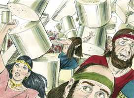 

**31** 	Então seus irmãos desceram, e toda a casa de seu pai, e tomaram-no, e subiram com ele, e sepultaram-no entre Zorá e Estaol, no sepulcro de Manoá, seu pai. Ele julgou a Israel vinte anos.

