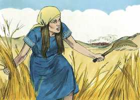
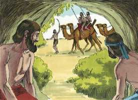
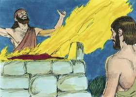
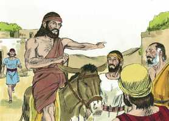
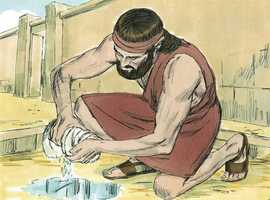

# Juízes Capítulo 6

**1** 	PORÉM os filhos de Israel fizeram o que era mau aos olhos do Senhor; e o Senhor os deu nas mãos dos midianitas por sete anos.

**2** 	E, prevalecendo a mão dos midianitas sobre Israel, fizeram os filhos de Israel para si, por causa dos midianitas, as covas que estão nos montes, as cavernas e as fortificações.

**3** 	Porque sucedia que, semeando Israel, os midianitas e os amalequitas, e também os do oriente, contra ele subiam.

 

**4** 	E punham-se contra ele em campo, e destruíam os frutos da terra, até chegarem a Gaza; e não deixavam mantimento em Israel, nem ovelhas, nem bois, nem jumentos.

**5** 	Porque subiam com os seus gados e tendas; vinham como gafanhotos, em grande multidão que não se podia contar, nem a eles nem aos seus camelos; e entravam na terra, para a destruir.

**6** 	Assim Israel empobreceu muito pela presença dos midianitas; então os filhos de Israel clamaram ao Senhor.

**7** 	E sucedeu que, clamando os filhos de Israel ao Senhor por causa dos midianitas,

**8** 	Enviou o Senhor um profeta aos filhos de Israel, que lhes disse: Assim diz o Senhor Deus de Israel: Do Egito eu vos fiz subir, e vos tirei da casa da servidão;

**9** 	E vos livrei da mão dos egípcios, e da mão de todos quantos vos oprimiam; e os expulsei de diante de vós, e a vós dei a sua terra.

**10** 	E vos disse: Eu sou o Senhor vosso Deus; não temais aos deuses dos amorreus, em cuja terra habitais; mas não destes ouvidos à minha voz.

**11** 	Então o anjo do Senhor veio, e assentou-se debaixo do carvalho que está em Ofra, que pertencia a Joás, abiezrita; e Gideão, seu filho, estava malhando o trigo no lagar, para o salvar dos midianitas.

 

**12** 	Então o anjo do Senhor lhe apareceu, e lhe disse: O Senhor é contigo, homem valoroso.

 

**13** 	Mas Gideão lhe respondeu: Ai, Senhor meu, se o Senhor é conosco, por que tudo isto nos sobreveio? E que é feito de todas as suas maravilhas que nossos pais nos contaram, dizendo: Não nos fez o Senhor subir do Egito? Porém agora o Senhor nos desamparou, e nos deu nas mãos dos midianitas.

**14** 	Então o Senhor olhou para ele, e disse: Vai nesta tua força, e livrarás a Israel das mãos dos midianitas; porventura não te enviei eu?

**15** 	E ele lhe disse: Ai, Senhor meu, com que livrarei a Israel? Eis que a minha família é a mais pobre em Manassés, e eu o menor na casa de meu pai.

**16** 	E o Senhor lhe disse: Porquanto eu hei de ser contigo, tu ferirás aos midianitas como se fossem um só homem.

**17** 	E ele disse: Se agora tenho achado graça aos teus olhos, dá-me um sinal de que és tu que falas comigo.

**18** 	Rogo-te que daqui não te apartes, até que eu volte e traga o meu presente, e o ponha perante ti. E disse: Eu esperarei até que voltes.

**19** 	E entrou Gideão e preparou um cabrito e pães ázimos de um efa de farinha; a carne pôs num cesto e o caldo pôs numa panela; e trouxe-lho até debaixo do carvalho, e lho ofereceu.

**20** 	Porém o anjo de Deus lhe disse: Toma a carne e os pães ázimos, e põe-nos sobre esta penha e derrama-lhe o caldo. E assim fez.

**21** 	E o anjo do Senhor estendeu a ponta do cajado, que estava na sua mão, e tocou a carne e os pães ázimos; então subiu o fogo da penha, e consumiu a carne e os pães ázimos; e o anjo do Senhor desapareceu de seus olhos.

 

**22** 	Então viu Gideão que era o anjo do Senhor e disse: Ah, Senhor Deus, pois vi o anjo do Senhor face a face.

**23** 	Porém o Senhor lhe disse: Paz seja contigo; não temas; não morrerás.

 

**24** 	Então Gideão edificou ali um altar ao Senhor, e chamou-lhe: O SENHOR É PAZ; e ainda até o dia de hoje está em Ofra dos abiezritas.

**25** 	E aconteceu naquela mesma noite, que o Senhor lhe disse: Toma o boi que pertence a teu pai, a saber, o segundo boi de sete anos, e derruba o altar de Baal, que é de teu pai; e corta o bosque que está ao pé dele.

**26** 	E edifica ao Senhor teu Deus um altar no cume deste lugar forte, num lugar conveniente; e toma o segundo boi, e o oferecerás em holocausto com a lenha que cortares do bosque.

**27** 	Então Gideão tomou dez homens dentre os seus servos, e fez como o Senhor lhe dissera; e sucedeu que, temendo ele a casa de seu pai, e os homens daquela cidade, não o fez de dia, mas fê-lo de noite.

 

**28** 	Levantando-se, pois, os homens daquela cidade, de madrugada, eis que estava o altar de Baal derrubado, e o bosque estava ao pé dele, cortado; e o segundo boi oferecido no altar que fora edificado.

**29** 	E uns aos outros disseram: Quem fez esta coisa? E, esquadrinhando, e inquirindo, disseram: Gideão, o filho de Joás, fez esta coisa.

**30** 	Então os homens daquela cidade disseram a Joás: Tira para fora a teu filho; para que morra; pois derribou o altar de Baal, e cortou o bosque que estava ao pé dele.

**31** 	Porém Joás disse a todos os que se puseram contra ele: Contendereis vós por Baal? Livrá-lo-eis vós? Qualquer que por ele contender ainda esta manhã será morto; se é deus, por si mesmo contenda; pois derrubaram o seu altar.

 

**32** 	Por isso naquele dia lhe chamaram Jerubaal, dizendo: Baal contenda contra ele, pois derrubou o seu altar.

**33** 	E todos os midianitas e amalequitas, e os filhos do oriente se ajuntaram, e passaram, e acamparam no vale de Jizreel.

**34** 	Então o Espírito do Senhor revestiu a Gideão, o qual tocou a buzina, e os abiezritas se ajuntaram após ele.

**35** 	E enviou mensageiros por toda a tribo de Manassés, que também se ajuntou após ele; também enviou mensageiros a Aser, e a Zebulom, e a Naftali, que saíram-lhe ao encontro.

 

**36** 	E disse Gideão a Deus: Se hás de livrar a Israel por minha mão, como disseste,

**37** 	Eis que eu porei um velo de lã na eira; se o orvalho estiver somente no velo, e toda a terra ficar seca, então conhecerei que hás de livrar a Israel por minha mão, como disseste.

**38** 	E assim sucedeu; porque no outro dia se levantou de madrugada, e apertou o velo; e do orvalho que espremeu do velo, encheu uma taça de água.

 

**39** 	E disse Gideão a Deus: Não se acenda contra mim a tua ira, se ainda falar só esta vez; rogo-te que só esta vez faça a prova com o velo; rogo-te que só o velo fique seco, e em toda a terra haja o orvalho.

**40** 	E Deus assim fez naquela noite; pois só o velo ficou seco, e sobre toda a terra havia orvalho.

