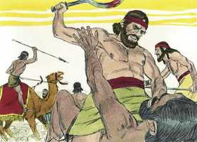
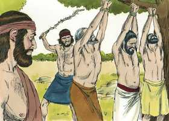
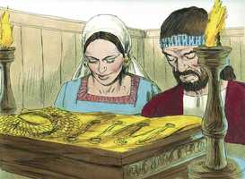
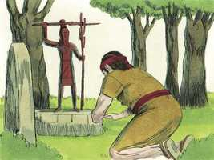

# Juízes Capítulo 8

**1** 	ENTÃO os homens de Efraim lhe disseram: Que é isto que nos fizeste, que não nos chamaste, quando foste pelejar contra os midianitas? E contenderam com ele fortemente.

 

**2** 	Porém ele lhes disse: Que mais fiz eu agora do que vós? Não são porventura os rabiscos de Efraim melhores do que a vindima de Abiezer?

**3** 	Deus vos deu na vossa mão os príncipes dos midianitas, Orebe e Zeebe; que mais pude eu fazer do que vós? Então a sua ira se abrandou para com ele, quando falou esta palavra.

**4** 	E, como Gideão veio ao Jordão, passou com os trezentos homens que com ele estavam, já cansados, mas ainda perseguindo.

**5** 	E disse aos homens de Sucote: Dai, peço-vos, alguns pedaços de pão ao povo, que segue as minhas pisadas; porque estão cansados, e eu vou ao encalço de Zeba e Salmuna, reis dos midianitas.

**6** 	Porém os príncipes de Sucote disseram: Estão já, Zeba e Salmuna, em tua mão, para que demos pão ao teu exército?

**7** 	Então disse Gideão: Pois quando o Senhor der na minha mão a Zeba e a Salmuna, trilharei a vossa carne com os espinhos do deserto, e com os abrolhos.

**8** 	E dali subiu a Penuel, e falou-lhes da mesma maneira; e os homens de Penuel lhe responderam como os homens de Sucote lhe haviam respondido.

**9** 	Por isso também falou aos homens de Penuel, dizendo: Quando eu voltar em paz, derribarei esta torre.

**10** 	Estavam, pois, Zeba e Salmuna em Carcor, e os seus exércitos com eles, uns quinze mil homens, todos os que restaram do exército dos filhos do oriente; e os que caíram foram cento e vinte mil homens, que puxavam da espada.

**11** 	E subiu Gideão pelo caminho dos que habitavam em tendas, para o oriente de Nobá e Jogbeá; e feriu aquele exército, porquanto o exército estava descuidado.

 

**12** 	E fugiram Zeba e Salmuna; porém ele os perseguiu, e tomou presos a ambos os reis dos midianitas, a Zeba e a Salmuna, e afugentou a todo o exército.

**13** 	Voltando, pois, Gideão, filho de Joás, da peleja, antes do nascer do sol,

**14** 	Tomou preso a um moço dos homens de Sucote, e lhe fez perguntas; o qual lhe deu por escrito os nomes dos príncipes de Sucote, e dos seus anciãos, setenta e sete homens.

**15** 	Então veio aos homens de Sucote, e disse: Vede aqui a Zeba e a Salmuna, a respeito dos quais desprezivelmente me escarnecestes, dizendo: Estão já, Zeba e Salmuna, na tua mão, para que demos pão aos teus homens, já cansados?

**16** 	E tomou os anciãos daquela cidade, e os espinhos do deserto, e os abrolhos; e com eles ensinou aos homens de Sucote.

 

**17** 	E derrubou a torre de Penuel, e matou os homens da cidade.

**18** 	Depois perguntou a Zeba e a Salmuna: Que homens eram os que matastes em Tabor? E disseram: Como és tu, assim eram eles; cada um parecia filho de rei.

**19** 	Então disse ele: Meus irmãos eram, filhos de minha mãe; vive o Senhor, que, se os tivésseis deixado com vida, eu não vos mataria.

**20** 	E disse a Jeter, seu primogênito: Levanta-te, mata-os. Porém o moço não puxou da sua espada, porque temia; porquanto ainda era jovem.

**21** 	Então disseram Zeba e Salmuna: Levanta-te, e acomete-nos; porque, qual o homem, tal a sua valentia. Levantou-se, pois, Gideão, e matou a Zeba e a Salmuna, e tomou os ornamentos que estavam nos pescoços dos seus camelos.

**22** 	Então os homens de Israel disseram a Gideão: Domina sobre nós, tanto tu, como teu filho e o filho de teu filho; porquanto nos livraste da mão dos midianitas.

 

**23** 	Porém Gideão lhes disse: Sobre vós eu não dominarei, nem tampouco meu filho sobre vós dominará; o Senhor sobre vós dominará.

**24** 	E disse-lhes mais Gideão: Uma petição vos farei: Dá-me, cada um de vós, os pendentes do seu despojo (porque tinham pendentes de ouro, porquanto eram ismaelitas).

**25** 	E disseram eles: De boa vontade os daremos. E estenderam uma capa, e cada um deles deitou ali um pendente do seu despojo.

 

**26** 	E foi o peso dos pendentes de ouro, que pediu, mil e setecentos siclos de ouro, afora os ornamentos, e as cadeias, e as vestes de púrpura que traziam os reis dos midianitas, e afora as coleiras que os camelos traziam ao pescoço.

**27** 	E fez Gideão dele um éfode, e colocou-o na sua cidade, em Ofra; e todo o Israel prostituiu-se ali após ele; e foi por tropeço a Gideão e à sua casa.

 

**28** 	Assim foram abatidos os midianitas diante dos filhos de Israel, e nunca mais levantaram a sua cabeça; e sossegou a terra quarenta anos nos dias de Gideão.

**29** 	E foi Jerubaal, filho de Joás, e habitou em sua casa.

**30** 	E teve Gideão setenta filhos, que procederam dele, porque tinha muitas mulheres.

**31** 	E sua concubina, que estava em Siquém, lhe deu à luz também um filho; e pôs-lhe por nome Abimeleque.

**32** 	E faleceu Gideão, filho de Joás, numa boa velhice; e foi sepultado no sepulcro de seu pai Joás, em Ofra dos abiezritas.

**33** 	E sucedeu que, como Gideão faleceu, os filhos de Israel tornaram a se prostituir após os baalins; e puseram a Baal-Berite por deus.

 

**34** 	E assim os filhos de Israel não se lembraram do Senhor seu Deus, que os livrara da mão de todos os seus inimigos ao redor.

**35** 	Nem usaram de beneficência com a casa de Jerubaal, a saber, de Gideão, conforme a todo o bem que ele havia feito a Israel.

