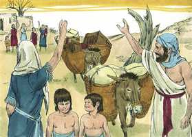
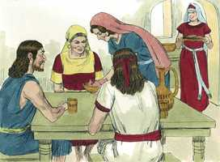
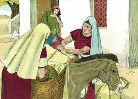
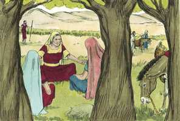
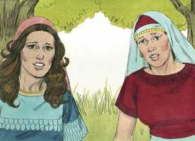
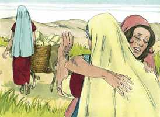
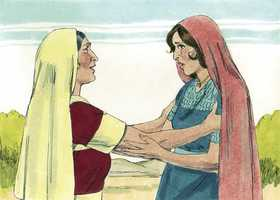
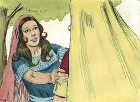
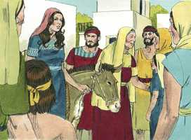

# Rute Capítulo 1

**1** 	E SUCEDEU que, nos dias em que os juízes julgavam, houve uma fome na terra; por isso um homem de Belém de Judá saiu a peregrinar nos campos de Moabe, ele e sua mulher, e seus dois filhos;

**2** 	E era o nome deste homem Elimeleque, e o de sua mulher Noemi, e os de seus dois filhos Malom e Quiliom, efrateus, de Belém de Judá; e chegaram aos campos de Moabe, e ficaram ali.

 

**3** 	E morreu Elimeleque, marido de Noemi; e ficou ela com os seus dois filhos,

**4** 	Os quais tomaram para si mulheres moabitas; e era o nome de uma Orfa, e o da outra Rute; e ficaram ali quase dez anos.

 

**5** 	E morreram também ambos, Malom e Quiliom, ficando assim a mulher desamparada dos seus dois filhos e de seu marido.

 

**6** 	Então se levantou ela com as suas noras, e voltou dos campos de Moabe, porquanto na terra de Moabe ouviu que o Senhor tinha visitado o seu povo, dando-lhe pão.

 

**7** 	Por isso saiu do lugar onde estivera, e as suas noras com ela. E, indo elas caminhando, para voltarem para a terra de Judá,

**8** 	Disse Noemi às suas noras: Ide, voltai cada uma à casa de sua mãe; e o Senhor use convosco de benevolência, como vós usastes com os falecidos e comigo.

 

**9** 	O Senhor vos dê que acheis descanso cada uma em casa de seu marido. E, beijando-as ela, levantaram a sua voz e choraram.

**10** 	E disseram-lhe: Certamente voltaremos contigo ao teu povo.

 

**11** 	Porém Noemi disse: Voltai, minhas filhas. Por que iríeis comigo? Tenho eu ainda no meu ventre mais filhos, para que vos sejam por maridos?

**12** 	Voltai, filhas minhas, ide-vos embora, que já mui velha sou para ter marido; ainda quando eu dissesse: Tenho esperança, ou ainda que esta noite tivesse marido e ainda tivesse filhos,

**13** 	Esperá-los-íeis até que viessem a ser grandes? Deter-vos-íeis por eles, sem tomardes marido? Não, filhas minhas, que mais amargo me é a mim do que a vós mesmas; porquanto a mão do Senhor se descarregou contra mim.

**14** 	Então levantaram a sua voz, e tornaram a chorar; e Orfa beijou a sua sogra, porém Rute se apegou a ela.

 

**15** 	Por isso disse Noemi: Eis que voltou tua cunhada ao seu povo e aos seus deuses; volta tu também após tua cunhada.

 

**16** 	Disse, porém, Rute: Não me instes para que te abandone, e deixe de seguir-te; porque aonde quer que tu fores irei eu, e onde quer que pousares, ali pousarei eu; o teu povo é o meu povo, o teu Deus é o meu Deus;

 

**17** 	Onde quer que morreres morrerei eu, e ali serei sepultada. Faça-me assim o Senhor, e outro tanto, se outra coisa que não seja a morte me separar de ti.

**18** 	Vendo Noemi, que de todo estava resolvida a ir com ela, deixou de lhe falar.

**19** 	Assim, pois, foram-se ambas, até que chegaram a Belém; e sucedeu que, entrando elas em Belém, toda a cidade se comoveu por causa delas, e diziam: Não é esta Noemi?

 

**20** 	Porém ela lhes dizia: Não me chameis Noemi; chamai-me Mara; porque grande amargura me tem dado o Todo-Poderoso.

 

**21** 	Cheia parti, porém vazia o Senhor me fez tornar; por que pois me chamareis Noemi? O Senhor testifica contra mim, e o Todo-Poderoso me tem feito mal.

**22** 	Assim Noemi voltou, e com ela Rute a moabita, sua nora, que veio dos campos de Moabe; e chegaram a Belém no princípio da colheita das cevadas.

