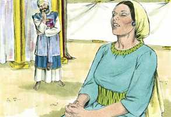
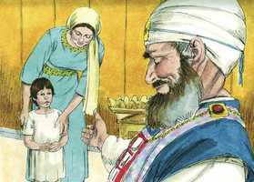

# 1Samuel Capítulo 1

**1** 	HOUVE um homem de Ramataim-Zofim, da montanha de Efraim, cujo nome era Elcana, filho de Jeroão, filho de Eliú, filho de Toú, filho de Zufe, efrateu.

**2** 	E este tinha duas mulheres: o nome de uma era Ana, e o da outra Penina. E Penina tinha filhos, porém Ana não os tinha.

**3** 	Subia, pois, este homem, da sua cidade, de ano em ano, a adorar e a sacrificar ao Senhor dos Exércitos em Siló; e estavam ali os sacerdotes do Senhor, Hofni e Finéias, os dois filhos de Eli.

**4** 	E sucedeu que no dia em que Elcana sacrificava, dava ele porções a Penina, sua mulher, e a todos os seus filhos, e a todas as suas filhas.

**5** 	Porém a Ana dava uma parte excelente; porque amava a Ana, embora o Senhor lhe tivesse cerrado a madre.

**6** 	E a sua rival excessivamente a provocava, para a irritar; porque o Senhor lhe tinha cerrado a madre.

**7** 	E assim fazia ele de ano em ano. Sempre que Ana subia à casa do Senhor, a outra a irritava; por isso chorava, e não comia.

**8** 	Então Elcana, seu marido, lhe disse: Ana, por que choras? E por que não comes? E por que está mal o teu coração? Não te sou eu melhor do que dez filhos?

**9** 	Então Ana se levantou, depois que comeram e beberam em Siló; e Eli, sacerdote, estava assentado numa cadeira, junto a um pilar do templo do Senhor.

**10** 	Ela, pois, com amargura de alma, orou ao Senhor, e chorou abundantemente.

**11** 	E fez um voto, dizendo: Senhor dos Exércitos! Se benignamente atentares para a aflição da tua serva, e de mim te lembrares, e da tua serva não te esqueceres, mas à tua serva deres um filho homem, ao Senhor o darei todos os dias da sua vida, e sobre a sua cabeça não passará navalha.

 

**12** 	E sucedeu que, perseverando ela em orar perante o Senhor, Eli observou a sua boca.

 

**13** 	Porquanto Ana no seu coração falava; só se moviam os seus lábios, porém não se ouvia a sua voz; pelo que Eli a teve por embriagada.

**14** 	E disse-lhe Eli: Até quando estarás tu embriagada? Aparta de ti o teu vinho.

**15** 	Porém Ana respondeu: Não, senhor meu, eu sou uma mulher atribulada de espírito; nem vinho nem bebida forte tenho bebido; porém tenho derramado a minha alma perante o Senhor.

**16** 	Não tenhas, pois, a tua serva por filha de Belial; porque da multidão dos meus cuidados e do meu desgosto tenho falado até agora.

**17** 	Então respondeu Eli: Vai em paz; e o Deus de Israel te conceda a petição que lhe fizeste.

 

**18** 	E disse ela: Ache a tua serva graça aos teus olhos. Assim a mulher foi o seu caminho, e comeu, e o seu semblante já não era triste.

**19** 	E levantaram-se de madrugada, e adoraram perante o Senhor, e voltaram, e chegaram à sua casa, em Ramá, e Elcana conheceu a Ana sua mulher, e o Senhor se lembrou dela.

**20** 	E sucedeu que, passado algum tempo, Ana concebeu, e deu à luz um filho, ao qual chamou Samuel; porque, dizia ela, o tenho pedido ao Senhor.

**21** 	E subiu aquele homem Elcana com toda a sua casa, a oferecer ao Senhor o sacrifício anual e a cumprir o seu voto.

**22** 	Porém Ana não subiu; mas disse a seu marido: Quando o menino for desmamado, então o levarei, para que apareça perante o Senhor, e lá fique para sempre.

**23** 	E Elcana, seu marido, lhe disse: Faze o que bem te parecer aos teus olhos; fica até que o desmames; então somente confirme o Senhor a sua palavra. Assim ficou a mulher, e deu leite a seu filho, até que o desmamou.

**24** 	E, havendo-o desmamado, tomou-o consigo, com três bezerros, e um efa de farinha, e um odre de vinho, e levou-o à casa do Senhor, em Siló, e era o menino ainda muito criança.

**25** 	E degolaram um bezerro, e trouxeram o menino a Eli.

**26** 	E disse ela: Ah, meu senhor, viva a tua alma, meu senhor; eu sou aquela mulher que aqui esteve contigo, para orar ao Senhor.

 

**27** 	Por este menino orava eu; e o Senhor atendeu à minha petição, que eu lhe tinha feito.

**28** 	Por isso também ao Senhor eu o entreguei, por todos os dias que viver, pois ao Senhor foi pedido. E adorou ali ao Senhor.

