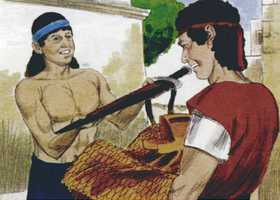
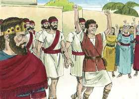
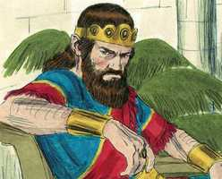
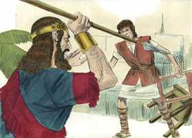
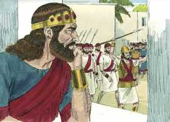
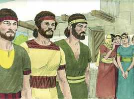
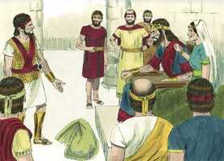
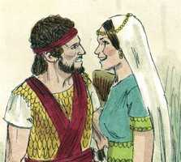

# 1Samuel Capítulo 18

**1** 	E SUCEDEU que, acabando ele de falar com Saul, a alma de Jônatas se ligou com a alma de Davi; e Jônatas o amou, como à sua própria alma.

**2** 	E Saul naquele dia o tomou, e não lhe permitiu que voltasse para casa de seu pai.

**3** 	E Jônatas e Davi fizeram aliança; porque Jônatas o amava como à sua própria alma.

**4** 	E Jônatas se despojou da capa que trazia sobre si, e a deu a Davi, como também as suas vestes, até a sua espada, e o seu arco, e o seu cinto.

 

**5** 	E saía Davi aonde quer que Saul o enviasse e conduzia-se com prudência, e Saul o pôs sobre os homens de guerra; e era aceito aos olhos de todo o povo, e até aos olhos dos servos de Saul.

**6** 	Sucedeu, porém, que, vindo eles, quando Davi voltava de ferir os filisteus, as mulheres de todas as cidades de Israel saíram ao encontro do rei Saul, cantando e dançando, com adufes, com alegria, e com instrumentos de música.

 

**7** 	E as mulheres dançando e cantando se respondiam umas às outras, dizendo: Saul feriu os seus milhares, porém, Davi os seus dez milhares.

**8** 	Então Saul se indignou muito, e aquela palavra pareceu mal aos seus olhos, e disse: Dez milhares deram a Davi, e a mim somente milhares; na verdade, que lhe falta, senão só o reino?

 

**9** 	E, desde aquele dia em diante, Saul tinha Davi em suspeita.

**10** 	E aconteceu no outro dia, que o mau espírito da parte de Deus se apoderou de Saul, e profetizava no meio da casa; e Davi tocava a harpa com a sua mão, como nos outros dias; Saul, porém, tinha na mão uma lança.

**11** 	E Saul atirou com a lança, dizendo: Encravarei a Davi na parede. Porém Davi se desviou dele por duas vezes.

 

**12** 	E temia Saul a Davi, porque o Senhor era com ele e se tinha retirado de Saul.

**13** 	Por isso Saul o desviou de si, e o pôs por capitão de mil; e saía e entrava diante do povo.

 

**14** 	E Davi se conduzia com prudência em todos os seus caminhos, e o Senhor era com ele.

**15** 	Vendo então Saul que tão prudentemente se conduzia, tinha receio dele.

**16** 	Porém todo o Israel e Judá amava a Davi, porquanto saía e entrava diante deles.

**17** 	Por isso Saul disse a Davi: Eis que Merabe, minha filha mais velha, te darei por mulher; sê-me somente filho valoroso, e guerreia as guerras do Senhor (porque Saul dizia consigo: Não seja contra ele a minha mão, mas sim a dos filisteus).

**18** 	Mas Davi disse a Saul: Quem sou eu, e qual é a minha vida e a família de meu pai em Israel, para vir a ser genro do rei?

**19** 	Sucedeu, porém, que ao tempo que Merabe, filha de Saul, devia ser dada a Davi, ela foi dada por mulher a Adriel, meolatita.

**20** 	Mas Mical, a outra filha de Saul amava a Davi; o que, sendo anunciado a Saul, pareceu isto bom aos seus olhos.

 

**21** 	E Saul disse: Eu lha darei, para que lhe sirva de laço, e para que a mão dos filisteus venha a ser contra ele. Disse, pois, Saul a Davi: Com a outra serás hoje meu genro.

**22** 	E Saul deu ordem aos seus servos: Falai em segredo a Davi, dizendo: Eis que o rei te está mui afeiçoado, e todos os seus servos te amam; agora, pois, consente em ser genro do rei.

**23** 	E os servos de Saul falaram todas estas palavras aos ouvidos de Davi. Então disse Davi: Parece-vos pouco aos vossos olhos ser genro do rei, sendo eu homem pobre e desprezível?

**24** 	E os servos de Saul lhe anunciaram isto, dizendo: Foram tais as palavras que falou Davi.

**25** 	Então disse Saul: Assim direis a Davi: O rei não tem necessidade de dote, senão de cem prepúcios de filisteus, para se tomar vingança dos inimigos do rei. Porquanto Saul tentava fazer cair a Davi pela mão dos filisteus.

 

**26** 	E anunciaram os seus servos estas palavras a Davi, e este negócio pareceu bem aos olhos de Davi, de que fosse genro do rei; porém ainda os dias não se haviam cumprido.

**27** 	Então Davi se levantou, e partiu com os seus homens, e feriu dentre os filisteus duzentos homens, e Davi trouxe os seus prepúcios, e os entregou todos ao rei, para que fosse genro do rei; então Saul lhe deu por mulher a sua filha.

 

**28** 	E viu Saul, e notou que o Senhor era com Davi; e Mical, filha de Saul, o amava.

**29** 	Então Saul temeu muito mais a Davi; e Saul foi todos os seus dias inimigo de Davi.

**30** 	E, saindo os príncipes dos filisteus à campanha, sucedia que Davi se conduzia com mais êxito do que todos os servos de Saul; portanto o seu nome era muito estimado.

