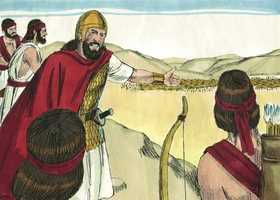
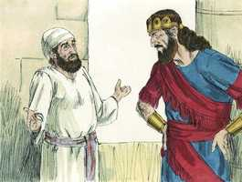
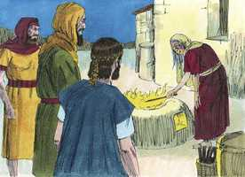
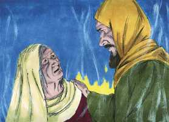
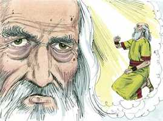

# 1Samuel Capítulo 28

**1** 	E SUCEDEU naqueles dias que, juntando os filisteus os seus exércitos à peleja, para fazer guerra contra Israel, disse Aquis a Davi: Sabe de certo que comigo sairás ao arraial, tu e os teus homens.

**2** 	Então disse Davi a Aquis: Assim saberás o que fará o teu servo. E disse Aquis a Davi: Por isso te terei por guarda da minha pessoa para sempre.

**3** 	E Samuel já estava morto, e todo o Israel o tinha chorado, e o tinha sepultado em Ramá, que era a sua cidade; e Saul tinha desterrado os adivinhos e os encantadores.

**4** 	E ajuntaram-se os filisteus, e vieram, e acamparam-se em Suném; e ajuntou Saul a todo o Israel, e se acamparam em Gilboa.

**5** 	E, vendo Saul o arraial dos filisteus, temeu, e estremeceu muito o seu coração.

 

**6** 	E perguntou Saul ao Senhor, porém o Senhor não lhe respondeu, nem por sonhos, nem por Urim, nem por profetas.

 

**7** 	Então disse Saul aos seus criados: Buscai-me uma mulher que tenha o espírito de feiticeira, para que vá a ela, e consulte por ela. E os seus criados lhe disseram: Eis que em En-Dor há uma mulher que tem o espírito de adivinhar.

 

**8** 	E Saul se disfarçou, e vestiu outras roupas, e foi ele com dois homens, e de noite chegaram à mulher; e disse: Peço-te que me adivinhes pelo espírito de feiticeira, e me faças subir a quem eu te disser.

 

**9** 	Então a mulher lhe disse: Eis aqui tu sabes o que Saul fez, como tem destruído da terra os adivinhos e os encantadores; por que, pois, me armas um laço à minha vida, para me fazeres morrer?

**10** 	Então Saul lhe jurou pelo Senhor, dizendo: Vive o Senhor, que nenhum mal te sobrevirá por isso.

 

**11** 	A mulher então lhe disse: A quem te farei subir? E disse ele: Faze-me subir a Samuel.

**12** 	Vendo, pois, a mulher a Samuel, gritou com alta voz, e falou a Saul, dizendo: Por que me tens enganado? Pois tu mesmo és Saul.

**13** 	E o rei lhe disse: Não temas; que é que vês? Então a mulher disse a Saul: Vejo deuses que sobem da terra.

**14** 	E lhe disse: Como é a sua figura? E disse ela: Vem subindo um homem ancião, e está envolto numa capa. Entendendo Saul que era Samuel, inclinou-se com o rosto em terra, e se prostrou.

 

**15** 	Samuel disse a Saul: Por que me inquietaste, fazendo-me subir? Então disse Saul: Mui angustiado estou, porque os filisteus guerreiam contra mim, e Deus se tem desviado de mim, e não me responde mais, nem pelo ministério dos profetas, nem por sonhos; por isso te chamei a ti, para que me faças saber o que hei de fazer.

**16** 	Então disse Samuel: Por que, pois, me perguntas a mim, visto que o Senhor te tem desamparado, e se tem feito teu inimigo?

**17** 	Porque o Senhor tem feito para contigo como pela minha boca te disse, e o Senhor tem rasgado o reino da tua mão, e o tem dado ao teu próximo, a Davi.

**18** 	Como tu não deste ouvidos à voz do Senhor, e não executaste o fervor da sua ira contra Amaleque, por isso o Senhor te fez hoje isto.

**19** 	E o Senhor entregará também a Israel contigo na mão dos filisteus, e amanhã tu e teus filhos estareis comigo; e o arraial de Israel o Senhor entregará na mão dos filisteus.

**20** 	E imediatamente Saul caiu estendido por terra, e grandemente temeu por causa daquelas palavras de Samuel; e não houve força nele; porque não tinha comido pão todo aquele dia e toda aquela noite.

 

**21** 	Então veio a mulher a Saul e, vendo que estava tão perturbado, disse-lhe: Eis que a tua criada deu ouvidos à tua voz, e pus a minha vida na minha mão, e ouvi as palavras que disseste.

**22** 	Agora, pois, ouve também tu as palavras da tua serva, e porei um bocado de pão diante de ti, e come, para que tenhas forças para te pores a caminho.

**23** 	Porém ele o recusou, e disse: Não comerei. Porém os seus criados e a mulher o constrangeram; e deu ouvidos à sua voz; e levantou-se do chão, e se assentou sobre uma cama.

**24** 	E tinha a mulher em casa um bezerro cevado, e se apressou, e o matou, e tomou farinha, e a amassou, e a cozeu em bolos ázimos.

**25** 	E os trouxe diante de Saul e de seus criados, e comeram; depois levantaram-se e partiram naquela mesma noite.

