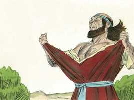

# 2 Samuel Capítulo 1

**1** 	E SUCEDEU que, depois da morte de Saul, voltando Davi da derrota dos amalequitas, ficou dois dias em Ziclague;

**2** 	Ao terceiro dia um homem veio do arraial de Saul, com as vestes rotas e com terra sobre a cabeça; e, chegando ele a Davi, se lançou no chão, e se inclinou.

**3** 	E Davi lhe disse: Donde vens? E ele lhe disse: Escapei do arraial de Israel.

**4** 	E disse-lhe Davi: Como foi lá isso? peço-te, dize-mo. E ele lhe respondeu: O povo fugiu da batalha, e muitos do povo caíram, e morreram; assim como também Saul e Jônatas, seu filho, foram mortos.

**5** 	E disse Davi ao moço que lhe trazia as novas: Como sabes tu que Saul e Jônatas, seu filho, foram mortos?

**6** 	Então disse o moço que lhe dava a notícia: Cheguei por acaso à montanha de Gilboa, e eis que Saul estava encostado sobre a sua lança, e eis que os carros e a cavalaria apertavam-no.

**7** 	E, olhando ele para trás de si, viu-me, e chamou-me; e eu disse: Eis-me aqui.

**8** 	E ele me disse: Quem és tu? E eu lhe disse: Sou amalequita.

**9** 	Então ele me disse: Peço-te, arremessa-te sobre mim, e mata-me, porque angústias me têm cercado, pois toda a minha vida está ainda em mim.

**10** 	Arremessei-me, pois, sobre ele, e o matei, porque bem sabia eu que não viveria depois da sua queda, e tomei a coroa que tinha na cabeça, e o bracelete que trazia no braço, e os trouxe aqui a meu senhor.

**11** 	Então apanhou Davi as suas vestes, e as rasgou; assim fizeram todos os homens que estavam com ele.

 

**12** 	E prantearam, e choraram, e jejuaram até à tarde por Saul, e por Jônatas, seu filho, e pelo povo do Senhor, e pela casa de Israel, porque tinham caído à espada.

**13** 	Disse então Davi ao moço que lhe trouxera a nova: Donde és tu? E disse ele: Sou filho de um estrangeiro, amalequita.

**14** 	E Davi lhe disse: Como não temeste tu estender a mão para matares ao ungido do Senhor?

**15** 	Então chamou Davi a um dos moços, e disse: Chega, e lança-te sobre ele. E ele o feriu, e morreu.

**16** 	Pois Davi lhe dissera: O teu sangue seja sobre a tua cabeça, porque a tua própria boca testificou contra ti, dizendo: Eu matei o ungido do Senhor.

**17** 	E lamentou Davi a Saul e a Jônatas, seu filho, com esta lamentação

**18** 	(Dizendo ele que ensinassem aos filhos de Judá o uso do arco. Eis que está escrito no livro de Jasher):

**19** 	Ah, ornamento de Israel! Nos teus altos foi ferido, como caíram os poderosos!

**20** 	Não o noticieis em Gate, não o publiqueis nas ruas de Ascalom, para que não se alegrem as filhas dos filisteus, para que não saltem de contentamento as filhas dos incircuncisos.

**21** 	Vós, montes de Gilboa, nem orvalho, nem chuva caia sobre vós, nem haja campos de ofertas alçadas, pois aí desprezivelmente foi arrojado o escudo dos poderosos, o escudo de Saul, como se não fora ungido com óleo.

**22** 	Do sangue dos feridos, da gordura dos valentes, nunca se retirou para trás o arco de Jônatas, nem voltou vazia a espada de Saul.

**23** 	Saul e Jônatas, tão amados e queridos na sua vida, também na sua morte não se separaram; eram mais ligeiros do que as águias, mais fortes do que os leões.

**24** 	Vós, filhas de Israel, chorai por Saul, que vos vestia de escarlata em delícias, que vos fazia trazer ornamentos de ouro sobre as vossas vestes.

**25** 	Como caíram os poderosos, no meio da peleja! Jônatas nos teus altos foi morto.

**26** 	Angustiado estou por ti, meu irmão Jônatas; quão amabilíssimo me eras! Mais maravilhoso me era o teu amor do que o amor das mulheres.

**27** 	Como caíram os poderosos, e pereceram as armas de guerra!

