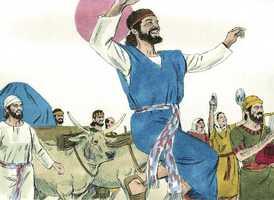
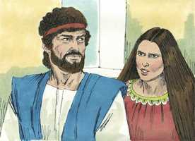

# 2 Samuel Capítulo 6

**1** 	E TORNOU Davi a ajuntar todos os escolhidos de Israel, em número de trinta mil.

**2** 	E levantou-se Davi, e partiu, com todo o povo que tinha consigo, para Baalim de Judá, para levarem dali para cima a arca de Deus, sobre a qual se invoca o nome, o nome do Senhor dos Exércitos, que se assenta entre os querubins.

 

**3** 	E puseram a arca de Deus em um carro novo, e a levaram da casa de Abinadabe, que está em Gibeá; e Uzá e Aiô, filhos de Abinadabe, guiavam o carro novo.

**4** 	E levando-o da casa de Abinadabe, que está em Gibeá, com a arca de Deus, Aiô ia adiante da arca.

**5** 	E Davi, e toda a casa de Israel, festejavam perante o Senhor, com toda a sorte de instrumentos de pau de faia, como também com harpas, e com saltérios, e com tamboris, e com pandeiros, e com címbalos.

 

**6** 	E, chegando à eira de Nacom, estendeu Uzá a mão à arca de Deus, e pegou nela; porque os bois a deixavam pender.

**7** 	Então a ira do Senhor se acendeu contra Uzá, e Deus o feriu ali por esta imprudência; e morreu ali junto à arca de Deus.

 

**8** 	E Davi se contristou, porque o Senhor abrira rotura em Uzá; e chamou àquele lugar Perez-Uzá, até ao dia de hoje.

**9** 	E temeu Davi ao Senhor naquele dia; e disse: Como virá a mim a arca do Senhor?

**10** 	E não quis Davi retirar para junto de si a arca do Senhor, à cidade de Davi; mas Davi a fez levar à casa de Obede-Edom, o giteu.

 

**11** 	E ficou a arca do Senhor em casa de Obede-Edom, o giteu, três meses; e abençoou o Senhor a Obede-Edom, e a toda a sua casa.

**12** 	Então avisaram a Davi, dizendo: Abençoou o Senhor a casa de Obede-Edom, e tudo quanto tem, por causa da arca de Deus; foi pois Davi, e trouxe a arca de Deus para cima, da casa de Obede-Edom, à cidade de Davi, com alegria.

 

**13** 	E sucedeu que, quando os que levavam a arca do Senhor tinham dado seis passos, sacrificava bois e carneiros cevados.

 

**14** 	E Davi saltava com todas as suas forças diante do Senhor; e estava Davi cingido de um éfode de linho.

**15** 	Assim subindo, levavam Davi e todo o Israel a arca do Senhor, com júbilo, e ao som das trombetas.

**16** 	E sucedeu que, entrando a arca do Senhor na cidade de Davi, Mical, a filha de Saul, estava olhando pela janela; e, vendo ao rei Davi, que ia bailando e saltando diante do Senhor, o desprezou no seu coração.

**17** 	E introduzindo a arca do Senhor, a puseram no seu lugar, na tenda que Davi lhe armara; e ofereceu Davi holocaustos e ofertas pacíficas perante o Senhor.

**18** 	E acabando Davi de oferecer os holocaustos e ofertas pacíficas, abençoou o povo em nome do Senhor dos Exércitos.

**19** 	E repartiu a todo o povo, e a toda a multidão de Israel, desde os homens até às mulheres, a cada um, um bolo de pão, e um bom pedaço de carne, e um frasco de vinho; então retirou-se todo o povo, cada um para sua casa,

**20** 	E, voltando Davi para abençoar a sua casa, Mical, a filha de Saul, saiu a encontrar-se com Davi, e disse: Quão honrado foi o rei de Israel, descobrindo-se hoje aos olhos das servas de seus servos, como sem pejo se descobre qualquer dos vadios.

 

**21** 	Disse, porém, Davi a Mical: Perante o Senhor, que me escolheu preferindo-me a teu pai, e a toda a sua casa, mandando-me que fosse soberano sobre o povo do Senhor, sobre Israel, perante o Senhor tenho me alegrado.

**22** 	E ainda mais do que isto me envilecerei, e me humilharei aos meus olhos; mas das servas, de quem falaste, delas serei honrado.

**23** 	E Mical, a filha de Saul, não teve filhos, até o dia da sua morte.

