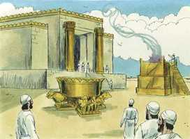

# 1 Reis Capítulo 7

**1** 	PORÉM a sua casa edificou Salomão em treze anos; e acabou toda a sua casa.

**2** 	Também edificou a casa do bosque do Líbano de cem côvados de comprimento, e de cinqüenta côvados de largura, e de trinta côvados de altura, sobre quatro ordens de colunas de cedro, e vigas de cedro sobre as colunas.

**3** 	E por cima estava coberta de cedro sobre as vigas, que estavam sobre quarenta e cinco colunas, quinze em cada ordem.

**4** 	E havia três ordens de janelas; e uma janela estava defronte da outra janela, em três ordens.

**5** 	Também todas as portas e ombreiras quadradas eram de uma mesma vista; e uma janela estava defronte da outra, em três ordens.

**6** 	Depois fez um pórtico de colunas de cinqüenta côvados de comprimento e de trinta côvados de largura; e o pórtico estava defronte delas, e as colunas com as grossas vigas defronte delas.

**7** 	Também fez o pórtico para o trono onde julgava, isto é, o pórtico do juízo, que estava revestido de cedro de soalho a soalho.

**8** 	E em sua casa, em que morava, havia outro pátio, por dentro do pórtico, de obra semelhante à deste; também para a filha de Faraó, que Salomão tomara por mulher, fez uma casa semelhante àquele pórtico.

**9** 	Todas estas coisas eram de pedras de grande valor, cortadas à medida, serradas à serra por dentro e por fora; e isto desde o fundamento até às beiras do teto, e por fora até ao grande pátio.

**10** 	Também estava fundado sobre pedras finas, pedras grandes; sobre pedras de dez côvados e pedras de oito côvados.

**11** 	E em cima delas pedras de grande valor, lavradas segundo as medidas, e madeira de cedro.

**12** 	Havia três ordens de pedras lavradas, com uma ordem de vigas de cedro; assim era também o pátio interior da casa do Senhor e o pórtico daquela casa.

**13** 	E enviou o rei Salomão um mensageiro e mandou trazer a Hirão de Tiro.

**14** 	Era ele filho de uma mulher viúva, da tribo de Naftali, e fora seu pai um homem de Tiro, que trabalhava em cobre; e era cheio de sabedoria, e de entendimento, e de ciência para fazer toda a obra de cobre; este veio ao rei Salomão, e fez toda a sua obra.

**15** 	E formou duas colunas de cobre; a altura de cada coluna era de dezoito côvados, e um fio de doze côvados cercava cada uma das colunas.

**16** 	Também fez dois capitéis de fundição de cobre para pôr sobre as cabeças das colunas; de cinco côvados era a altura de um capitel, e de cinco côvados a altura do outro capitel.

**17** 	As redes eram de malhas, as ligas de obra de cadeia para os capitéis que estavam sobre a cabeça das colunas, sete para um capitel e sete para o outro capitel.

**18** 	Assim fez as colunas, juntamente com duas fileiras em redor sobre uma rede, para cobrir os capitéis que estavam sobre a cabeça das romãs, assim também fez com o outro capitel.

**19** 	E os capitéis que estavam sobre a cabeça das colunas eram de obra de lírios no pórtico, de quatro côvados.

**20** 	Os capitéis, pois, sobre as duas colunas estavam também defronte, em cima da parte globular que estava junto à rede; e duzentas romãs, em fileiras em redor, estavam também sobre o outro capitel.

**21** 	Depois levantou as colunas no pórtico do templo; e levantando a coluna direita, pôs-lhe o nome de Jaquim; e levantando a coluna esquerda, pôs-lhe o nome de Boaz.

 

**22** 	E sobre a cabeça das colunas estava a obra de lírios; e assim se acabou a obra das colunas.

**23** 	Fez mais o mar de fundição, de dez côvados de uma borda até à outra borda, perfeitamente redondo, e de cinco côvados de alto; e um cordão de trinta côvados o cingia em redor.

**24** 	E por baixo da sua borda em redor havia botões que o cingiam; por dez côvados cercavam aquele mar em redor; duas ordens destes botões foram fundidas quando o mar foi fundido.

**25** 	E firmava-se sobre doze bois, três que olhavam para o norte, e três que olhavam para o ocidente, e três que olhavam para o sul, e três que olhavam para o oriente; e o mar estava em cima deles, e todas as suas partes posteriores para o lado de dentro.

**26** 	E a grossura era de um palmo, e a sua borda era como a de um copo, como de flor de lírios; ele levava dois mil batos.

**27** 	Fez também as dez bases de cobre; o comprimento de uma base de quatro côvados, e de quatro côvados a sua largura, e três côvados a sua altura.

**28** 	E esta era a obra das bases; tinham cintas, e as cintas estavam entre as molduras.

**29** 	E sobre as cintas que estavam entre as molduras havia leões, bois, e querubins, e sobre as molduras uma base por cima; e debaixo dos leões e dos bois junturas de obra estendida.

**30** 	E uma base tinha quatro rodas de metal, e lâminas de cobre; e os seus quatro cantos tinham suportes; debaixo da pia estavam estes suportes fundidos, do lado de cada uma das junturas.

**31** 	E a boca da pia estava dentro da coroa, e de um côvado por cima; e era a sua boca redonda segundo a obra da base, de côvado e meio; e também sobre a sua boca havia entalhes, e as suas cintas eram quadradas, não redondas.

**32** 	E as quatro rodas estavam debaixo das cintas, e os eixos das rodas na base; e era a altura de cada roda de côvado e meio.

**33** 	E era a obra das rodas como a obra da roda de carro; seus eixos, e suas cambas e seus cubos, e seus raios, todos eram fundidos.

**34** 	E havia quatro suportes aos quatro cantos de cada base; seus suportes saíam da base.

**35** 	E no alto de cada base havia uma peça redonda de meio côvado de altura; também sobre o alto de cada base havia asas e cintas, que saíam delas.

**36** 	E nas placas de seus esteios e nas suas cintas lavrou querubins, leões, e palmas, segundo o espaço de cada uma, e outros adornos em redor.

**37** 	Conforme a esta fez as dez bases; todas tinham uma mesma fundição, uma mesma medida, e um mesmo entalhe.

**38** 	Também fez dez pias de cobre; em cada pia cabiam quarenta batos, e cada pia era de quatro côvados, e sobre cada uma das dez bases estava uma pia.

**39** 	E pôs cinco bases à direita da casa, e cinco à esquerda da casa; porém o mar pôs ao lado direito da casa para o lado do oriente, da parte do sul.

**40** 	Depois fez Hirão as pias, e as pás, e as bacias; e acabou Hirão de fazer toda a obra que fez para o rei Salomão, para a casa do Senhor.

**41** 	A saber: as duas colunas, e os globos dos capitéis que estavam sobre a cabeça das duas colunas; e as duas redes, para cobrir os dois globos dos capitéis que estavam sobre a cabeça das colunas.

**42** 	E as quatrocentas romãs para as duas redes, a saber: duas carreiras de romãs para cada rede, para cobrirem os dois globos dos capitéis que estavam em cima das colunas.

**43** 	Juntamente com as dez bases, e as dez pias sobre as bases;

**44** 	Como também um mar, e os doze bois debaixo daquele mar;

**45** 	E os caldeirões, e as pás, e as bacias, e todos estes objetos que fez Hirão para o rei Salomão, para a casa do Senhor, todos eram de cobre polido.

**46** 	Na planície do Jordão, o rei os fundiu em terra barrenta; entre Sucote e Zaretã.

**47** 	E deixou Salomão de pesar todos os objetos, pelo seu excessivo número; nem se averiguou o peso do cobre.

**48** 	Também fez Salomão todos os objetos que convinham à casa do Senhor; o altar de ouro, e a mesa de ouro, sobre a qual estavam os pães da proposição.

**49** 	E os castiçais, cinco à direita e cinco à esquerda, diante do oráculo, de ouro finíssimo; e as flores, e as lâmpadas, e os espevitadores, também de ouro.

**50** 	Como também os vasos, e os apagadores, e as bacias, e as colheres, e os perfumadores, de ouro finíssimo; e as dobradiças para as portas da casa interior para o lugar santíssimo, e as das portas da casa do templo, também de ouro.

**51** 	Assim se acabou toda a obra que fez o rei Salomão para a casa do Senhor; então trouxe Salomão as coisas que seu pai Davi havia consagrado; a prata, e o ouro, e os objetos pôs entre os tesouros da casa do Senhor.

