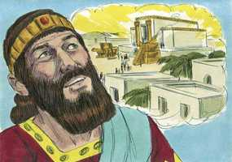
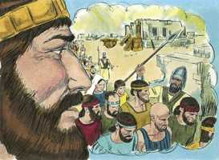

# 1 Reis Capítulo 9

**1** 	SUCEDEU, pois, que, acabando Salomão de edificar a casa do Senhor, e a casa do rei, e todo o desejo de Salomão, que lhe veio à vontade fazer,

**2** 	O Senhor tornou a aparecer a Salomão; como lhe tinha aparecido em Gibeom.

**3** 	E o Senhor lhe disse: Ouvi a tua oração, e a súplica que fizeste perante mim; santifiquei a casa que edificaste, a fim de pôr ali o meu nome para sempre; e os meus olhos e o meu coração estarão ali todos os dias.

 

**4** 	E se tu andares perante mim como andou Davi, teu pai, com inteireza de coração e com sinceridade, para fazeres segundo tudo o que te mandei, e guardares os meus estatutos e os meus juízos,

**5** 	Então confirmarei o trono de teu reino sobre Israel para sempre; como falei acerca de teu pai Davi, dizendo: Não te faltará sucessor sobre o trono de Israel;

**6** 	Porém, se vós e vossos filhos de qualquer maneira vos apartardes de mim, e não guardardes os meus mandamentos, e os meus estatutos, que vos tenho proposto, mas fordes, e servirdes a outros deuses, e vos prostrardes perante eles,

**7** 	Então destruirei a Israel da terra que lhes dei; e a esta casa, que santifiquei a meu nome, lançarei longe da minha presença; e Israel será por provérbio e motejo, entre todos os povos.

**8** 	E desta casa, que é tão exaltada, todo aquele que por ela passar pasmará, e assobiará, e dirá: Por que fez o Senhor assim a esta terra e a esta casa?

 

**9** 	E dirão: Porque deixaram ao Senhor seu Deus, que tirou da terra do Egito a seus pais, e se apegaram a deuses alheios, e se encurvaram perante eles, e os serviram; por isso trouxe o Senhor sobre eles todo este mal.

**10** 	E sucedeu, ao fim de vinte anos, que Salomão edificara as duas casas; a casa do Senhor e a casa do rei

**11** 	(Para o que Hirão, rei de Tiro, trouxera a Salomão madeira de cedro e de cipreste, e ouro, segundo todo o seu desejo); então deu o rei Salomão a Hirão vinte cidades na terra da Galiléia.

**12** 	E saiu Hirão de Tiro a ver as cidades que Salomão lhe dera, porém não foram boas aos seus olhos.

**13** 	Por isso disse: Que cidades são estas que me deste, irmão meu? E chamaram-nas: Terra de Cabul, até hoje.

**14** 	E enviara Hirão ao rei cento e vinte talentos de ouro.

**15** 	E esta é a causa do tributo que impôs o rei Salomão, para edificar a casa do Senhor e a sua casa, e Milo, e o muro de Jerusalém, como também a Hasor, e a Megido, e a Gezer.

**16** 	Porque Faraó, rei do Egito, subiu e tomou a Gezer, e a queimou a fogo, e matou os cananeus que moravam na cidade, e a deu em dote à sua filha, mulher de Salomão.

**17** 	Assim edificou Salomão a Gezer, e Bete-Horom, a baixa,

**18** 	E a Baalate, e a Tadmor, no deserto daquela terra,

**19** 	E a todas as cidades de provisões que Salomão tinha, e as cidades dos carros, e as cidades dos cavaleiros, e tudo o que Salomão quis edificar em Jerusalém, e no Líbano, e em toda a terra do seu domínio.

**20** 	Quanto a todo o povo que restou dos amorreus, heteus, perizeus, heveus, e jebuseus, e que não eram dos filhos de Israel,

**21** 	A seus filhos, que restaram depois deles na terra, os quais os filhos de Israel não puderam destruir totalmente, Salomão os reduziu a tributo servil, até hoje.

**22** 	Porém dos filhos de Israel não fez Salomão servo algum; porém eram homens de guerra, e seus criados, e seus príncipes, e seus capitães, e chefes dos seus carros e dos seus cavaleiros.

**23** 	Estes eram os chefes dos oficiais que estavam sobre a obra de Salomão, quinhentos e cinqüenta, que davam ordens ao povo que trabalhava na obra.

**24** 	Subiu, porém, a filha de Faraó da cidade de Davi, à sua casa, que Salomão lhe edificara; então edificou a Milo.

**25** 	E oferecia Salomão três vezes cada ano holocaustos e sacrifícios pacíficos sobre o altar que edificaram ao Senhor, e queimava incenso sobre o que estava perante o Senhor; e assim acabou a casa.

**26** 	Também o rei Salomão fez naus em Eziom-Geber, que está junto a Elate, à praia do mar de Sufe, na terra de Edom.

**27** 	E mandou Hirão com aquelas naus a seus servos, marinheiros, que sabiam do mar, com os servos de Salomão.

**28** 	E vieram a Ofir, e tomaram de lá quatrocentos e vinte talentos de ouro, e os trouxeram ao rei Salomão.

