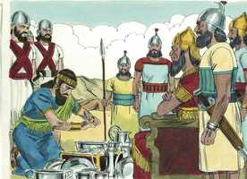
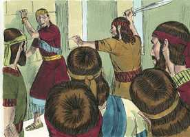

# 2 Reis Capítulo 15

**1** 	NO ano vinte e sete de Jeroboão, rei de Israel, começou a reinar Azarias, filho de Amazias, rei de Judá.

**2** 	Tinha dezesseis anos quando começou a reinar, e cinqüenta e dois anos reinou em Jerusalém; e era o nome de sua mãe Jecolias, de Jerusalém.

**3** 	E fez o que era reto aos olhos do Senhor, conforme tudo o que fizera Amazias, seu pai.

**4** 	Tão-somente os altos não foram tirados; porque o povo ainda sacrificava e queimava incenso nos altos.

**5** 	E o Senhor feriu o rei, e ficou leproso até ao dia da sua morte; e habitou numa casa separada; porém Jotão, filho do rei, tinha o cargo da casa, julgando o povo da terra.

**6** 	Ora, o mais dos atos de Azarias, e tudo o que fez, porventura não está escrito no livro das crônicas dos reis de Judá?

**7** 	E Azarias dormiu com seus pais e o sepultaram junto a seus pais, na cidade de Davi; e Jotão, seu filho, reinou em seu lugar.

**8** 	No ano trinta e oito de Azarias, rei de Judá, reinou Zacarias, filho de Jeroboão, sobre Israel, em Samaria, seis meses.

**9** 	E fez o que era mau aos olhos do Senhor, como tinham feito seus pais; nunca se apartou dos pecados de Jeroboão, filho de Nebate, com que fez pecar a Israel.

**10** 	E Salum, filho de Jabes, conspirou contra ele e feriu-o diante do povo, e matou-o; e reinou em seu lugar.

**11** 	Ora, o mais dos atos de Zacarias, eis que está escrito no livro das crônicas dos reis de Israel.

**12** 	Esta foi a palavra do Senhor, que falou a Jeú: Teus filhos, até à quarta geração, se assentarão sobre o trono de Israel. E assim foi.

**13** 	Salum, filho de Jabes, começou a reinar no ano trinta e nove de Uzias, rei de Judá, e reinou um mês inteiro em Samaria.

**14** 	Porque Menaém, filho de Gadi, subiu de Tirza, e veio a Samaria; e feriu a Salum, filho de Jabes, em Samaria, e o matou, e reinou em seu lugar.

 

**15** 	Ora, o mais dos atos de Salum, e a conspiração que fez, eis que está escrito no livro das crônicas dos reis de Israel.

**16** 	Então Menaém feriu a Tifsa, e a todos os que nela havia, como também a seus termos desde Tirza, porque não lha tinham aberto; e os feriu, pois, e a todas as mulheres grávidas fendeu pelo meio.

**17** 	Desde o ano trinta e nove de Azarias, rei de Judá, Menaém, filho de Gadi, começou a reinar sobre Israel, e reinou dez anos em Samaria.

**18** 	E fez o que era mau aos olhos do Senhor; todos os seus dias não se apartou dos pecados de Jeroboão, filho de Nebate, com que fez pecar a Israel.

**19** 	Então veio Pul, rei da Assíria, contra a terra; e Menaém deu a Pul mil talentos de prata, para que este o ajudasse a firmar o reino na sua mão.

 

**20** 	E Menaém tirou este dinheiro de Israel, de todos os poderosos e ricos, para dá-lo ao rei da Assíria, de cada homem cinqüenta siclos de prata; assim voltou o rei da Assíria, e não ficou ali na terra.

**21** 	Ora, o mais dos atos de Menaém, e tudo quanto fez, porventura não está escrito no livro das crônicas dos reis de Israel?

**22** 	E Menaém dormiu com seus pais; e Pecaías, seu filho, reinou em seu lugar.

**23** 	No ano cinqüenta de Azarias, rei de Judá, começou a reinar Pecaías, filho de Menaém, sobre Israel, em Samaria, e reinou dois anos.

**24** 	E fez o que era mau aos olhos do Senhor; nunca se apartou dos pecados de Jeroboão, filho de Nebate, com que fez pecar a Israel.

**25** 	E Peca, filho de Remalias, seu capitão, conspirou contra ele, e o feriu em Samaria, no paço da casa do rei, juntamente com Argobe e com Arié, e com ele cinqüenta homens dos filhos dos gileaditas; e o matou, e reinou em seu lugar.

 

**26** 	Ora, o mais dos atos de Pecaías, e tudo quanto fez, eis que está escrito no livro das crônicas dos reis de Israel.

**27** 	No ano cinqüenta e dois de Azarias, rei de Judá, começou a reinar Peca, filho de Remalias, sobre Israel, em Samaria, e reinou vinte anos.

**28** 	E fez o que era mau aos olhos do Senhor; nunca se apartou dos pecados de Jeroboão, filho de Nebate, com que fez pecar a Israel.

**29** 	Nos dias de Peca, rei de Israel, veio Tiglate-Pileser, rei da Assíria, e tomou a Ijom, a Abel-Bete-Maaca, a Janoa, e a Quedes, a Hazor, a Gileade, e a Galiléia, e a toda a terra de Naftali, e os levou à Assíria.

 

**30** 	E Oséias, filho de Elá, conspirou contra Peca, filho de Remalias, e o feriu, e o matou, e reinou em seu lugar, no vigésimo ano de Jotão, filho de Uzias.

**31** 	Ora, o mais dos atos de Peca, e tudo quanto fez, eis que está escrito no livro das crônicas dos reis de Israel.

**32** 	No ano segundo de Peca, filho de Remalias, rei de Israel, começou a reinar Jotão, filho de Uzias, rei de Judá.

**33** 	Tinha vinte e cinco anos de idade quando começou a reinar, e reinou dezesseis anos em Jerusalém; e era o nome de sua mãe Jerusa, filha de Zadoque.

**34** 	E fez o que era reto aos olhos do Senhor; fez conforme tudo quanto fizera seu pai Uzias.

**35** 	Tão-somente os altos não foram tirados; porque o povo ainda sacrificava e queimava incenso nos altos. Este edificou a porta alta da casa do Senhor.

**36** 	Ora, o mais dos atos de Jotão, e tudo quanto fez, porventura não está escrito no livro das crônicas dos reis de Judá?

**37** 	Naqueles dias começou o Senhor a enviar contra Judá a Rezim, rei da Síria, e a Peca, filho de Remalias.

**38** 	E Jotão dormiu com seus pais, e foi sepultado junto a seus pais, na cidade de Davi, seu pai; e Acaz, seu filho, reinou em seu lugar.

