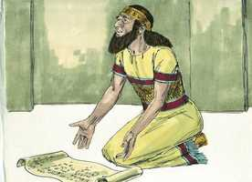
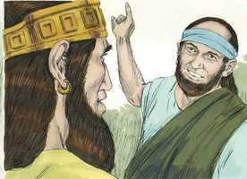
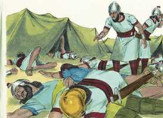

# 2 Reis Capítulo 19

**1** 	E ACONTECEU que, tendo Ezequias ouvido isto, rasgou as suas vestes, e se cobriu de saco, e entrou na casa do Senhor.

**2** 	Então enviou a Eliaquim, o mordomo, e a Sebna, o escrivão, e os anciãos dos sacerdotes, cobertos de sacos, ao profeta Isaías, filho de Amós.

**3** 	E disseram-lhe: Assim diz Ezequias: Este dia é dia de angústia, de vituperação e de blasfêmia; porque os filhos chegaram ao parto, e não há força para dá-los à luz.

**4** 	Bem pode ser que o Senhor teu Deus ouça todas as palavras de Rabsaqué, a quem enviou o seu senhor, o rei da Assíria, para afrontar o Deus vivo, e para vituperá-lo com as palavras que o Senhor teu Deus tem ouvido; faze, pois, oração pelo restante que subsiste.

**5** 	E os servos do rei Ezequias foram a Isaías.

**6** 	E Isaías lhes disse: Assim direis a vosso senhor: Assim diz o Senhor: Não temas as palavras que ouviste, com as quais os servos do rei da Assíria me blasfemaram.

**7** 	Eis que porei nele um espírito, e ele ouvirá um rumor, e voltará para a sua terra; à espada o farei cair na sua terra.

**8** 	Voltou, pois, Rabsaqué, e achou o rei da Assíria pelejando contra Libna, porque tinha ouvido que o rei havia partido de Laquis.

**9** 	E, ouvindo ele dizer de Tiraca, rei da Etiópia: Eis que saiu para te fazer guerra; tornou a enviar mensageiros a Ezequias, dizendo:

**10** 	Assim falareis a Ezequias, rei de Judá: Não te engane o teu Deus, em quem confias, dizendo: Jerusalém não será entregue na mão do rei da Assíria.

**11** 	Eis que já tens ouvido o que fizeram os reis da Assíria a todas as terras, destruindo-as totalmente; e tu, te livrarás?

**12** 	Porventura as livraram os deuses das nações, a quem meus pais destruíram, como a Gozã, a Harã, a Rezefe, e aos filhos de Éden, que estavam em Telassar?

**13** 	Que é feito do rei de Hamate, do rei de Arpade, e do rei da cidade de Sefarvaim, Hena e Iva?

**14** 	Recebendo, pois, Ezequias as cartas das mãos dos mensageiros e lendo-as, subiu à casa do Senhor; e Ezequias as estendeu perante o Senhor.

 

**15** 	E orou Ezequias perante o Senhor e disse: Ó Senhor Deus de Israel, que habitas entre os querubins, tu mesmo, só tu és Deus de todos os reinos da terra; tu fizeste os céus e a terra.

**16** 	Inclina, Senhor, o teu ouvido, e ouve; abre, Senhor, os teus olhos, e olha; e ouve as palavras de Senaqueribe, que enviou a este, para afrontar o Deus vivo.

**17** 	Verdade é, ó Senhor, que os reis da Assíria assolaram as nações e as suas terras.

**18** 	E lançaram os seus deuses no fogo; porquanto não eram deuses, mas obra de mãos de homens, madeira e pedra; por isso os destruíram.

**19** 	Agora, pois, ó Senhor nosso Deus, te suplico, livra-nos da sua mão; e assim saberão todos os reinos da terra que só tu és o Senhor Deus.

**20** 	Então Isaías, filho de Amós, mandou dizer a Ezequias: Assim diz o Senhor Deus de Israel: O que me pediste acerca de Senaqueribe, rei da Assíria, ouvi.

 

**21** 	Esta é a palavra que o Senhor falou dele: A virgem, a filha de Sião, te despreza, de ti zomba; a filha de Jerusalém meneia a cabeça por detrás de ti.

**22** 	A quem afrontaste e blasfemaste? E contra quem alçaste a voz e ergueste os teus olhos ao alto? Contra o Santo de Israel?

**23** 	Por meio de teus mensageiros afrontaste o Senhor, e disseste: Com a multidão de meus carros subi ao alto dos montes, aos lados do Líbano, e cortarei os seus altos cedros e as suas mais formosas faias, e entrarei nas suas pousadas extremas, até no bosque do seu campo fértil.

**24** 	Eu cavei, e bebi águas estranhas; e com as plantas de meus pés sequei todos os rios do Egito.

**25** 	Porventura não ouviste que já dantes fiz isto, e já desde os dias antigos o planejei? Agora, porém, o fiz vir, para que fosses tu que reduzisses as cidades fortificadas a montões desertos.

**26** 	Por isso os moradores delas, com pouca força, ficaram pasmados e confundidos; eram como a erva do campo, e a hortaliça verde, e o feno dos telhados, e o trigo queimado, antes de amadurecer.

**27** 	Porém o teu assentar, e o teu sair e o teu entrar, e o teu furor contra mim, eu o sei.

**28** 	Por causa do teu furor contra mim, e porque a tua revolta subiu aos meus ouvidos, portanto porei o meu anzol no teu nariz e o meu freio nos teus lábios, e te farei voltar pelo caminho por onde vieste.

**29** 	E isto te será por sinal; este ano se comerá o que nascer por si mesmo, e no ano seguinte o que daí proceder; porém, no terceiro ano semeai e segai, plantai vinhas, e comei os seus frutos.

 

**30** 	Porque o que escapou da casa de Judá, e restou, tornará a lançar raízes para baixo, e dará fruto para cima.

**31** 	Porque de Jerusalém sairá o restante, e do monte Sião o que escapou; o zelo do Senhor dos Exércitos fará isto.

**32** 	Portanto, assim diz o Senhor acerca do rei da Assíria: Não entrará nesta cidade, nem lançará nela flecha alguma; tampouco virá perante ela com escudo, nem levantará contra ela trincheira alguma.

**33** 	Pelo caminho por onde vier, por ele voltará; porém nesta cidade não entrará, diz o Senhor.

**34** 	Porque eu ampararei a esta cidade, para a livrar, por amor de mim e por amor do meu servo Davi.

**35** 	Sucedeu, pois, que naquela mesma noite saiu o anjo do Senhor, e feriu no arraial dos assírios a cento e oitenta e cinco mil deles; e, levantando-se pela manhã cedo, eis que todos eram cadáveres.

 

**36** 	Então Senaqueribe, rei da Assíria, partiu, e se foi, e voltou e ficou em Nínive.

**37** 	E sucedeu que, estando ele prostrado na casa de Nisroque, seu deus, Adrameleque e Sarezer, seus filhos, o feriram à espada; porém eles escaparam para a terra de Ararate; e Esar-Hadom, seu filho, reinou em seu lugar.

 

