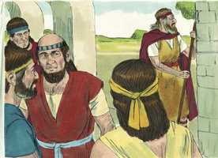
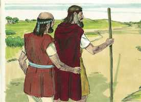
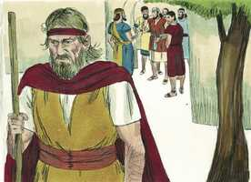
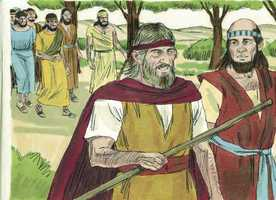
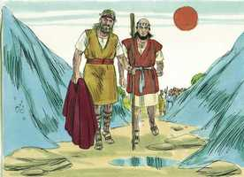
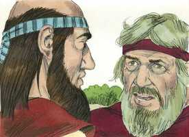
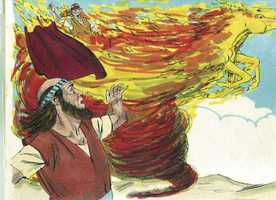
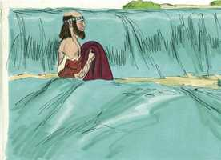
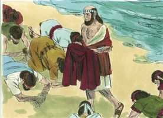

# 2 Reis Capítulo 2

**1** 	SUCEDEU que, quando o Senhor estava para elevar a Elias num redemoinho ao céu, Elias partiu de Gilgal com Eliseu.

**2** 	E disse Elias a Eliseu: Fica-te aqui, porque o Senhor me enviou a Betel. Porém Eliseu disse: Vive o Senhor, e vive a tua alma, que não te deixarei. E assim foram a Betel.

 

**3** 	Então os filhos dos profetas que estavam em Betel saíram ao encontro de Eliseu, e lhe disseram: Sabes que o Senhor hoje tomará o teu senhor por sobre a tua cabeça? E ele disse: Também eu bem o sei; calai-vos.

 

**4** 	E Elias lhe disse: Eliseu, fica-te aqui, porque o Senhor me enviou a Jericó. Porém ele disse: Vive o Senhor, e vive a tua alma, que não te deixarei. E assim foram a Jericó.

 

**5** 	Então os filhos dos profetas que estavam em Jericó se chegaram a Eliseu, e lhe disseram: Sabes que o Senhor hoje tomará o teu senhor por sobre a tua cabeça? E ele disse: Também eu bem o sei; calai-vos.

 

**6** 	E Elias disse: Fica-te aqui, porque o Senhor me enviou ao Jordão. Mas ele disse: Vive o Senhor, e vive a tua alma, que não te deixarei. E assim ambos foram juntos.

**7** 	E foram cinqüenta homens dos filhos dos profetas, e pararam defronte deles, de longe: e assim ambos pararam junto ao Jordão.

 

**8** 	Então Elias tomou a sua capa e a dobrou, e feriu as águas, as quais se dividiram para os dois lados; e passaram ambos em seco.

 

**9** 	Sucedeu que, havendo eles passado, Elias disse a Eliseu: Pede-me o que queres que te faça, antes que seja tomado de ti. E disse Eliseu: Peço-te que haja porção dobrada de teu espírito sobre mim.

 

**10** 	E disse: Coisa difícil pediste; se me vires quando for tomado de ti, assim se te fará, porém, se não, não se fará.

**11** 	E sucedeu que, indo eles andando e falando, eis que um carro de fogo, com cavalos de fogo, os separou um do outro; e Elias subiu ao céu num redemoinho.

 

**12** 	O que vendo Eliseu, clamou: Meu pai, meu pai, carros de Israel, e seus cavaleiros! E nunca mais o viu; e, pegando as suas vestes, rasgou-as em duas partes.

 

**13** 	Também levantou a capa de Elias, que dele caíra; e, voltando-se, parou à margem do Jordão.

**14** 	E tomou a capa de Elias, que dele caíra, e feriu as águas, e disse: Onde está o Senhor Deus de Elias? Quando feriu as águas elas se dividiram de um ao outro lado; e Eliseu passou.

 

**15** 	Vendo-o, pois, os filhos dos profetas que estavam defronte em Jericó, disseram: O espírito de Elias repousa sobre Eliseu. E vieram-lhe ao encontro, e se prostraram diante dele em terra.

 

**16** 	E disseram-lhe: Eis que agora entre os teus servos há cinqüenta homens valentes; ora deixa-os ir para buscar a teu senhor; pode ser que o elevasse o Espírito do Senhor e o lançasse em algum dos montes, ou em algum dos vales. Porém ele disse: Não os envieis.

**17** 	Mas eles insistiram com ele, até que, constrangido, disse-lhes: Enviai. E enviaram cinqüenta homens, que o buscaram três dias, porém não o acharam.

**18** 	Então voltaram para ele, pois ficara em Jericó; e disse-lhes: Eu não vos disse que não fôsseis?

**19** 	E os homens da cidade disseram a Eliseu: Eis que é boa a situação desta cidade, como o meu senhor vê; porém as águas são más, e a terra é estéril.

**20** 	E ele disse: Trazei-me um prato novo, e ponde nele sal. E lho trouxeram.

**21** 	Então saiu ele ao manancial das águas, e deitou sal nele; e disse: Assim diz o Senhor: Sararei a estas águas; e não haverá mais nelas morte nem esterilidade.

**22** 	Ficaram, pois, sãs aquelas águas, até ao dia de hoje, conforme a palavra que Eliseu tinha falado.

**23** 	Então subiu dali a Betel; e, subindo ele pelo caminho, uns meninos saíram da cidade, e zombavam dele, e diziam-lhe: Sobe, calvo; sobe, calvo!

**24** 	E, virando-se ele para trás, os viu, e os amaldiçoou no nome do Senhor; então duas ursas saíram do bosque, e despedaçaram quarenta e dois daqueles meninos.

**25** 	E dali foi para o monte Carmelo de onde voltou para Samaria.

