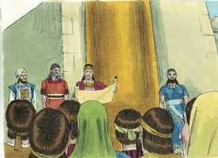
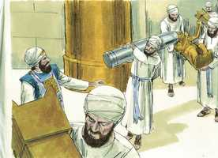
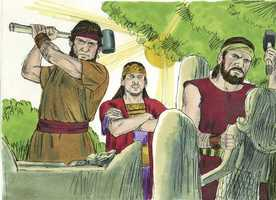
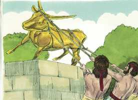
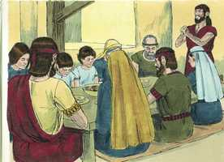
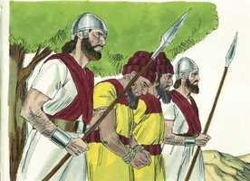
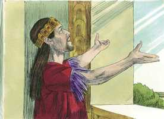

# 2 Reis Capítulo 23

**1** 	ENTÃO o rei ordenou, e todos os anciãos de Judá e de Jerusalém se reuniram a ele.

**2** 	O rei subiu à casa do Senhor, e com ele todos os homens de Judá, e todos os moradores de Jerusalém, os sacerdotes, os profetas e todo o povo, desde o menor até ao maior; e leu aos ouvidos deles todas as palavras do livro da aliança, que se achou na casa do Senhor.

**3** 	E o rei se pôs em pé junto à coluna, e fez a aliança perante o Senhor, para seguirem o Senhor, e guardarem os seus mandamentos, os seus testemunhos e os seus estatutos, com todo o coração e com toda a alma, confirmando as palavras desta aliança, que estavam escritas naquele livro; e todo o povo apoiou esta aliança.

 

**4** 	E o rei mandou ao sumo sacerdote Hilquias, aos sacerdotes da segunda ordem, e aos guardas do umbral da porta, que tirassem do templo do Senhor todos os vasos que se tinham feito para Baal, para o bosque e para todo o exército dos céus e os queimou fora de Jerusalém, nos campos de Cedrom e levou as cinzas deles a Betel.

 

**5** 	Também destituiu os sacerdotes que os reis de Judá estabeleceram para incensarem sobre os altos nas cidades de Judá e ao redor de Jerusalém, como também os que queimavam incenso a Baal, ao sol, à lua, e aos planetas, e a todo o exército dos céus.

**6** 	Também tirou da casa do Senhor o ídolo do bosque levando-o para fora de Jerusalém até ao ribeiro de Cedrom, e o queimou junto ao ribeiro de Cedrom, e o desfez em pó, e lançou o seu pó sobre as sepulturas dos filhos do povo.

**7** 	Também derrubou as casas dos sodomitas que estavam na casa do Senhor, em que as mulheres teciam casinhas para o ídolo do bosque.

 

**8** 	E a todos os sacerdotes trouxe das cidades de Judá, e profanou os altos em que os sacerdotes queimavam incenso, desde Geba até Berseba; e derrubou os altos que estavam às portas, junto à entrada da porta de Josué, o governador da cidade, que estava à esquerda daquele que entrava pela porta da cidade.

**9** 	Mas os sacerdotes dos altos não sacrificavam sobre o altar do Senhor em Jerusalém; porém comiam pães ázimos no meio de seus irmãos.

**10** 	Também profanou a Tofete, que está no vale dos filhos de Hinom, para que ninguém fizesse passar a seu filho, ou sua filha, pelo fogo a Moloque.

**11** 	Também tirou os cavalos que os reis de Judá tinham dedicado ao sol, à entrada da casa do Senhor, perto da câmara de Natã-Meleque, o camareiro, que estava no recinto; e os carros do sol queimou a fogo.

**12** 	Também o rei derrubou os altares que estavam sobre o terraço do cenáculo de Acaz, os quais os reis de Judá tinham feito, como também o rei derrubou os altares que fizera Manassés nos dois átrios da casa do Senhor; e esmiuçados os tirou dali e lançou o pó deles no ribeiro de Cedrom.

**13** 	O rei profanou também os altos que estavam defronte de Jerusalém, à mão direita do monte de Masite, os quais edificara Salomão, rei de Israel, a Astarote, a abominação dos sidônios, e a Quemós, a abominação dos moabitas, e a Milcom, a abominação dos filhos de Amom.

**14** 	Semelhantemente quebrou as estátuas, cortou os bosques e encheu o seu lugar com ossos de homens.

**15** 	E também o altar que estava em Betel, e o alto que fez Jeroboão, filho de Nebate, com que tinha feito Israel pecar, esse altar derrubou juntamente com o alto; queimando o alto, em pó o esmiuçou, e queimou o ídolo do bosque.

 

**16** 	E, virando-se Josias, viu as sepulturas que estavam ali no monte; e mandou tirar os ossos das sepulturas, e os queimou sobre aquele altar, e assim o profanou, conforme a palavra do Senhor, que profetizara o homem de Deus, quando anunciou estas palavras.

**17** 	Então disse: Que é este monumento que vejo? E os homens da cidade lhe disseram: É a sepultura do homem de Deus que veio de Judá, e anunciou estas coisas que fizeste contra este altar de Betel.

**18** 	E disse: Deixai-o estar; ninguém mexa nos seus ossos. Assim deixaram estar os seus ossos com os ossos do profeta que viera de Samaria.

**19** 	Demais disto também Josias tirou todas as casas dos altos que havia nas cidades de Samaria, e que os reis de Israel tinham feito para provocarem à ira o Senhor; e lhes fez conforme todos os atos que tinha feito em Betel.

**20** 	E sacrificou todos os sacerdotes dos altos, que havia ali, sobre os altares, e queimou ossos humanos sobre eles; depois voltou a Jerusalém.

**21** 	O rei deu ordem a todo o povo, dizendo: Celebrai a páscoa ao Senhor vosso Deus, como está escrito no livro da aliança.

 

**22** 	Porque nunca se celebrou tal páscoa como esta desde os dias dos juízes que julgaram a Israel, nem em todos os dias dos reis de Israel, nem tampouco dos reis de Judá.

**23** 	Porém no ano décimo oitavo do rei Josias esta páscoa se celebrou ao Senhor em Jerusalém.

**24** 	E também os adivinhos, os feiticeiros, os terafins, os ídolos, e todas as abominações que se viam na terra de Judá e em Jerusalém, os extirpou Josias, para confirmar as palavras da lei, que estavam escritas no livro que o sacerdote Hilquias achara na casa do Senhor.

 

**25** 	E antes dele não houve rei semelhante, que se convertesse ao Senhor com todo o seu coração, com toda a sua alma e com todas as suas forças, conforme toda a lei de Moisés; e depois dele nunca se levantou outro tal.

 

**26** 	Todavia o Senhor não se demoveu do ardor da sua grande ira, com que ardia contra Judá, por todas as provocações com que Manassés o tinha provocado.

**27** 	E disse o Senhor: Também a Judá hei de tirar de diante da minha face, como tirei a Israel, e rejeitarei esta cidade de Jerusalém que escolhi, como também a casa de que disse: Estará ali o meu nome.

**28** 	Ora, o mais dos atos de Josias e tudo quanto fez, porventura não está escrito no livro das crônicas dos reis de Judá?

**29** 	Nos seus dias subiu Faraó Neco, rei do Egito, contra o rei da Assíria, ao rio Eufrates; e o rei Josias lhe foi ao encontro; e, vendo-o ele, o matou em Megido.

**30** 	E seus servos, num carro, o levaram morto, de Megido, e o trouxeram a Jerusalém, e o sepultaram na sua sepultura; e o povo da terra tomou a Jeoacaz, filho de Josias, e ungiram-no, e fizeram-no rei em lugar de seu pai.

**31** 	Tinha Jeoacaz vinte e três anos de idade quando começou a reinar, e três meses reinou em Jerusalém; e era o nome de sua mãe Hamutal, filha de Jeremias, de Libna.

**32** 	E fez o que era mau aos olhos do Senhor, conforme tudo o que fizeram seus pais.

**33** 	Porém Faraó Neco o mandou prender em Ribla, em terra de Hamate, para que não reinasse em Jerusalém; e à terra impôs pena de cem talentos de prata e um talento de ouro.

**34** 	Também Faraó Neco constituiu rei a Eliaquim, filho de Josias, em lugar de seu pai Josias, e lhe mudou o nome para Jeoiaquim; porém a Jeoacaz tomou consigo, e foi ao Egito, e morreu ali.

**35** 	E Jeoiaquim deu aquela prata e aquele ouro a Faraó; porém tributou a terra, para dar esse dinheiro conforme o mandado de Faraó; a cada um segundo a sua avaliação exigiu a prata e o ouro do povo da terra, para o dar a Faraó Neco.

**36** 	Tinha Jeoiaquim vinte e cinco anos de idade quando começou a reinar, e reinou onze anos em Jerusalém; e era o nome de sua mãe Zebida, filha de Pedaías, de Ruma.

**37** 	E fez o que era mau aos olhos do Senhor, conforme tudo quanto fizeram seus pais.

