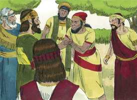
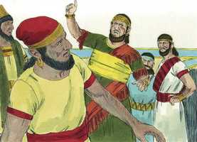
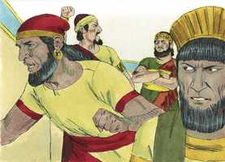

# 2 Crônicas Capítulo 10

**1** 	E FOI Roboão a Siquém, porque todo o Israel se reunira ali, para fazê-lo rei.

**2** 	Sucedeu que, ouvindo-o Jeroboão, filho de Nebate (o qual estava então no Egito para onde fugira da presença do rei Salomão), voltou do Egito,

**3** 	Porque enviaram a ele, e o chamaram; e vieram, Jeroboão e todo o Israel, e falaram a Roboão dizendo:

**4** 	Teu pai fez duro o nosso jugo; agora, pois, alivia tu a dura servidão de teu pai, e o pesado jugo que nos impôs, e nós te serviremos.

 

**5** 	E ele lhes disse: Daqui a três dias voltai a mim. Então o povo se foi.

**6** 	E tomou Roboão conselho com os anciãos, que estiveram perante Salomão seu pai, enquanto viveu, dizendo: Como aconselhais vós que se responda a este povo?

**7** 	E eles lhe falaram, dizendo: Se te fizeres benigno e afável para com este povo, e lhes falares boas palavras, todos os dias serão teus servos.

**8** 	Porém ele deixou o conselho que os anciãos lhe deram; e tomou conselho com os jovens, que haviam crescido com ele, e estavam perante ele.

**9** 	E disse-lhes: Que aconselhais vós, que respondamos a este povo, que me falou, dizendo: Alivia o jugo que teu pai nos impôs?

**10** 	E os jovens, que com ele haviam crescido, lhe falaram, dizendo: Assim dirás a este povo, que te falou: Teu pai agravou o nosso jugo, tu porém alivia-nos; assim, pois, lhe falarás: O meu dedo mínimo é mais grosso do que os lombos de meu pai.

**11** 	Assim que, se meu pai vos carregou de um jugo pesado, eu ainda aumentarei o vosso jugo; meu pai vos castigou com açoites, porém eu vos castigarei com escorpiões.

**12** 	Veio, pois, Jeroboão, e todo o povo, ao terceiro dia, a Roboão, como o rei havia ordenado, dizendo: Voltai a mim ao terceiro dia.

**13** 	E o rei lhes respondeu asperamente; porque o rei Roboão deixara o conselho dos anciãos.

 

**14** 	E falou-lhes conforme o conselho dos jovens, dizendo: Meu pai agravou o vosso jugo, porém eu o aumentarei mais; meu pai vos castigou com açoites, porém eu vos castigarei com escorpiões.

**15** 	Assim o rei não deu ouvidos ao povo, porque esta mudança vinha de Deus, para que o Senhor confirmasse a sua palavra, a qual falara pelo ministério de Aías, o silonita, a Jeroboão, filho de Nebate.

**16** 	Vendo, pois, todo o Israel, que o rei não lhe dava ouvidos, tornou-lhe o povo a responder, dizendo: Que parte temos nós com Davi? Já não temos herança no filho de Jessé. Cada um à sua tenda, ó Israel! Olha agora pela tua casa, ó Davi. Assim todo o Israel se foi para as suas tendas.

 

**17** 	Porém, quanto aos filhos de Israel, que habitavam nas cidades de Judá, sobre eles reinou Roboão.

**18** 	Então o rei Roboão enviou a Hadorão, que tinha cargo dos tributos; porém os filhos de Israel o apedrejaram, e ele morreu. Então o rei Roboão se esforçou para subir ao seu carro, e fugiu para Jerusalém.

**19** 	Assim se rebelaram os israelitas contra a casa de Davi, até ao dia de hoje.

