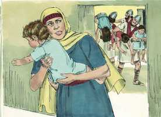

# 2 Crônicas Capítulo 22

**1** 	E OS moradores de Jerusalém, em lugar de Jeorão, fizeram rei a Acazias, seu filho mais moço, porque a tropa, que viera com os árabes ao arraial, tinha matado a todos os mais velhos. Assim reinou Acazias, filho de Jeorão, rei de Judá.

**2** 	Era da idade de quarenta e dois anos, quando começou a reinar, e reinou um ano em Jerusalém; e era o nome de sua mãe Atalia, filha de Onri.

**3** 	Também ele andou nos caminhos da casa de Acabe, porque sua mãe era sua conselheira, para proceder impiamente.

**4** 	E fez o que era mau aos olhos do Senhor, como a casa de Acabe, porque eles eram seus conselheiros depois da morte de seu pai, para a sua perdição.

**5** 	Também andou nos conselhos deles, e foi com Jorão, filho de Acabe, rei de Israel, à peleja contra Hazael, rei da Síria, junto a Ramote de Gileade; e os sírios feriram a Jorão.

**6** 	E voltou para curar-se em Jizreel, das feridas que lhe fizeram em Ramá, pelejando contra Hazael, rei da Síria; e Acazias, filho de Jeorão, rei de Judá, desceu para ver a Jorão, filho de Acabe, em Jizreel, porque estava doente.

**7** 	Foi, pois, da vontade de Deus, que Acazias, para sua ruína, visitasse Jorão; porque chegando ele, saiu com Jorão contra Jeú, filho de Ninsi, a quem o Senhor tinha ungido para desarraigar a casa de Acabe.

**8** 	E sucedeu que, executando Jeú juízo contra a casa de Acabe, achou os príncipes de Judá e os filhos dos irmãos de Acazias, que serviam a Acazias, e os matou.

**9** 	Depois buscou a Acazias (porque se tinha escondido em Samaria), e o alcançaram, e o trouxeram a Jeú, e o mataram, e o sepultaram; porque disseram: Filho é de Jeosafá, que buscou ao Senhor com todo o seu coração. E já não tinha a casa de Acazias ninguém que tivesse força para o reino.

**10** 	Vendo, pois, Atalia, mãe de Acazias, que seu filho era morto, levantou-se e destruiu toda a descendência real da casa de Judá.

**11** 	Porém Jeosabeate, filha do rei, tomou a Joás, filho de Acazias, furtando-o dentre os filhos do rei, aos quais matavam, e o pôs com a sua ama na câmara dos leitos; assim Jeosabeate, filha do rei Jeorão, mulher do sacerdote Joiada (porque era irmã de Acazias), o escondeu de Atalia, de modo que ela não o matou.

 

**12** 	E esteve com eles seis anos escondido na casa de Deus; e Atalia reinou sobre a terra.

