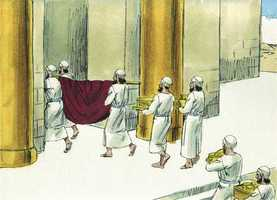
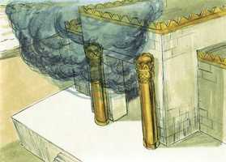

# 2 Crônicas Capítulo 5

**1** 	ASSIM se acabou toda a obra que Salomão fez para a casa do Senhor; então trouxe Salomão as coisas que seu pai Davi havia consagrado, a prata, o ouro e todos os objetos, e pô-los entre os tesouros da casa de Deus.

**2** 	Então Salomão congregou em Jerusalém os anciãos de Israel, e todos os chefes das tribos, os chefes dos pais entre os filhos de Israel, para fazerem subir a arca da aliança do Senhor, da cidade de Davi, que é Sião.

**3** 	E todos os homens de Israel se congregaram ao rei na ocasião da festa, que foi no sétimo mês.

**4** 	E vieram todos os anciãos de Israel; e os levitas levantaram a arca.

 

**5** 	E fizeram subir a arca, e a tenda da congregação, com todos os objetos sagrados, que estavam na tenda; os sacerdotes e os levitas os fizeram subir.

**6** 	Então o rei Salomão e toda a congregação de Israel, que se tinha reunido com ele diante da arca, sacrificaram carneiros e bois, que não se podiam contar, nem numerar, por causa da sua abundância.

**7** 	Assim trouxeram os sacerdotes a arca da aliança do Senhor ao seu lugar, ao oráculo da casa, ao lugar santíssimo, até debaixo das asas dos querubins.

**8** 	Porque os querubins estendiam ambas as asas sobre o lugar da arca, e os querubins cobriam, por cima, a arca e os seus varais.

**9** 	Então os varais sobressaíam para que as pontas dos varais da arca se vissem perante o oráculo, mas não se vissem de fora; e ali tem estado até ao dia de hoje.

**10** 	Na arca não havia coisa alguma senão as duas tábuas, que Moisés tinha posto em Horebe, quando o Senhor fez aliança com os filhos de Israel, saindo eles do Egito.

**11** 	E sucedeu que, saindo os sacerdotes do santuário (porque todos os sacerdotes, que ali se acharam, se santificaram, sem respeitarem as suas turmas,

 

**12** 	E os levitas, que eram cantores, todos eles, de Asafe, de Hemã, de Jedutum, de seus filhos e de seus irmãos, vestidos de linho fino, com címbalos, com saltérios e com harpas, estavam em pé para o oriente do altar; e com eles até cento e vinte sacerdotes, que tocavam as trombetas).

**13** 	E aconteceu que, quando eles uniformemente tocavam as trombetas, e cantavam, para fazerem ouvir uma só voz, bendizendo e louvando ao Senhor; e levantando eles a voz com trombetas, címbalos, e outros instrumentos musicais, e louvando ao Senhor, dizendo: Porque ele é bom, porque a sua benignidade dura para sempre, então a casa se encheu de uma nuvem, a saber, a casa do Senhor;

**14** 	E os sacerdotes não podiam permanecer em pé, para ministrar, por causa da nuvem; porque a glória do Senhor encheu a casa de Deus.

