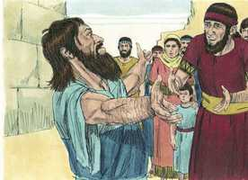
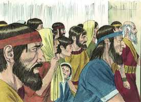
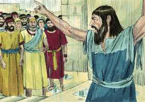
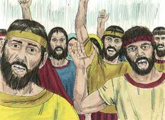
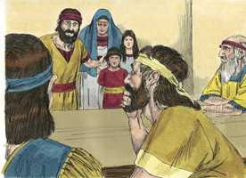
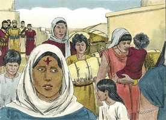

# Esdras Capítulo 10

**1** 	E ENQUANTO Esdras orava, e fazia confissão, chorando e prostrando-se diante da casa de Deus, ajuntou-se a ele, de Israel, uma grande congregação de homens, mulheres e crianças; pois o povo chorava com grande choro.

**2** 	Então Secanias, filho de Jeiel, um dos filhos de Elão, tomou a palavra e disse a Esdras: Nós temos transgredido contra o nosso Deus, e casamos com mulheres estrangeiras dentre os povos da terra, mas, no tocante a isto, ainda há esperança para Israel.

 

**3** 	Agora, pois, façamos aliança com o nosso Deus de que despediremos todas as mulheres, e os que delas são nascidos, conforme ao conselho do meu senhor, e dos que tremem ao mandado do nosso Deus; e faça-se conforme a lei.

**4** 	Levanta-te, pois, porque te pertence este negócio, e nós seremos contigo; esforça-te, e age.

**5** 	Então Esdras se levantou, e ajuramentou os chefes dos sacerdotes e dos levitas, e a todo o Israel, de que fariam conforme a esta palavra; e eles juraram.

**6** 	E Esdras se levantou de diante da casa de Deus, e entrou na câmara de Joanã, filho de Eliasibe; e, chegando lá, não comeu pão, e nem bebeu água; porque lamentava pela transgressão dos do cativeiro.

**7** 	E fizeram passar pregão por Judá e Jerusalém, a todos os que vieram do cativeiro, para que se ajuntassem em Jerusalém.

**8** 	E que todo aquele que em três dias não viesse, segundo o conselho dos príncipes e dos anciãos, toda a sua fazenda se poria em interdito, e ele seria separado da congregação dos do cativeiro.

**9** 	Então todos os homens de Judá e Benjamim em três dias se ajuntaram em Jerusalém; era o nono mês, aos vinte dias do mês; e todo o povo se assentou na praça da casa de Deus, tremendo por este negócio e por causa das grandes chuvas.

 

**10** 	Então se levantou Esdras, o sacerdote, e disse-lhes: Vós tendes transgredido, e casastes com mulheres estrangeiras, aumentando a culpa de Israel.

 

**11** 	Agora, pois, fazei confissão ao Senhor Deus de vossos pais, e fazei a sua vontade; e apartai-vos dos povos das terras, e das mulheres estrangeiras.

**12** 	E respondeu toda a congregação, e disse em altas vozes: Assim seja, conforme às tuas palavras nos convém fazer.

 

**13** 	Porém o povo é muito, e também é tempo de grandes chuvas, e não se pode estar aqui fora; nem é obra de um dia nem de dois, porque somos muitos os que transgredimos neste negócio.

**14** 	Ora, ponham-se os nossos líderes, por toda a congregação sobre este negócio; e todos os que em nossas cidades casaram com mulheres estrangeiras venham em tempos apontados, e com eles os anciãos de cada cidade, e os seus juízes, até que desviemos de nós o ardor da ira do nosso Deus, por esta causa.

**15** 	Porém, somente Jônatas, filho de Asael, e Jaseías, filho de Ticva, se opuseram a isto; e Mesulão, e Sabetai, levita, os ajudaram.

**16** 	E assim o fizeram os que voltaram do cativeiro; e o sacerdote Esdras e os homens, chefes dos pais, segundo a casa de seus pais, e todos pelos seus nomes, foram apontados; e assentaram-se no primeiro dia do décimo mês, para inquirirem neste negócio.

 

**17** 	E no primeiro dia do primeiro mês acabaram de tratar com todos os homens que casaram com mulheres estrangeiras.

**18** 	E acharam-se dos filhos dos sacerdotes que casaram com mulheres estrangeiras: Dos filhos de Jesuá, filho de Jozadaque, e seus irmãos, Maaséias, e Eliezer, e Jaribe, e Gedalias.

**19** 	E deram as suas mãos prometendo que despediriam suas mulheres; e, achando-se culpados, ofereceram um carneiro do rebanho pelo seu delito.

 

**20** 	E dos filhos de Imer: Hanani e Zebadias.

**21** 	E dos filhos de Harim: Maaséias, Elias, Semaías, Jeiel e Uzias.

**22** 	E dos filhos de Pasur: Elioenai, Maaséias, Ismael, Netanel, Jozabade e Eleasa.

**23** 	E dos levitas: Jozabade, Simei, Quelaías (este é Quelita), Petaías, Judá e Eliezer.

**24** 	E dos cantores: Eliasibe; e dos porteiros: Salum, Telém e Uri.

**25** 	E de Israel, dos filhos de Parós: Ramias, Jezias, Malquias, Miamim, Eleazar, Malquias e Benaia.

**26** 	E dos filhos de Elão: Matanias, Zacarias, Jeiel, Abdi, Jeremote e Elias.

**27** 	E dos filhos de Zatu: Elioenai, Eliasibe, Matanias, Jeremote, Zabade e Aziza.

**28** 	E dos filhos de Bebai: Joanã, Hananias, Zabai e Atlai.

**29** 	E dos filhos de Bani: Mesulão, Maluque, Adaías, Jasube, Seal, Jeremote.

**30** 	E dos filhos de Paate-Moabe: Adna, Quelal, Benaia, Maséias, Matanias, Bezalel, Binui e Manassés.

**31** 	E dos filhos de Harim: Eliezer, Josias, Malquias, Semaías, Simeão,

**32** 	Benjamim, Maluque, Semarias.

**33** 	Dos filhos de Hasum: Matenai, Matatá, Zabade, Elifelete, Jeremai, Manassés e Simei.

**34** 	Dos filhos de Bani: Maadai, Anrão, e Uel,

**35** 	Benaia, Bedias, Queluí,

**36** 	Vanias, Meremote, Eliasibe,

**37** 	Matanias, Matnai e Jaasai,

**38** 	E Bani, Binui, Simei,

**39** 	E Selemias, Natã e Adaías,

**40** 	Macnadbai, Sasai, Sarai,

**41** 	Azareel, Selemias, Semarias,

**42** 	Salum, Amarias e José.

**43** 	Dos filhos de Nebo: Jeiel, Matitias, Zabade, Zebina, Jadai, Joel e Benaia.

**44** 	Todos estes tomaram mulheres estrangeiras; e alguns deles tinham mulheres de quem tiveram filhos.

