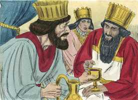
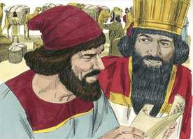
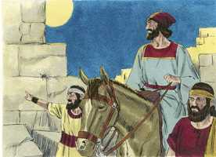
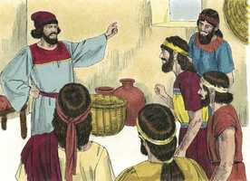
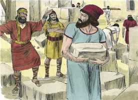

# Neemias Capítulo 2

**1** 	SUCEDEU, pois, no mês de Nisã, no ano vigésimo do rei Artaxerxes, que estava posto vinho diante dele, e eu peguei o vinho e o dei ao rei; porém eu nunca estivera triste diante dele.

**2** 	E o rei me disse: Por que está triste o teu rosto, pois não estás doente? Não é isto senão tristeza de coração; então temi sobremaneira.

 

**3** 	E disse ao rei: Viva o rei para sempre! Como não estaria triste o meu rosto, estando a cidade, o lugar dos sepulcros de meus pais, assolada, e tendo sido consumidas as suas portas a fogo?

**4** 	E o rei me disse: Que me pedes agora? Então orei ao Deus dos céus,

**5** 	E disse ao rei: Se é do agrado do rei, e se o teu servo é aceito em tua presença, peço-te que me envies a Judá, à cidade dos sepulcros de meus pais, para que eu a reedifique.

**6** 	Então o rei me disse, estando a rainha assentada junto a ele: Quanto durará a tua viagem, e quando voltarás? E aprouve ao rei enviar-me, apontando-lhe eu um certo tempo.

**7** 	Disse mais ao rei: Se ao rei parece bem, dêem-se-me cartas para os governadores dalém do rio, para que me permitam passar até que chegue a Judá.

 

**8** 	Como também uma carta para Asafe, guarda da floresta do rei, para que me dê madeira para cobrir as portas do paço da casa, para o muro da cidade e para a casa em que eu houver de entrar. E o rei mas deu, segundo a boa mão de Deus sobre mim.

**9** 	Então fui aos governadores dalém do rio, e dei-lhes as cartas do rei; e o rei tinha enviado comigo capitães do exército e cavaleiros.

**10** 	O que ouvindo Sambalate, o horonita, e Tobias, o servo amonita, lhes desagradou extremamente que alguém viesse a procurar o bem dos filhos de Israel.

**11** 	E cheguei a Jerusalém, e estive ali três dias.

**12** 	E de noite me levantei, eu e poucos homens comigo, e não declarei a ninguém o que o meu Deus me pôs no coração para fazer em Jerusalém; e não havia comigo animal algum, senão aquele em que estava montado.

 

**13** 	E de noite saí pela porta do vale, e para o lado da fonte do dragão, e para a porta do monturo, e contemplei os muros de Jerusalém, que estavam fendidos, e as suas portas, que tinham sido consumidas pelo fogo.

**14** 	E passei à porta da fonte, e ao tanque do rei; e não havia lugar por onde pudesse passar o animal em que estava montado.

**15** 	Ainda, de noite subi pelo ribeiro e contemplei o muro; e, virando entrei pela porta do vale; assim voltei.

**16** 	E não souberam os magistrados aonde eu fora nem o que eu fazia; porque ainda nem aos judeus, nem aos sacerdotes, nem aos nobres, nem aos magistrados, nem aos mais que faziam a obra, até então tinha declarado coisa alguma.

**17** 	Então lhes disse: Bem vedes vós a miséria em que estamos, que Jerusalém está assolada, e que as suas portas têm sido queimadas a fogo; vinde, pois, e reedifiquemos o muro de Jerusalém, e não sejamos mais um opróbrio.

 

**18** 	Então lhes declarei como a mão do meu Deus me fora favorável, como também as palavras do rei, que ele me tinha dito; então disseram: Levantemo-nos, e edifiquemos. E esforçaram as suas mãos para o bem.

**19** 	O que ouvindo Sambalate, o horonita, e Tobias, o servo amonita, e Gesém, o árabe, zombaram de nós, e desprezaram-nos, e disseram: Que é isto que fazeis? Quereis rebelar-vos contra o rei?

 

**20** 	Então lhes respondi, e disse: O Deus dos céus é o que nos fará prosperar: e nós, seus servos, nos levantaremos e edificaremos; mas vós não tendes parte, nem justiça, nem memória em Jerusalém.

