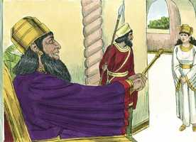
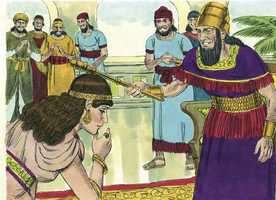
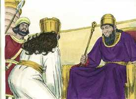
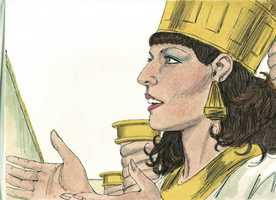
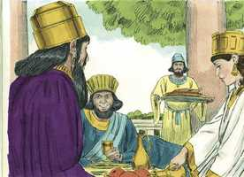
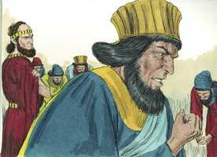
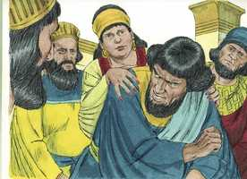
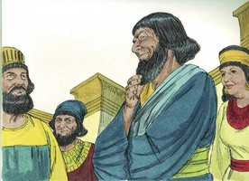

# Ester Capítulo 5

**1** 	SUCEDEU, pois, que ao terceiro dia Ester se vestiu com trajes reais, e se pôs no pátio interior da casa do rei, defronte do aposento do rei; e o rei estava assentado sobre o seu trono real, na casa real, defronte da porta do aposento.

**2** 	E sucedeu que, vendo o rei a rainha Ester, que estava no pátio, ela alcançou graça aos seus olhos; e o rei estendeu para Ester o cetro de ouro, que tinha na sua mão, e Ester chegou, e tocou a ponta do cetro.

  

**3** 	Então o rei lhe disse: Que é que queres, rainha Ester, ou qual é a tua petição? Até metade do reino se te dará.

 

**4** 	E disse Ester: Se parecer bem ao rei, venha hoje com Hamã ao banquete que lhe tenho preparado.

 

**5** 	Então disse o rei: Fazei apressar a Hamã, para que se atenda ao desejo de Ester. Vindo, pois, o rei e Hamã ao banquete, que Ester tinha preparado,

**6** 	Disse o rei a Ester, no banquete do vinho: Qual é a tua petição? E ser-te-á concedida, e qual é o teu desejo? E se fará, ainda até metade do reino.

 

**7** 	Então respondeu Ester, e disse: Minha petição e desejo é:

**8** 	Se achei graça aos olhos do rei, e se bem parecer ao rei conceder-me a minha petição, e cumprir o meu desejo, venha o rei com Hamã ao banquete que lhes hei de preparar, e amanhã farei conforme a palavra do rei.

**9** 	Então saiu Hamã naquele dia alegre e de bom ânimo; porém, vendo Mardoqueu à porta do rei, e que ele não se levantara nem se movera diante dele, então Hamã se encheu de furor contra Mardoqueu.

 

**10** 	Hamã, porém, se refreou, e foi para sua casa; e enviou, e mandou vir os seus amigos, e Zeres, sua mulher.

**11** 	E contou-lhes Hamã a glória das suas riquezas, a multidão de seus filhos, e tudo em que o rei o tinha engrandecido, e como o tinha exaltado sobre os príncipes e servos do rei.

**12** 	Disse mais Hamã: Tampouco a rainha Ester a ninguém fez vir com o rei ao banquete que tinha preparado, senão a mim; e também para amanhã estou convidado por ela juntamente com o rei.

 

**13** 	Porém tudo isto não me satisfaz, enquanto eu vir o judeu Mardoqueu assentado à porta do rei.

**14** 	Então lhe disseram Zeres, sua mulher, e todos os seus amigos: Faça-se uma forca de cinqüenta côvados de altura, e amanhã dize ao rei que nela seja enforcado Mardoqueu; e então entra alegre com o rei ao banquete. E este conselho bem pareceu a Hamã, que mandou fazer a forca.

 

