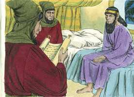
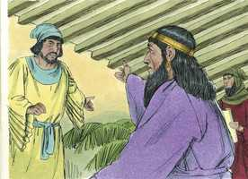
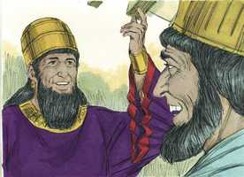
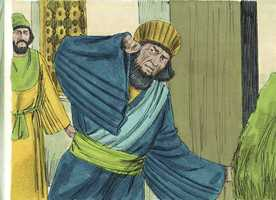

# Ester Capítulo 6

**1** 	NAQUELA mesma noite fugiu o sono do rei; então mandou trazer o livro de registro das crônicas, as quais se leram diante do rei.

 

**2** 	E achou-se escrito que Mardoqueu tinha denunciado Bigtã e Teres, dois dos camareiros do rei, da guarda da porta, que tinham procurado lançar mão do rei Assuero.

**3** 	Então disse o rei: Que honra e distinção se deu por isso a Mardoqueu? E os servos do rei, que ministravam junto a ele, disseram: Coisa nenhuma se lhe fez.

 

**4** 	Então disse o rei: Quem está no pátio? E Hamã tinha entrado no pátio exterior da casa do rei, para dizer ao rei que enforcassem a Mardoqueu na forca que lhe tinha preparado.

**5** 	E os servos do rei lhe disseram: Eis que Hamã está no pátio. E disse o rei que entrasse.

**6** 	E, entrando Hamã, o rei lhe disse: Que se fará ao homem de cuja honra o rei se agrada? Então Hamã disse no seu coração: De quem se agradaria o rei para lhe fazer honra mais do que a mim?

 

**7** 	Assim disse Hamã ao rei: Para o homem, de cuja honra o rei se agrada,

**8** 	Tragam a veste real que o rei costuma vestir, como também o cavalo em que o rei costuma andar montado, e ponha-se-lhe a coroa real na sua cabeça.

**9** 	E entregue-se a veste e o cavalo à mão de um dos príncipes mais nobres do rei, e vistam delas aquele homem a quem o rei deseja honrar; e levem-no a cavalo pelas ruas da cidade, e apregoe-se diante dele: Assim se fará ao homem a quem o rei deseja honrar!

 

**10** 	Então disse o rei a Hamã: Apressa-te, toma a veste e o cavalo, como disseste, e faze assim para com o judeu Mardoqueu, que está assentado à porta do rei; e coisa nenhuma omitas de tudo quanto disseste.

 

**11** 	E Hamã tomou a veste e o cavalo, e vestiu a Mardoqueu, e o levou a cavalo pelas ruas da cidade, e apregoou diante dele: Assim se fará ao homem a quem o rei deseja honrar!

**12** 	Depois disto Mardoqueu voltou para a porta do rei; porém Hamã se retirou correndo à sua casa, triste, e de cabeça coberta.

**13** 	E contou Hamã a Zeres, sua mulher, e a todos os seus amigos, tudo quanto lhe tinha sucedido. Então os seus sábios e Zeres, sua mulher, lhe disseram: Se Mardoqueu, diante de quem já começaste a cair, é da descendência dos judeus, não prevalecerás contra ele, antes certamente cairás diante dele.

 

**14** 	E estando eles ainda falando com ele, chegaram os camareiros do rei, e se apressaram a levar Hamã ao banquete que Ester preparara.

